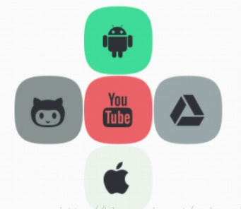
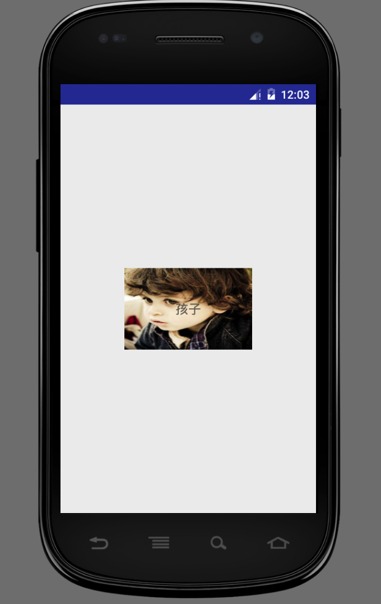

## Android布局

在进行Android开发中，常常需要用到各种布局来进行UI的绘制


我们需要知道，在一个Android应用程序中，用户界面通过`View`和`ViewGroup`对象构建：


ViewGroup类是布局（layout）和视图容器（View container）的基类，此类也定义了ViewGroup.LayoutParams类，它作为布局参数的基类，此类告诉父视图其中的子视图想如何显示。

**我们要介绍的View的布局方式的类，都是直接或间接继承自ViewGroup类**

在Android中，共有五种布局方式，分别是：

 - FrameLayout(框架布局)
 - LinearLayout(线性布局)
 - AbsoluteLayout(绝对布局)
 - RelativeLayout(相对布局)
 - TableLayout(表格布局)

**其中用的最多的是线性布局和相对布局，所以重点介绍这两个，还有一种新出的布局叫百分比布局，也需要了解下。**


### LinearLayout线性布局


LinearLayout容器中的组件一个挨一个排列，通过控制android:orientation属性，可控制各组件是横向排列还是纵向排列。

LinearLayout的常用XML属性及相关方法:

 - android:gravity	setGravity(int)	设置布局管理器内组件的对齐方式
 - android:orientation	setOrientation(int)	设置布局管理器内组件的排列方式，可以设置为horizontal、vertical两个值之一

其中，gravity属性支持top, left, right, center_vertical, fill_vertical, center_horizontal, fill_horizontal, center, fill, clip_vertical, clip_horizontal。也可以同时指定多种对齐方式的组合。


如图定义
``` xml
<LinearLayout xmlns:android="http://schemas.android.com/apk/res/android"
    xmlns:tools="http://schemas.android.com/tools"
    android:id="@+id/LinearLayout1"
    android:layout_width="match_parent"
    android:layout_height="match_parent"
    android:orientation="horizontal">

    <LinearLayout
        android:layout_width="0dp"
        android:layout_height="fill_parent"
        android:background="#ADFF2F"
        android:layout_weight="1"/>


    <LinearLayout
        android:layout_width="0dp"
        android:layout_height="fill_parent"
        android:background="#DA70D6"
        android:layout_weight="2"/>

</LinearLayout>
```

则可实现的效果


使用线性布局要注意的一点是：

**当 android:orientation="vertical" 时， 只有水平方向的设置才起作用，垂直方向的设置不起作用。 即：left，right，center_horizontal 是生效的。 当 android:orientation="horizontal" 时， 只有垂直方向的设置才起作用，水平方向的设置不起作用。 即：top，bottom，center_vertical 是生效的。**


### RelaiveLayout

RelaiveLayout相对布局也是我们用的比较多的一个布局之一。就是以某个兄弟组件,或者父容器来决定位置。

看个例子,梅花布局



``` xml
<RelativeLayout xmlns:android="http://schemas.android.com/apk/res/android"
    xmlns:tools="http://schemas.android.com/tools"
    android:id="@+id/RelativeLayout1"
    android:layout_width="match_parent"
    android:layout_height="match_parent" >

    <!-- 这个是在容器中央的 -->

    <ImageView
        android:id="@+id/img1"
        android:layout_width="80dp"
        android:layout_height="80dp"
        android:layout_centerInParent="true"
        android:src="@drawable/pic1"
    />

    <!-- 在中间图片的左边 -->
    <ImageView
        android:id="@+id/img2"
        android:layout_width="80dp"
        android:layout_height="80dp"
        android:layout_toLeftOf="@id/img1"
        android:layout_centerVertical="true"
        android:src="@drawable/pic2"
    />

    <!-- 在中间图片的右边 -->
    <ImageView
        android:id="@+id/img3"
        android:layout_width="80dp"
        android:layout_height="80dp"
        android:layout_toRightOf="@id/img1"
        android:layout_centerVertical="true"
        android:src="@drawable/pic3"
    />

    <!-- 在中间图片的上面-->
    <ImageView
        android:id="@+id/img4"
        android:layout_width="80dp"
        android:layout_height="80dp"
        android:layout_above="@id/img1"
        android:layout_centerHorizontal="true"
        android:src="@drawable/pic4"
    />

    <!-- 在中间图片的下面 -->
    <ImageView
        android:id="@+id/img5"
        android:layout_width="80dp"
        android:layout_height="80dp"
        android:layout_below="@id/img1"
        android:layout_centerHorizontal="true"
        android:src="@drawable/pic5"
    />

</RelativeLayout>
```

根据相对位置来布局，并且利用设置了组件里的android:layout_xxx属性。


### FrameLayout
FrameLayout布局是最简单的布局方式，所有添加到这个布局中的视图都是以层叠的方式显示。第一个添加到布局中视图显示在最底层，最后一个被放在最顶层。上一层的视图会覆盖下一层的视图

设定位置也更为直接，**通过layout_gravity设定值，再配合layout_marginTop，layout_marginLeft来设置位置**。

### 百分比布局
Android新提供了Android-percent-support这个库，支持百分比布局，在一定程度上可以解决屏幕适配的问题

由于线性布局已经实现了指定控件大小。所以它只扩展了FrameLayout和RelativeLayout。

他提供了PercentRelativeLayout和PercentFrameLayout

支持的属性：
 - layout_widthPercent
 - layout_heightPercent
 - layout_marginPercent
 - layout_marginLeftPercent
 - layout_marginTopPercent
 - layout_marginRightPercent
 - layout_marginBottomPercent
 - layout_marginStartPercent
 - layout_marginEndPercent

使用时，添加gradle

```
compile 'com.android.support:percent:25.2.0'
```

然后设置xml

``` xml
<?xml version="1.0" encoding="utf-8"?>
<android.support.percent.PercentFrameLayout
    xmlns:android="http://schemas.android.com/apk/res/android"
    xmlns:app="http://schemas.android.com/apk/res-auto"
    android:layout_width="match_parent"
    android:layout_height="match_parent">

    <ImageView
        android:layout_width="0dp"
        android:layout_height="0dp"
        app:layout_heightPercent="20%"
        app:layout_widthPercent="50%"
        android:layout_gravity="center"
        android:background="@mipmap/picture"/>

    <TextView
        android:layout_width="wrap_content"
        android:layout_height="wrap_content"
        android:textSize="16sp"
        android:layout_gravity="center"
        android:text="孩子"
        android:gravity="center"/>

</android.support.percent.PercentFrameLayout>
```

可得


