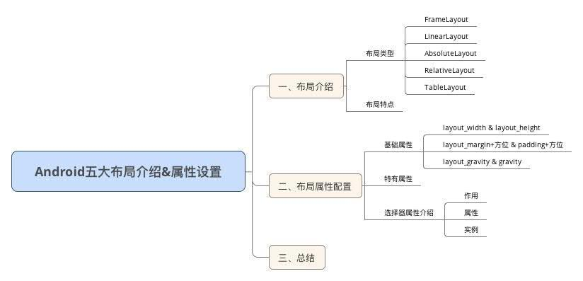
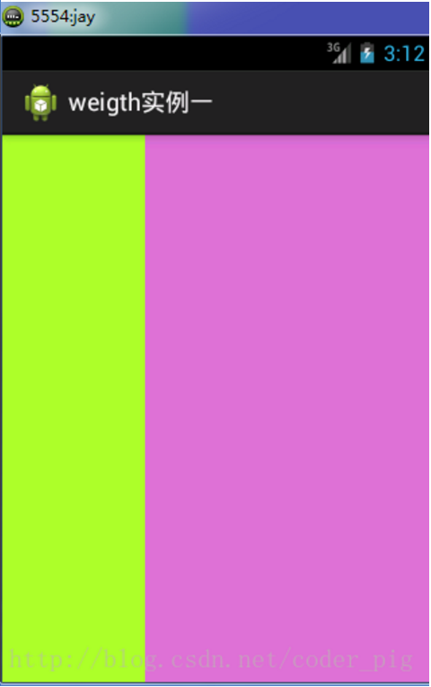

## Android布局

在进行Android开发中，常常需要用到各种布局来进行UI的绘制




我们需要知道，在一个Android应用程序中，用户界面通过`View`和`ViewGroup`对象构建：


ViewGroup类是布局（layout）和视图容器（View container）的基类，此类也定义了ViewGroup.LayoutParams类，它作为布局参数的基类，此类告诉父视图其中的子视图想如何显示。

**我们要介绍的View的布局方式的类，都是直接或间接继承自ViewGroup类**

在Android中，共有五种布局方式，分别是：

 - FrameLayout(框架布局)
 - LinearLayout(线性布局)
 - AbsoluteLayout(绝对布局)
 - RelativeLayout(相对布局)
 - TableLayout(表格布局)


### LinearLayout线性布局


LinearLayout容器中的组件一个挨一个排列，通过控制android:orientation属性，可控制各组件是横向排列还是纵向排列。

LinearLayout的常用XML属性及相关方法:

 - android:gravity	setGravity(int)	设置布局管理器内组件的对齐方式
 - android:orientation	setOrientation(int)	设置布局管理器内组件的排列方式，可以设置为horizontal、vertical两个值之一

其中，gravity属性支持top, left, right, center_vertical, fill_vertical, center_horizontal, fill_horizontal, center, fill, clip_vertical, clip_horizontal。也可以同时指定多种对齐方式的组合。


如图定义
``` xml
<LinearLayout xmlns:android="http://schemas.android.com/apk/res/android"
    xmlns:tools="http://schemas.android.com/tools"
    android:id="@+id/LinearLayout1"
    android:layout_width="match_parent"
    android:layout_height="match_parent"
    android:orientation="horizontal">

    <LinearLayout
        android:layout_width="0dp"
        android:layout_height="fill_parent"
        android:background="#ADFF2F"
        android:layout_weight="1"/>


    <LinearLayout
        android:layout_width="0dp"
        android:layout_height="fill_parent"
        android:background="#DA70D6"
        android:layout_weight="2"/>

</LinearLayout>
```

则可实现的效果



使用线性布局要注意的一点是：

**当 android:orientation="vertical" 时， 只有水平方向的设置才起作用，垂直方向的设置不起作用。 即：left，right，center_horizontal 是生效的。 当 android:orientation="horizontal" 时， 只有垂直方向的设置才起作用，水平方向的设置不起作用。 即：top，bottom，center_vertical 是生效的。**
