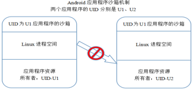
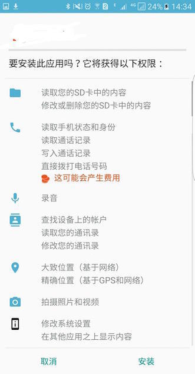
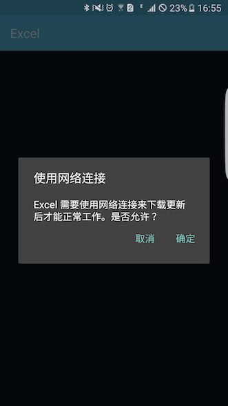

## Android权限机制
Android是一个**权限分离**的操作系统，每一个应用程序运行时都会有一个**明确地系统身份标识,即Linux的user ID和group ID**。部分系统也同样被特定身份标识而隔开。因此，Linux才能将应用程序与其他程序和系统隔离开来。

这样的机制可以说是相当安全，但是也阻断了各个应用程序之间或者和系统之间的“交流”。因此，Android通过一种“permission”机制强力限制某些特定地操作来达到细粒度的安全能力。

### 进程沙箱
Android进程沙箱机制是借鉴Linux中用户组的原理，其限制了不同应用程序之间的资源和数据的互访。

当应用首次安装的时，系统会向其分配一个UID。如果该应用程序是第三方的，**那么其UID值大于10000，如果是系统应用程序则小于10000**。如果应用程序卸载后又重新安装，那么其UID值是会改变的。

``` java
//获取应用程序UID方法
    public void getApplicationUid() {
        PackageManager pm = getPackageManager();
        try {
            ApplicationInfo ai = pm.getApplicationInfo(getPackageName(), PackageManager.GET_ACTIVITIES);
            Log.d(getClass().getSimpleName(), "uid = " + ai.uid);

        } catch (PackageManager.NameNotFoundException e) {
            e.printStackTrace();
        }
    }

```

**不同UID的应用程序是不能进行资源互访，从而有效达到进程隔离目的。**



此外，你可以每个应用程序的AndroidManifest.xml文件中使用ShareUserID属性来使他们拥有同一UserID。UserID相同的应用程序将会被系统当做同一应用程序，拥有相同的UserID和文件权限。

(注意:为了保留系统安全性，只有签名相同（并且需要相同的shareUserId）的应用程序才会被分配相同的UserID。)

### 权限使用

``` xml
<manifest xmlns:android="http://schemas.android.com/apk/res/android"
    package="com.android.app.myapp" >
    <uses-permission android:name="android.permission.RECEIVE_SMS" />
    ...
</manifest>

```

权限的使用是相当简单的，某功能需要申请权限时，只需在AndroidManifest.xml文件中申明对应权限就行。如上述代码。

如果你的App在其manifest文件中声明一系列**normal permissions**(不会对用户隐私或者设备运行构成威胁的权限)，系统会自动准许这些权限申请。如果你的App在其manifest文件中声明一系列**dangerous permissions**(对用户隐私或者设备运行构成潜在威胁的权限)，系统将会询问用户是否同意这些权限申请。

询问的方式根据系统的版本而有所不同。

如果应用程序在manifest中声明了一个dangerous permission，并且它目前没有该权限组中的任一权限，那么系统会弹出一个将要申请权限组的对话框。但是该对话框**不会具体描述是该权限组中的哪一个权限**。比如应用程序需要READ_CONTACTS权限，那么该对话框仅仅只描述为该应用程序需要访问联系人。


#### 静态权限申请

**若设备运行的系统版本为Android5.1(API版本22)或更低，或者App的targetSdkVersion是22或更低，Android提供的是静态权限申请询问界面。**


当应用程序首次安装时，会弹出以下类似界面，出现在图标列表中的权限**都是dangerous permissions**。



**这种询问方式相当霸道**，如果想要安装该应用，我们**只有同意**其申请的所有权限。当应用程序安装更新时，如果该应用程序有新申请的权限，那么该权限询问界面会将新申请的权限列出。你废除这些权限申请的唯一方式就是卸载它们！

#### 动态权限申请

**如果设备运行的系统版本为Android6.0(API版本23)或更高，或者App的targetSdkVersion是23或更高，Android提供了动态权限申请询问界面。**



这种交互方式更加的人性化，也更加安全。在应用程序运行的过程中，如果需要申请网络连接权限，那么系统会弹出权限询问对话框供用户选择。
