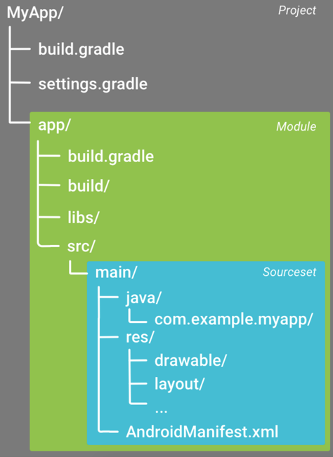

## gradle
Gradle是一种**构建工具**，它抛弃了基于XML的构建脚本，取而代之的是**采用一种基于Groovy的内部领域特定语言**

在Gradle中，有两个基本概念：**项目** 和**任务**。请看以下详解：

 - 项目是指我们的构建产物（比如Jar包）或实施产物（将应用程序部署到生产环境）。一个项目包含一个或多个任务。

 - 任务是指不可分的最小工作单元，执行构建工作（比如编译项目或执行测试）。


**每一个构建都是由一个或多个 projects 构成的**. 一个 project 到底代表什么依赖于你想用 Gradle 做什么. 举个例子, 一个 project 可以代表一个 JAR 或者一个网页应用. 它也可能代表一个发布的 ZIP 压缩包, 这个 ZIP 可能是由许多其他项目的 JARs 构成的. 但是一个 project 不一定非要代表被构建的某个东西. 它可以代表一件**要做的事, 比如部署你的应用.

**每一个 project 是由一个或多个 tasks 构成的**. 一个 task 代表一些更加细化的构建. 可能是编译一些 classes, 创建一个 JAR, 生成 javadoc, 或者生成某个目录的压缩文件.

### 构建任务的例子
可以通过 gradle 命令运行一个 Gradle 构建.

gradle 命令会在当前目录中查找一个叫 **build.gradle** 的文件并执行.

build.gradle 文件为一个构建脚本 (build script), 但是严格来说它是一个构建配置脚本 (build configuration script).以下是一个示例：

```
task hello {
    doLast {
        println 'Hello world!'
    }
}
```

在命令行里, 进入脚本所在的文件夹然后输入 gradle -q hello 来执行构建脚本:

这个构建脚本定义了一个独立的 task, 叫做 hello, 并且加入了一个 action. 当你运行 gradle hello, Gradle 执行叫做 hello 的 task.也就是执行了你所提供的 action. 这个 action 是一个包含了一些 **Groovy** 代码的闭包

**-q参数指定为静默模式，当有很多无效信息输出时，这很有效。**

### Android gradle文件体系

Android工程通过gradle文件管理各项配置，gradle文件利用DSL（Domain Specific Language）语言描述配置，并使用Groovy语言处理编译逻辑。一个典型的Android工程结构如下：



在这里gradle文件分布在几个不同的层级，Project层级以及Module层级。

 - **Project层级的settings.gradle描述的是该Project包含哪些Module**

```
include ':presentation', ':qamodel', ':chatcommonmodule', ':qa', ':unlimit'
```

Project层级的build.gradle描述的是作用于所有Module的配置，包括gradle版本等。

 - Module层级的build.gradle。每个Module下都有一个作用于该Module的build.gradle文件，描述了该Module相关的配置。这些配置主要包括：BuildTypes，ProductFlavors，Dependency，SigningSettings等。
