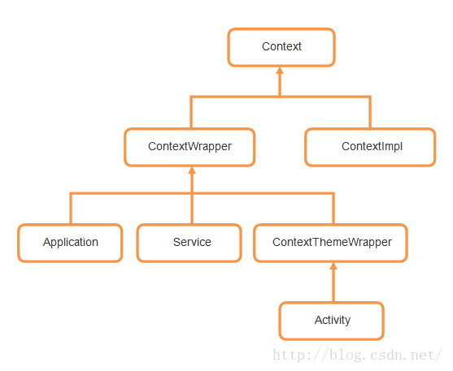

## Application类的使用

### Context类
我们熟悉的Activity、Service、ContentPrivoder等系统组件才能有自己各自的上下文环境，也就是Context。**Context是维持Android应用的核心功能类，是整个Android系统交互的核心**。



如上图

Context的继承结构从图中可以看到，直系子类有两个，一个是ContextWrapper，一个是ContextImpl。那么从名字上就可以看出，ContextWrapper是上下文功能的封装类，而ContextImpl则是上下文功能的实现类。

而ContextWrapper又有三个直接的子类，ContextThemeWrapper、Service和Application。其中，ContextThemeWrapper是一个带主题的封装类，而它有一个直接子类就是Activity。

其实我们就已经可以得出结论了，**Context一共有三种类型，分别是Application、Activity和Service**。

### Application类在项目开发中的使用

首先在项目目录下一个Java类继承Application类，实现`onCreate()`方法。这个类可以做**APP的全局初始化工作**，比如图片加载框架的全局配置信息设置。

``` java
public class AndroidApplication extends Application {

    private static AndroidApplication instance;

    @Override
    public void onCreate() {
        super.onCreate();
        instance = this;
    }

    public static AndroidApplication getInstance(){
        return instance;
    }
}

```

然后千万不要忘了在Android项目的Manifest文件中指定Application的实现类，不然系统会创建一个默认的Application类。

``` xml
<application
        android:name=".AndroidApplication"
        android:allowBackup="true"
        android:icon="@mipmap/ic_launcher"
        android:label="@string/app_name"
        android:supportsRtl="true"
        android:theme="@style/AppTheme">
        <activity android:name=".MainActivity">
            <intent-filter>
                <action android:name="android.intent.action.MAIN"/>

                <category android:name="android.intent.category.LAUNCHER"/>
            </intent-filter>
        </activity>
    </application>

```

name属性中指定。如果是在application包下，则应该指定为`.application.AndroidAplication`

### 注意的点

使用Application类要注意几个点

#### 不能用Application缓存数据
因为Application会因为进入background后内存不足被系统干掉，进入后系统会**重现创建**一个Application类，而导致缓存在Application类里的数据全部初始化而丢失。

#### 错误的获取全局Context对象的方式

``` java
public class AnddroidApplication extends Application {

    private static AnddroidApplication app;

    public static AnddroidApplication getInstance() {
        if (app == null) {
            app = new AnddroidApplication();
        }
        return app;
    }

}

```

上图用单例模式，创建了一个Application实例。但是这是不对的，那是因为Application是**系统组件**，系统组件实例是要**由系统去创建的**，如果我们这里直接创建一个，不过是简单的Java对象而已，不具备任何Context能力，也无法进行任何Context操作。标准的写法已经在上面给出，直接返回实例就可以的了。

#### 在控件的构造方法中获取Context或者做其他视图操作

在ContextWrapper类的源码中，他有一个attachBaseContext()方法，这个方法会将传入的一个Context参数赋值给mBase对象，之后mBase对象就有值了。而我们又知道，所有Context的方法都是调用这个mBase对象的同名方法，那么也就是说如果在mBase对象还没赋值的情况下就去调用Context中的任何一个方法时，就会出现空指针异常

所以不要在控件的构造方法中获取context或者做其他视图操作
