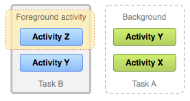

## Activity
作为Android的四大组件之一，Activity占据着非常重要的作用。

应用程序的每一个界面都是一个Activity，所以也有人称其为视图界面。从字面的意思去理解，Activity具有活动的意思，我们在应用中进行的操作都是集中在Activity上面完成

一个应用程序通常由多个activities组成，他们通常是松耦合关系，**通常一个应用程序包含有一个主Activity**，即点击桌面图标的时候首先进入的Activity。

### 创建

``` java
public class MainActivity extends Activity {
    Button mButton;
    @Override
    protected void onCreate(Bundle savedInstanceState) {
        super.onCreate(savedInstanceState);
        setContentView(R.layout.activity_main);
        mButton = (Button) findViewById(R.id.button1);
    }
}

```

通过继承Activity类完成新建Activity，**并且至少需要重写onCreate方法**。在onCreate中，通过`setContentView`为Activity设置布局。

### 注册
Activity必须在AndroidManifest.xml注册，如果没有注册，这个Activity就不能正常运行。

``` xml
<activity
        android:name=".activity.MainActivity"
        android:configChanges="orientation|screenSize"
        android:label="@string/app_name"
        android:launchMode="standard" >
        <intent-filter>
                 <action android:name="myaction2"/>
                 <action android:name="android.intent.action.MAIN" />
                 <category android:name="android.intent.category.LAUNCHER" />
        </intent-filter>
    </activity>

```

如上图。

其中如果在\<intent-filter\>中做出如下指定。

``` xml
<action android:name="android.intent.action.MAIN" />
<category android:name="android.intent.category.LAUNCHER" />
```

**表明这个Activity是主Activity**，在Android系统点击应用图标首先进入主Activity。

### Intent的显隐式启动

显式启动(当前activity中打开)：

``` java
Intent intent = new Intent(this , Activity2.class);
    startActivity(intent);
```

隐式启动:

若Activity2在AndroidManifest.xml文件中配置intent-filter的action和category、data，如下：

``` xml

<intent-filter>
    <action android:name="myaction2"/>
    <category android:name="android.intent.category.DEFAULT"/>
    <category android:name="mycategory" />
</intent-filter>

```

这样添加了intent-filter之后，隐式创建intent时，**必须action和category都对应上，才会启动相应的Activity**。但是也要注意，如果xml中的category标签为android.intent.category.DEFAULT.那就是使用默认值，创建intent时候可以缺省category。


那么可以通过如下方式启动Activity2：

``` java
Intent intent = new Intent("myaction2");
startActivity(intent);
```

### Actvity生命周期


1. onCreate
表示Activity正在被创建，这是第一个执行的方法，在Activity的生命周期中**只执行一次**。在这个方法中做一些初始化工作，比如调用setContentView去加载界面布局，初始化Activity所需要的数据等。后续的方法是onStart

2. onRestart
表示Activity正在重新启动，一般情况下，当前的Activity**从不可见的状态变为可见状态时**，onRestart就会被调用。这种情形一般是用户操作出现所致，比如用户**按Home键**回到桌面或者用户打开了一个新的Activity，这时候Activity就会暂停，接着用户又回到该Activity。后续方法是onStart

3. onStart
表示Activity正在被启动，即将开始。**这个时候Activity是可见的**，但是还没有出现在前台，**不能和用户进行交互**。这个时候可以理解为Activity已经显示出来，但是我们还看不到。后续的方法是onResume

4. onResume
表示Activity可见，并且已经出现在前台并开始活动，能和用户正常进行交互。需要注意的是onStart和onResume的区别，二者都是Activity可见，但是onStart时Activity还在后台，而onResume时Activity到了前台了，这时候可以开启动画或者获取独占性设备的操作如打开相机、获取麦克风等。

5. onPause
表示Activity由前台转到后台，**正常情况下，紧接着onStop就会被调用**。这时仍然可见。如果这时候快速地回到当前Activity，那么onResume会被调用，这类情况属于极端情况，用户操作很难重现这一场景。此时可以做一些存储数据，停止动画等操作，但是注意不能太耗时，如果太耗时会影响到新的Activity的显示。onPause是先执行完，新的Activity的onCreate才会执行。onResume和onPause相对应。

6. onStop
**表示Activity即将停止**，当前的Activity对用户不在可见。可稍微做些重量级的回收操作。后续的操作可能是onRestart或者onDestroy或者一直保持这个状态。
7. onDestory
**表示Activity正在被销毁，是生命周期的最后一个回调，也是只调用一次**。发生的条件是Activity本身已经执行完毕，或者系统资源不足需要回收资源将Activity销毁。


### 启动模式

首先先了解两个概念Task和Back Stack。

#### Task和Back Stack

Task：用于提供给用户操作完成一项任务的Activity集合，注意Activity可以来自不同的App，同一个App的Activity也可能在不同的Task中。

Back Stack(回退栈): 管理着Task中所有的Activity的Stack(栈)， 遵循后进先出原则。
处于Back Stack的最低部的Activity被称作根Activity。

来看下回退栈


如上图一样，当前Activity A启动新的Activity B的时候，B会入栈，处于回退栈最顶端，并获取焦点。A位于栈中，处于stop的状态。如果用户点击后退键或者B调用finish()方法，那么B被出栈，B的onDestroy被调用，整体销毁。A重新获取焦点，进入前台。

**而task仅仅是一组相关的Activity**，可能会同时存在很多组task。

Task里面的Activity严格按照"后进先出"的方式进行管理，他们的顺序**不会发生改变**，跟回退栈有所区别。

如果Task的栈顶Activity处于前台状态，Task也是处于前台状态。
如果Task的栈顶Activity处于后台状态，Task也处于后台状态。

用户在使用应用的时候点击Home键，Task则由前台转入后台，用户之后点击桌面启动图标，再次启动应用，那么此时Task由后台转入前台页面。


Activity有四种不同的启动模式，不同的模式，对应着Activity对象创建与复用策略各有特点，可以在Manifest中配置启动模式

``` xml
<activity android:name="cn.iterlog.xmimagepicker.videoplay.VideoActivity"
    android:theme="@style/ImageTheme"
    android:launchMode="singleInstance"
    >
    <intent-filter>
        <action android:name="android.intent.action.MAIN" />
        <category android:name="android.intent.category.LAUNCHER" />
    </intent-filter>
</activity>

```

#### 四种启动模式

Android提供了四种启动模式


##### standard

系统默认模式，每次启动一个Activity都会重新创建一个新的实例，而不管Activity是否已经创建了一个实例。

##### singleTop

栈顶复用模式，启动时，**系统会检测当前栈顶Activity是不是要启动的Activity**，如果是则不需要创建新的Activity而直接引用这个Activity，如果不是那么创建新的Activity。系统会回调onNewIntent的方法。

##### singleTask

栈内复用模式，**如果栈内已经存在了一个Activity的实例，那么Activity不会被重新创建**，同时他的onNewIntent方法会被回调，并将该Activity实例置于栈顶，原先处于该实例顶部的Activity实例会被出栈销毁。如果是其他程序启动Activity，那么它会重新创建一个任务栈。

##### singleInstance

单实例模式，是singleTask的加强版，具有singleTask所有特点，并且此种模式下**Activity只有一个实例，并且只能单独的存在一个任务栈中**。

也就是说，这个Activity实例只有一个，而且是在一个独有的任务栈中单独管理的。每次启动这个Actvity时，都会调用这个独有的任务栈，而不是处于不同应用自己的任务栈中。

那么用途是什么呢？这么做，**可以让不同的应用都共享这个Activity实例**,因为调用的都是这个独有的任务栈，里面也只有这一个Activity。
