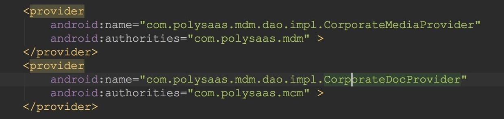

## ContentProvider
内容提供器(ContentProvider)主要用于不同的程序之间实现数据共享的功能，并保证被访数据的安全性。

使用内容提供器是Android是**实现跨程序共享数据的标准方式**。


如图，内容提供者可以让**内容集中**，必要时可以有多个不同的应用程序来访问。内容提供者的行为和数据库很像。你可以查询，编辑它的内容，使用 `insert()`， `update()`， `delete()` 和 `query()` 来添加或者删除内容。多数情况下数据被存储在 SQLite 数据库。

Android系统为了让我们更好的**对外**暴露数据，提供了统一的接口，所以定义了抽象类ContentProvider，因此，如果我们想**对外提供数据**，我们需要继承ContentProvider

``` java
public class MyApplication extends  ContentProvider {

}
```

继承这个抽象类需要实现一系列标准的 API，**以便其他的应用程序来执行事务**。

也就是说我们想让外部应用访问我们内部数据的时候，就需要定义ContentProvider并且实现一系列方法才行，这样可以方便别的程序访问。

需要实现的方法如下：

 - **public boolean onCreate()** 在创建ContentProvider时调用

 - **public Cursor query(Uri, String\[\], String, String\[\], String)** 用于查询指定Uri的ContentProvider，返回一个Cursor

 - **public Uri insert(Uri, ContentValues):** 用于添加数据到指定Uri的ContentProvider中，(外部应用向ContentProvider中添加数据)

 - **public int update(Uri, ContentValues, String, String[])方法**用于更新指定Uri的ContentProvider中的数据

 - **public int delete(Uri, String, String\[\])方法**用于从指定Uri的ContentProvider中删除数据

 - **public String getType(Uri)** 用于返回指定的Uri中的数据的MIME类型

除了程序中实现了ContentProvider类之外，我们还需要在AndroidManifest.xml使用**对该ContentProvider进行注册**，为了能让其他应用**找到**该ContentProvider ，ContentProvider采用了authorities（主机名/域名）对它进行唯一标识，你可以把ContentProvider看作是一个网站（想想，网站也是提供数据者），authorities 就是他的域名：

如图：



### 内容URI
要查询内容提供者，你需要以如下格式的URI的形式来指定查询字符串：

\<prefix\>://\<authority\>/\<data_type\>/\<id\>

以下是URI中各部分的具体说明：

prefix-前缀：**一直被设置为content://**

authority-授权：**指定内容提供者的名称**，例如联系人，浏览器等。第三方的内容提供者可以是全名，如：cn.programmer.statusprovider

data_type	数据类型：这个表明这个特殊的内容提供者中的数据的类型。例如：你要通过内容提供者Contacts来获取所有的通讯录，数据路径是people，那么URI将是下面这样：content://contacts/people

id	这个指定特定的请求记录。例如：你在内容提供者Contacts中查找联系人的ID号为5，那么URI看起来是这样：content://contacts/people/5

### 通过ContentResolver获取数据

通过Context类获取ContentResolver

直接获取

``` java
ContentResolver resolver =  getContentResolver();
```

ContentResolver常用操作

``` java
//查询：
public final Cursor query(Uri uri, String[] projection,
           String selection, String[] selectionArgs, String sortOrder);
//新增
public final Uri insert(Uri url, ContentValues values)
//更新
public final int update(Uri uri, ContentValues values, String where,
             String[] selectionArgs)
//删除
public final int delete(Uri url, String where, String[] selectionArgs)
```

以上操作**实际是通过Uri来匹配ContentProvider**， 再由ContentProvider来进行具体操作的。
       操作的参数和操作sqlite各函数的参数意义是一样的。
