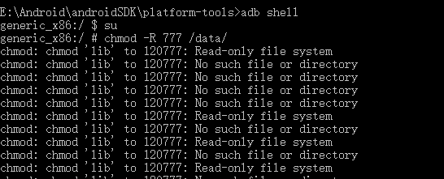
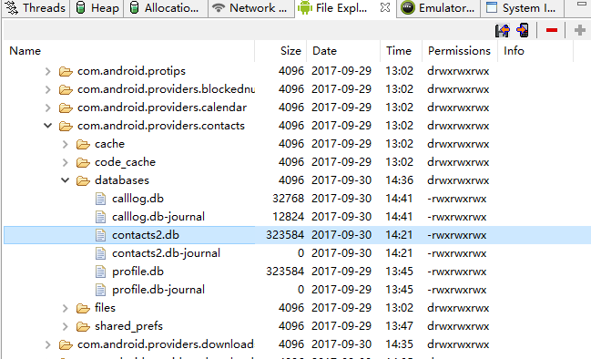
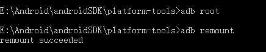

## 获取手机联系人
智能设备的联系人存储在SQLite数据库之中，名称为Contacts2


### AS上查看并导出contacts2.db

用Android的android monitor中的file explorer可以找到。在data/data/com.android.provider.contacts/database/contacts2中

但是在这之前，我们发现as的模拟器没有权限打开/data/目录，所以我们要用adb做一些前期工作。



工作也就上图这么轻松，我们去到sdk的platform-tools目录，运行adb shell命令，然后运行su命令获取root权限，然后chmod基于data完全的权限，这下就可以在as的ddms中看到这些数据库数据了。




我们很轻松就能找到这个数据库。

但是我们还是差一步，我们还不能导出，必须修改模拟器权限。



我们还要输入以上两个命令才能成功导出数据库文件。root命令获取权限，remount重新装载系统。


现在我们导出成功了。

我们用db browser for sqlite打开contacts2.db数据库。

### 通过ContentProvider获取联系人数据

官方都通讯录应用已经封装了ContentProvider，允许我们自己的应用调用。

所以我们便可以直接通过ContentResolver来获取通讯人的信息。关于ContentResolver可以参见相关笔记

注意以下代码

``` java

Cursor cursor = AndroidApplication.getInstance().getContentResolver().query(ContactsContract.CommonDataKinds.Phone.CONTENT_URI,
                   null, null, null, null);
if (cursor != null) {
  while (cursor.moveToNext()) {
        String displayName = cursor.getString(
        cursor.getColumnIndex(ContactsContract.CommonDataKinds.Phone.DISPLAY_NAME)
                   );

        String number = cursor.getString(cursor.getColumnIndex(
                           ContactsContract.CommonDataKinds.Phone.NUMBER
                   ));
  }

```

简而言之，就是先调用Context里的getContentResolver方法获取CotentResolver，然后调用它的query方法。

本来query方法需要封装一个Uri，但是Android系统已经帮我们封装好了，直接调用`Contracts.CommonDataKinds.Phone.CONTENT_URI`即可。同理，当我们拿到cursor指针，需要获取里面具体字段的时候，我们getColumnIndex时候，要传入具体`ContactsContract.CommonDataKinds.Phone.NUMBER`常量。如上代码，我们便可以获得通讯录里的人名和号码了。
