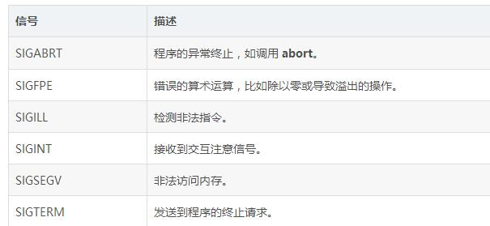

## 信号处理

信号是由操作系统传给进程的中断，会提早终止一个程序。在 UNIX、LINUX、Mac OS X 或 Windows 系统上，可以通过按 Ctrl+C 产生中断。

有些信号不能被程序捕获，但是下表所列信号可以在程序中捕获，并可以基于信号采取适当的动作。这些信号是定义在 C++ **头文件 \<csignal\>** 中。



比较常用的SIGINT就是程序终止(interrupt)信号, 在用户键入INTR字符(通常是Ctrl-C)时发出，用于通知前台进程组终止进程

### signal() 函数

C++ 信号处理库提供了 signal 函数，用来捕获突发事件。以下是 signal() 函数的语法：

``` c++
void (*signal (int sig, void (*func)(int)))(int);
```

这个函数接收两个参数：第一个参数是一个整数，代表了信号的编号；第二个参数是一个指向信号处理函数的指针。

简单来说就是注册信号和对应的处理函数，一旦进程收到信号，就交给相应的处理函数进行处理。

### raise函数
可以使用函数 raise() 生成信号，该函数带有一个整数信号编号作为参数，语法如下：

``` c++
int raise (signal sig);
```

在这里，sig 是要发送的信号的编号，这些信号包括：SIGINT、SIGABRT、SIGFPE、SIGILL、SIGSEGV、SIGTERM、SIGHUP
