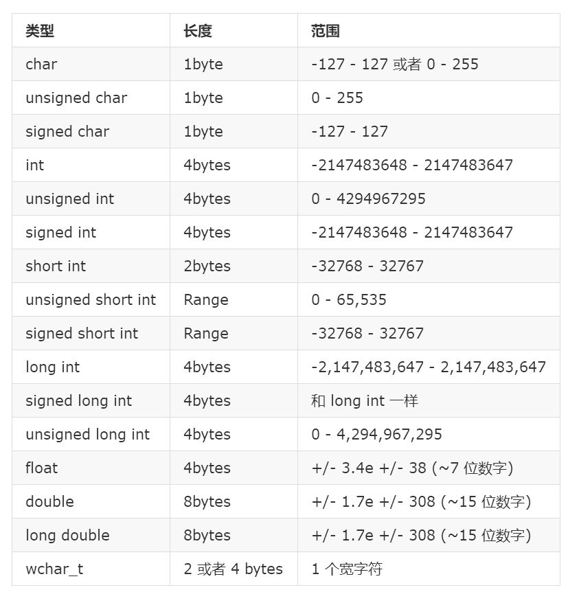

## 数据类型

**机器字长**：是指计算机进行一次整数运算所能处理的二进制数据的位数（整数运算即定点整数运算）。机器字长也就是运算器进行定点数运算的字长，通常也是**CPU内部数据通路的宽度**。现在一般为32位即4个字节，也有64位和16位的。

算术类型的存储空间按照机器而定。一般，**short类型为半个机器字长，int为一个机器字长，long为1或2个机器字长**，float为一个机器字长，double为两个字，long double用3或4个字长。**C++标准规定的是每个算术类型的最小存储空间，但其并不阻止编译器用更大的存储空间**。如果要保证移植性，尽量用__int16 __int32 __int64吧，或者自己typedef int INT32一下。

C++ 给程序员提供了一系列丰富的内置类型以及用户定义的数据类型。下表列出了七个基本的 C++ 数据类型:

上面的几个基本类型可以使用一个或多个如下的修饰符这来修饰:

 - signed
 - unsigned
 - short
 - long

