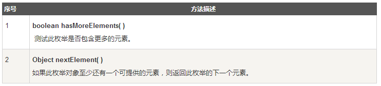

## Java Enumeration接口
Enumeration接口中定义了一些方法，通过这些方法可以枚举（一次获得一个）对象集合中的元素。

**这种传统接口已被迭代器取代**，虽然Enumeration 还未被遗弃，但在现代代码中已经被很少使用了。**尽管如此，它还是使用在诸如Vector和Properties这些传统类所定义的方法中**，除此之外，还用在一些API类，并且在应用程序中也广泛被使用。

这个接口中的常用方法有2个：



样例代码
``` java
while (days.hasMoreElements()){
   System.out.println(days.nextElement());
}
```

用来枚举集合里的元素。
