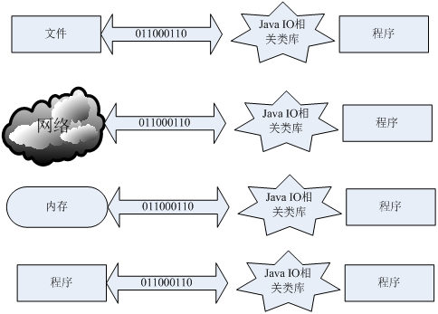
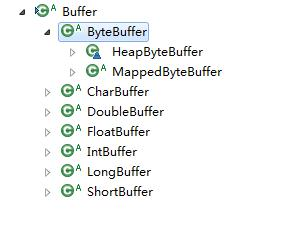

## IO与NIO
IO是Java及众多编程语言很重要的一块，同时很多程序的瓶颈和耗时操作也都在IO这块。所以能够很好的解决IO问题对提高程序性能有很大的帮助。Java对IO的支持是个不断的演变过程，经过了很多的优化，直到JDK1.4以后，才趋于稳定，在JDK1.4中，加入了nio类，解决了很多性能问题。

### 流
流是一系列**有顺序的字节的集合**，是网络传输的载体，流可以包装成基本数据类型或对象，流有输入和输出，输入时是从流从数据源流向程序输出时是流从程序传向数据源.



IO流的流向就如同上图。

### java I/O

我们先来了解java.io.

Java 的 I/O 操作类在包 java.io 下，大概有将近 80 个类.

这些类大概可以分成四组

1. 基于字节操作的 I/O 接口：InputStream 和 OutputStream
2. 基于字符操作的 I/O 接口：Writer 和 Reader
3. 基于磁盘操作的 I/O 接口：File
4. 基于网络操作的 I/O 接口：Socket

#### 基于字节的 I/O 操作接口
基于字节的 I/O 操作接口输入和输出分别是：InputStream 和 OutputStream，InputStream 输入流的类继承层次如下图所示：


输入流根据数据类型和操作方式又被划分成若干个子类，每个子类分别处理不同操作类型，OutputStream 输出流的类层次结构也是类似，如下图所示：


详细类的操作方法，可以查阅JDK手册。

#### 基于字符的 I/O 操作接口
因为我们的程序中通常操作的数据都是以字符形式，为了操作方便当然要提供一个直接写字符的 I/O 接口，如此而已。我们知道字符到字节必须要经过编码转换，而这个编码又非常耗时，而且还会经常出现乱码问题，所以 I/O 的编码问题经常是让人头疼的问题。

下图是写字符的 I/O 操作接口涉及到的类，Writer 类提供了一个抽象方法 write(char cbuf[], int off, int len) 由子类去实现。


下图Reader 类层次结构


读字符的操作接口中也是 int read(char cbuf[], int off, int len)，返回读到的 n 个字节数，不管是 Writer 还是 Reader 类它们都只定义了读取或写入的数据字符的方式，也就是怎么写或读，但是并没有规定数据要写到哪去

#### 磁盘 I/O 工作机制
一个关键问题就是数据写到何处，其中一个主要方式就是将数据持久化到物理磁盘，下面将介绍如何将数据持久化到物理磁盘的过程。

数据在磁盘的唯一最小描述就是文件，也就是说上层应用程序只能通过文件来操作磁盘上的数据，文件也是操作系统和磁盘驱动器交互的一个最小单元。

当你通过指定一个路径描述符时，它就会返回一个代表这个路径相关联的一个虚拟对象，这个可能是一个真实存在的文件或者是一个包含多个文件的目录。为何要这样设计？因为大部分情况下，我们并不关心这个文件是否真的存在，而是关心这个文件到底如何操作。

何时真正会要检查一个文件存不存？就是在真正要读取这个文件时，例如 FileInputStream 类都是操作一个文件的接口，注意到在创建一个 FileInputStream 对象时，会创建一个 FileDescriptor 对象，其实这个对象就是真正代表一个存在的文件对象的描述，当我们在操作一个文件对象时可以通过 getFD() 方法获取真正操作的与底层操作系统关联的文件描述。例如可以调用 FileDescriptor.sync() 方法将操作系统缓存中的数据强制刷新到物理磁盘中。


当传入一个文件路径，将会根据这个路径创建一个 File 对象来标识这个文件，然后将会根据这个 File 对象创建真正读取文件的操作对象，这时将会真正创建一个关联真实存在的磁盘文件的文件描述符 FileDescriptor，通过这个对象可以直接控制这个磁盘文件。由于我们需要读取的是字符格式，所以需要 StreamDecoder 类将 byte 解码为 char 格式，至于如何从磁盘驱动器上读取一段数据，由操作系统帮我们完成。至于操作系统是如何将数据持久化到磁盘以及如何建立数据结构需要根据当前操作系统使用何种文件系统来回答

#### Java Socket 的工作机制概要
*网络上的两个程序通过一个双向的通信连接实现数据的交换，这个连接的一端称为一个socket*---百度百科。

简单来说，socket 是对底层网络通信的一层抽象，目的是:**让程序员可以像文件那样操作网络上发送和接收的数据**。

socket起源于Unix，而Unix/Linux基本哲学之一就是“一切皆文件”，都可以用“打开open –> 读写write/read –> 关闭close”模式来操作。

zwlj：socket是操作系统提供的一组程序接口，它把复杂的TCP/IP协议族隐藏在Socket接口(层)后面，对用户来说，一组简单的接口就是全部，让Socket去组织数据，以符合指定的协议。


所以说，从这个意义上来理解，socket就如同插口(插座一般)，电器通过电线插在插座上就可以使用，而插座背后的电是如何运作传输都不需要知道。

不过，实际上，Socket跟TCP/IP协议没有必然的联系。Socket编程接口在设计的时候，就希望也能适应其他的网络协议。也就是说，这一层抽象隐藏底层的网络细节，但是这个底层网络未必是TCP/IP协议簇。然而最常用的确实是TCP/IP 的流套接字。

在 TCP/IP 协议中，有两部分信息用来确定一个指定的程序：互联网地址和端口号：其中互联网地址由 IP 协议使用，而附加的端口地址信息则由传输协议（TCP 或 UDP 协议）对其进行解析。

总之，**Socket是对TCP/IP协议的封装，Socket本身并不是协议，而是一个调用接口（API）**

java平台也提供了一组socket接口用以编程，在java.net包中。详细内容将会到相关笔记上再做诠释。

当连接已经建立成功，服务端和客户端都会拥有一个 Socket 实例，每个 Socket 实例都有一个 InputStream 和 OutputStream，**正是通过这两个对象来交换数据**。同时我们也知道网络 I/O 都是以字节流传输的。当 Socket 对象创建时，操作系统将会为 InputStream 和 OutputStream 分别分配一定大小的缓冲区，数据的写入和读取都是通过这个缓存区完成的。写入端将数据写到 OutputStream 对应的 SendQ 队列中，当队列填满时，数据将被发送到另一端 InputStream 的 RecvQ 队列中，如果这时 RecvQ 已经满了，那么 OutputStream 的 write 方法将会阻塞直到 RecvQ 队列有足够的空间容纳 SendQ 发送的数据。值得特别注意的是，这个缓存区的大小以及写入端的速度和读取端的速度非常影响这个连接的数据传输效率，由于可能会发生阻塞，所以网络 I/O 与磁盘 I/O 在数据的写入和读取还要有一个协调的过程。

### java NIO

#### 背景
BIO 即阻塞(blocking) I/O，不管是磁盘 I/O 还是网络 I/O，数据在写入 OutputStream 或者从 InputStream 读取时都有可能会阻塞。一旦有线程阻塞将会失去 CPU 的使用权，这在当前的大规模访问量和有性能要求情况下是不能接受的。


当前一些需要大量 HTTP 长连接的情况，像淘宝现在使用的 Web 旺旺项目，服务端需要同时保持几百万的 HTTP 连接，但是并不是每时每刻这些连接都在传输数据，这种情况下不可能同时创建这么多线程来保持连接。

zwlj：**也就是说，多线程或者多进程的技术确实是一个办法，但这个办法不够好**


*有关于网络IO的5种相关模型，可以去操作系统的笔记中去寻找。*

这些情况都说明，我们需要另外一种新的 I/O 操作方式。java.nio（java non-blocking IO），是jdk1.4 及以上版本里提供的新api（New IO） ，为所有的原始类型（boolean类型除外）提供缓存支持。

它引入了一种基于通道和缓冲区的 I/O 方式，它可以使用 Native 函数库直接分配堆外内存，然后通过一个存储在 Java 堆的 DirectByteBuffer 对象作为这块内存的引用进行操作，避免了在 Java 堆和 Native 堆中来回复制数据。


在操作系统知识中，我们是知道了5种基本的网络IO模型的。


以socket.read()为例子：

传统的BIO里面socket.read()，如果TCP RecvBuffer里没有数据，函数会一直阻塞，直到收到数据，返回读到的数据。

对于NIO，如果TCP RecvBuffer有数据，就把数据从网卡读到内存，并且返回给用户；反之则直接返回0，永远不会阻塞。

最新的AIO(Async I/O)里面会更进一步：不但等待就绪是非阻塞的，就连数据从网卡到内存的过程也是异步的。

换句话说，BIO里用户最关心“我要读”，NIO里用户最关心"我可以读了"，在AIO模型里用户更需要关注的是“读完了”。

NIO一个重要的特点是：socket主要的读、写、注册和接收函数，在等待就绪阶段都是非阻塞的(通过轮询完成)，真正的I/O操作是同步阻塞的（消耗CPU但性能非常高）。

所以说，NIO中，一个线程请求写入一些数据到某通道，不需要等待它完全写入，这个线程同时可以去做别的事情。 线程通常将非阻塞IO的空闲时间用于**在其它通道上执行IO操作**，所以一个单独的线程现在可以管理多个输入和输出通道（channel）。如若一个线程可以管理好几个通道IO，那么就不需要开大量线程来解决问题了。

#### 概述
java NIO主要有三大核心部分：**Channel(通道)，Buffer(缓冲区), Selector**。传统IO基于字节流和字符流进行操作，而NIO基于Channel和Buffer(缓冲区)进行操作，数据总是从通道读取到缓冲区中，或者从缓冲区写入到通道中。


NIO和传统IO之间第一个最大的区别是，IO是面向流的，NIO是面向缓冲区的。 Java IO面向流意味着每次从流中读一个或多个字节，直至读取所有字节，它们没有被缓存在任何地方。此外，它不能前后移动流中的数据。

zwlj：传统的IO操作，是直接从内核区读取流数据到虚拟机程序InputStream里的，而NIO，则用了类似用户区缓存技术，开辟了一个Buffer，然后通过通道读取。


#### Buffer
Buffer是一个对象，它包含一些要写入或读出的数据。在NIO中，数据是放入buffer对象的，而在IO中，数据是直接写入或者读到Stream对象的。应用程序不能直接对 Channel 进行读写操作，而必须通过 Buffer 来进行，即 Channel 是通过 Buffer 来读写数据的。

在NIO中，所有的数据都是用Buffer处理的，它是NIO读写数据的中转池。Buffer实质上是一个数组，通常是一个字节数据，但也可以是其他类型的数组。但一个缓冲区不仅仅是一个数组，重要的是它提供了对数据的结构化访问，而且还可以跟踪系统的读写进程。

使用 Buffer 读写数据一般遵循以下四个步骤：

1. 写入数据到 Buffer；
2. 调用 flip() 方法；
3. 从 Buffer 中读取数据；
4. 调用 clear() 方法或者 compact() 方法。

当向 Buffer 写入数据时，Buffer 会记录下写了多少数据。一旦要读取数据，需要通过 flip() 方法将 Buffer 从写模式切换到读模式。在读模式下，可以读取之前写入到 Buffer 的所有数据。

一旦读完了所有的数据，就需要清空缓冲区，让它可以再次被写入。有两种方式能清空缓冲区：调用 clear() 或 compact() 方法。clear() 方法会清空整个缓冲区。compact() 方法只会清除已经读过的数据。任何未读的数据都被移到缓冲区的起始处，新写入的数据将放到缓冲区未读数据的后面。

Buffer有以下类型



buffer缓冲区实质上就是一块内存，用于写入数据，也供后续再次读取数据。这块内存被NIO Buffer管理，并提供一系列的方法用于更简单的操作这块内存。

一个Buffer有三个属性是必须掌握的，分别是：

 - capacity容量
 - position位置
 - limit限制

##### capacity
作为一块内存，buffer有一个固定的大小，叫做capacity容量。也就是最多只能写入容量值得字节，整形等数据。一旦buffer写满了就需要清空已读数据以便下次继续写入新的数据。

###### position
当写入数据到Buffer的时候需要中一个确定的位置开始，默认初始化时这个位置position为0，一旦写入了数据比如一个字节，整形数据，那么position的值就会指向数据之后的一个单元，position最大可以到capacity-1.

当从Buffer读取数据时，也需要从一个确定的位置开始。**buffer从写入模式变为读取模式时，position会归零，每次读取后，position向后移动**。

##### limit
在写模式，**limit的含义是我们所能写入的最大数据量**。它等同于buffer的容量。

一旦切换到读模式，limit则代表我们所能读取的最大数据量，他的值等同于写模式下position的位置。

数据读取的上限时buffer中已有的数据，也就是limit的位置（原position所指的位置）。**所以说读模式下，limit就是最大可读的数据量。**

 position和limit的具体含义取决于当前buffer的模式。capacity在两种模式下都表示容量。

 下面有张示例图，描诉了不同模式下position和limit的含义：


#### Channel
Channel是对原IO中流的模拟，任何来源和目的数据都必须通过一个Channel对象。

Channel是一个对象，可以通过它读取和写入数据。可以把它看做IO中的流。但是它和流相比还有一些不同：

 - Channel是双向的，既可以读又可以写，而流是单向的
 - Channel可以进行异步的读写
 - 对Channel的读写必须通过buffer对象

所有数据都通过Buffer对象处理，所以，您永远不会将字节直接写入到Channel中，相反，您是将数据写入到Buffer中；同样，您也不会从Channel中读取字节，而是将数据从Channel读入Buffer，再从Buffer获取这个字节。

在Java NIO中Channel主要有如下几种类型：

 - FileChannel：从文件读取数据的
 - DatagramChannel：读写UDP网络协议数据
 - SocketChannel：读写TCP网络协议数据
 - ServerSocketChannel：可以监听TCP连接


##### 例子

``` java
RandomAccessFile aFile = new RandomAccessFile("data/nio-data.txt", "rw");
  FileChannel inChannel = aFile.getChannel();

  ByteBuffer buf = ByteBuffer.allocate(48);

  int bytesRead = inChannel.read(buf);
  while (bytesRead != -1) {

    System.out.println("Read " + bytesRead);
    buf.flip();

    while(buf.hasRemaining()){
        System.out.print((char) buf.get());
    }

    buf.clear();
    bytesRead = inChannel.read(buf);
  }
  aFile.close();
```

上面代码，先是创建一个随机读取文件，并创建出通道。

然后通道的read方法把文件数据读入到缓冲区中。然后while语句里则是分批次读出buffer里的内容，每次读完一次以后都要进行flip模式反转，然后读出来以后清空这一批内容，继续read下一批文件数据，直到整个文件的内容被读完。
