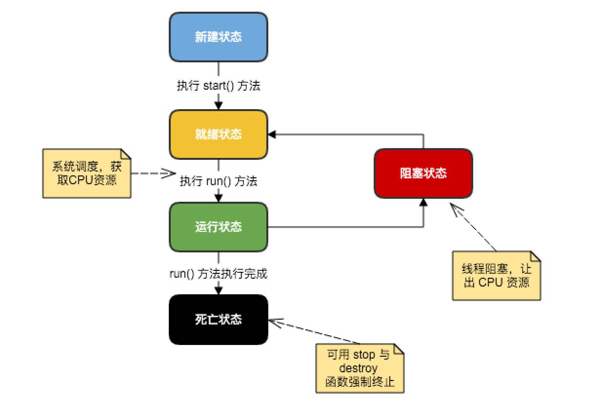

# java一些多进程知识点回顾
## 进程与线程

进程有一个包含了程序内容和数据的地址空间，以及其它的资源，包括打开的文件、子进程和信号处理器等。不同进程的地址空间是互相隔离的。而线程表示的是程序的执行流程，是CPU调度的基本单位。线程有自己的程序计数器、寄存器、栈和帧等。引入线程的动机在于操作系统中阻塞式I/O的存在。当一个线程所执行的I/O被阻塞的时候，同一进程中的其它线程可以使用CPU来进行计算。这样的话，就提高了应用的执行效率。线程的概念在主流的操作系统和编程语言中都得到了支持。

## 线程的生命周期

一个线程存在不同的生命周期。如下图

 - 新建状态
>使用 new 关键字和 Thread 类或其子类建立一个线程对象后，该线程对象就处于新建状态。它保持这个状态直到程序 start() 这个线程。

 - 就绪状态
>当线程对象调用了start()方法之后，该线程就进入就绪状态。就绪状态的线程处于就绪队列中，要等待JVM里线程调度器的调度。

 - 运行状态
>如果就绪状态的线程获取 CPU 资源，就可以执行 run()，此时线程便处于运行状态。处于运行状态的线程最为复杂，它可以变为阻塞状态、就绪状态和死亡状态。

 - 阻塞状态
>如果一个线程执行了sleep（睡眠）、suspend（挂起）等方法，失去所占用资源之后，该线程就从运行状态进入阻塞状态。在睡眠时间已到或获得设备资源后可以重新进入就绪状态。

 - 死亡状态
>一个运行状态的线程完成任务或者其他终止条件发生时，该线程就切换到终止状态。

## java线程同步

>在某个Java对象上面调用wait方法的时候，首先要检查当前线程是否获取到了这个对象上的锁。如果没有的话，就会直接抛出java.lang.IllegalMonitorStateException异常。如果有锁的话，就把当前线程添加到对象的等待集合中，并释放其所拥有的锁。当前线程被阻塞，无法继续执行，直到被从对象的等待集合中移除。引起某个线程从对象的等待集合中移除的原因有很多：对象上的notify方法被调用时，该线程被选中；对象上的notifyAll方法被调用；线程被中断；对于有超时限制的wait操作，当超过时间限制时；JVM内部实现在非正常情况下的操作。

## volatile的用法

>Java语言提供了一种稍弱的同步机制，即volatile变量，用来确保将变量的更新操作通知到其它线程。当把变量声明为volatile类型后，编译器与运行时都会注意到这个变量是共享的，因此不会将该变量上的操作与其它内存操作一起重排序。Volatile变量不会被缓存在寄存器或者其它对处理器不可见的地方，因此在读取volatile类型的变量时，总会返回最新写入的值。

其实也就是说，用volatile修饰的变量是不稳定的，经常要变动的，,编译器为了加快程序运行的速度,对一些变量的写操作会先在寄存器或者是CPU缓存上进行,最后才写入内存，volatile关键字保证不会被各种缓存机制优化，所以每次都可以直接去内存当中去读取出它的值。但是要注意，这就不能保证原子性了，只是提供了内存可见性。

### 原子性
原子是世界上的最小单位，具有不可分割性。比如 a=0；（a非long和double类型） 这个操作是不可分割的，那么我们说这个操作时原子操作。再比如：a++； 这个操作实际是a = a + 1；是可分割的，所以他不是一个原子操作。非原子操作都会存在线程安全问题，需要我们使用同步技术（sychronized）来让它变成一个原子操作。一个操作是原子操作，那么我们称它具有原子性。Java的concurrent包下提供了一些原子类，我们可以通过阅读API来了解这些原子类的用法。比如：AtomicInteger、AtomicLong、AtomicReference等。

>不管这个方法或者代码块被多少线程访问，方法和代码块中的语句只能作为一个整体执行，即当一个线程访问一个同步方法时，只有当方法执行完时，其他线程才能执行该方法。简单讲，就是一个线程一个线程来，而且必须全部执行完同步方法或代码块中的语句。

### 内存可见性
>这指的是一个线程在同步方法或者代码块中对共享变量做的任何改变，对随后的其他线程都是可见的

因此可见，我们在对一个变量内存可见性高的时候应该使用这个关键字，经常需要读取出最新的值从内存中。并且需要注意的是，这个关键字**不能保证原子性（如++操作）**

## 线程池的用法
我们使用线程的时候就去创建一个线程，这样实现起来非常简便，但是就会有一个问题：如果并发的线程数量很多，并且每个线程都是执行一个时间很短的任务就结束了，这样频繁创建线程就会大大降低系统的效率，因为频繁创建线程和销毁线程需要时间。

## Executor 框架与线程池
在 Java 5 之后，并发编程引入了一堆新的启动、调度和管理线程的API。Executor 框架便是 Java 5 中引入的，其内部使用了线程池机制，它在 java.util.cocurrent 包下，通过该框架来控制线程的启动、执行和关闭，可以简化并发编程的操作。因此，在 Java 5之后，通过 Executor 来启动线程比使用 Thread 的 start 方法更好，除了更易管理，效率更好（用线程池实现，节约开销）外，还有关键的一点：有助于避免 this 逃逸问题——如果我们在构造器中启动一个线程，因为另一个任务可能会在构造器结束之前开始执行，此时可能会访问到初始化了一半的对象用 Executor 在构造器中。

Java里面线程池的顶级接口是Executor，但是严格意义上讲Executor并不是一个线程池，而只是一个执行线程的工具。真正的线程池接口是ExecutorService。
