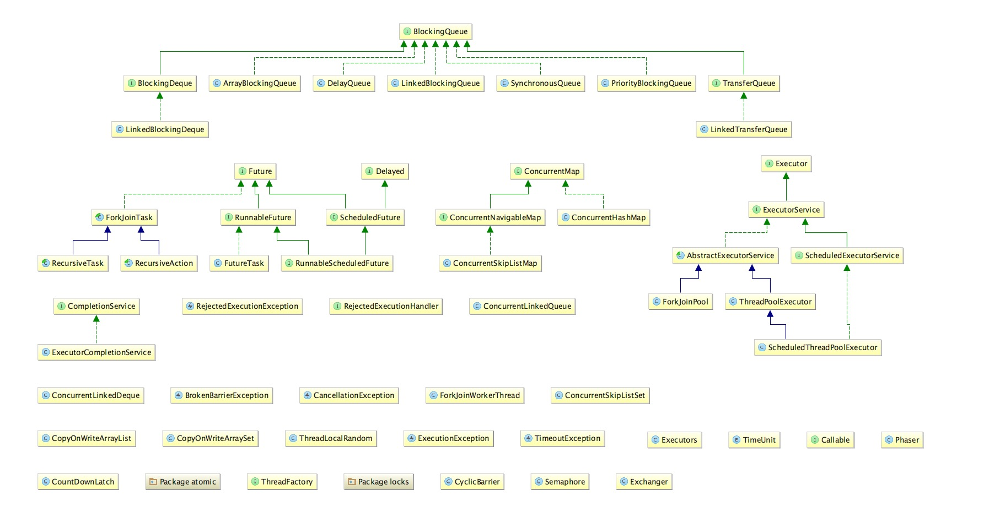

## JUC包基础内容概述

Concurrent Programming in Java 的作者 Doug Lea 编写了一个极其优秀的、免费的并发实用程序包，它包括并发应用程序的锁、互斥、队列、线程池、轻量级任务、有效的并发集合、原子的算术操作和其它基本构件。我们一般称这个包为 J.U.C(java.util.concurrent)。

这个包，里面具体大概有3个package。
观察它的源码结构的话

可知道package下，有atomic包，有locks包，还有一些杂七杂八的类和接口。

把这些杂七杂八的类按照继承结构划分成几个区块，可以得到下面这样的结构图。

总之便是分成了Executor一块体系，Future一块体系，BlockingQueue一块体系等等。

下图是juc包的功能结构，也就是把JUC包按照功能分成以下几个部分。

 - Atomic : AtomicInteger
 - Locks : Lock, Condition, ReadWriteLock
 - Collections : Queue, ConcurrentMap
 - Executer : Future, Callable, Executor
 - Tools : CountDownLatch, CyclicBarrier, Semaphore

其他一些概念可去笔记：java并发编程概况 里查阅
