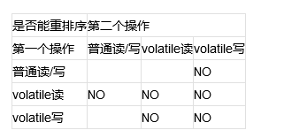

## volatile原理

在CPU实现原子操作的笔记中，我们对CPU如何保证原子性有了一定了解。那么Java环境下的原子性呢？

先回顾一下几个概念。

### 原子性
原子性：即一个操作或者多个操作 要么全部执行并且执行的过程不会被任何因素打断，要么就都不执行。

``` java
i = 0;            ---1
j = i ;            ---2
i++;            ---3
i = j + 1;    ---4
```

上面四个操作，有哪个几个是原子操作，那几个不是？如果不是很理解，可能会认为都是原子性操作，其实只有1才是原子操作，其余均不是。

1—在Java中，对基本数据类型的变量和赋值操作都是原子性操作；
2—包含了两个操作：读取i，将i值赋值给j
3—包含了三个操作：读取i值、i + 1 、将+1结果赋值给i；
4—同三一样

在单线程环境下我们可以认为整个步骤都是原子性操作，但是在多线程环境下则不同，Java只保证了基本数据类型的变量和赋值操作才是原子性的（注：**在32位的JDK环境下，对64位数据的读取不是原子性操作*，如long、double**）。要想在多线程环境下保证原子性，则可以通过锁、synchronized来确保。

所以volatile在多线程下其实不能保证原子性。
### 可见性
可见性是指当多个线程访问同一个变量时，一个线程修改了这个变量的值，其他线程能够立即看得到修改的值。

在上面已经分析了，在多线程环境下，一个线程对共享变量的操作对其他线程是不可见的。

**Java提供了volatile来保证可见性**。

当一个变量被volatile修饰后，表示着**线程本地内存无效**，当一个线程修改共享变量后他会立即被更新到主内存中，当其他线程读取共享变量时，它会直接从主内存中读取(可见java内存模型笔记)。

当然，synchronize和锁都可以保证可见性。

### 有序性
有序性：即程序执行的顺序按照代码的先后顺序执行。

在Java内存模型中，为了效率是允许编译器和处理器对指令进行重排序，当然重排序它不会影响单线程的运行结果，但是对多线程会有影响。重排序笔记可见*基础知识*。

Java提供volatile来保证一定的有序性。最著名的例子就是单例模式里面的DCL（双重检查锁）。

### volatile
一旦一个共享变量（类的成员变量、类的静态成员变量）被volatile修饰之后，那么就具备了两层语义：

1. 保证了不同线程对这个变量进行操作时的可见性，即一个线程修改了某个变量的值，这新值对其他线程来说是立即可见的。

2. 禁止进行指令重排序。

那么实际机制呢？

首先我们已经了解了CPU维持原子性的原理，那么接下来看看java的内存工作模型。

工作内存Work Memory**其实就是对CPU寄存器和高速缓存的抽象**，或者说每个线程的工作内存也可以简单理解为CPU寄存器和高速缓存。

理解这一点非常关键，不能把这个内存工作模型的抽象和JVM内存区域划分搞混。

所以我们就可以直接从CPU指令层面理解volatile是如何工作的了，在x86处理器下通过工具获取JIT编译器生成的汇编指令来看看对Volatile进行写操作CPU会做什么事情。

<table cellspacing="0" cellpadding="0" border="1">
    <tbody>
        <tr>
            <td width="90" valign="top">
            <p>Java代码：</p>
            </td>
            <td width="463" valign="top">
            <p>instance = new Singleton();//instance是volatile变量</p>
            </td>
        </tr>
        <tr>
            <td width="90" valign="top">
            <p>汇编代码：</p>
            </td>
            <td width="463" valign="top">
            <p>0x01a3de1d: movb $0x0,0x1104800(%esi);</p>
            <p>0x01a3de24: <b>lock</b> addl $0x0,(%esp);</p>
            </td>
        </tr>
    </tbody>
</table>

有volatile变量修饰的共享变量进行写操作的时候会多第二行汇编代码,指令添加lock前缀。lock前缀的指令在多核处理器下会引发了两件事情。

 - 将当前处理器缓存行的数据(高速缓存里的数据)写回到系统内存。
 - 这个写回内存的操作会引起在其他CPU里缓存了该内存地址的数据无效(缓存一致性原则)。


**zwlj：这里要着重讲一下volatile与原子性的关系。毫无疑问，volatile是根据缓存一致性来保证可见性，但却没能保证原子性。比如某个共享变量自增，线程1去读还没来得及修改就被线程2读了旧值。归根到底是因为，自增这个操作并非原子性的。而之前在CPU维持原子性里，CPU却可以根据缓存一致性保证原子性，这是为什么呢？因为我们指CPU的原子性，是指某一时刻对内存的操作是原子性，即我操作某个内存的时候别的CPU不能动这个内存，在这个意义上CPU保证了原子性。程序的层面上，volatile只能保证，可见性，如要保证自增的原子性可以用lock和Synchronize加锁或者用并发包里的原子类。**

*原子一致性(Atomic consistancy)：读操作未能立即读到此前最近一次写操作的结果，但多读几次还是获得了正确结果。所有对数据的修改操作都是原子的，不会产生竞态冲突。-----wiki*

正如上面所言，CPU内存一致性原则里的原子一致性，定义是对于操作上的一致性。跟java程序层面上的一致性主体不同，不能混淆。

但是说到这里，一开始的我还是抱着这样一个疑问，那就是当volatile变量被修改的那一刻起，不就要立刻刷新主存，并且让其他缓存更新吗？比如上面提到的线程交错自增,那么不应该是CPU1读取变量->CPU2读取变量->CPU1修改变量->同步修改后的变量到内存，刷新CPU2缓存->CPU2修改变量并写入主存。

这么一想，应该不会出现不同步才对，为什么还说volatile不能保证原子性呢。这里就要说到，volatile并不是说缓存一被修改就去"通知"其他CPU去立刻修改缓存。而是**其他CPU再经历到读操作时，废弃掉缓存再去主存读**，而上面的情况是，CPU1和CPU2(线程1和线程2)都已经默认完成了读操作，这时已经是默认缓存是最新的没有问题了，所以实际顺序就是CPU1读->CPU2读->CPU1修改并同步回主存->CPU2不知道缓存已经被更新，继续修改缓存，并返回一个错误值回主存。


回到volatile上，上面叙述了volatile保证了可见性，而为了实现volatile内存语义，JMM还会限制重排序。

观察刚才加入volatile关键字和没有加入volatile关键字时所生成的汇编代码发现，加入volatile关键字时，会多出一个lock前缀指令。lock前缀指令其实就相当于一个内存屏障。内存屏障是一组处理指令，用来实现对内存操作的顺序限制。volatile的底层就是通过内存屏障来实现的。

所谓限制重排序，即是让程序在符合一定规则顺序的情况下执行。


关于内存屏障的机制，有机会将于另外的笔记中归纳:) ，现在仅做一个了解。

总之便是，volatile利用内存屏障，保证了可见性和有序性。
