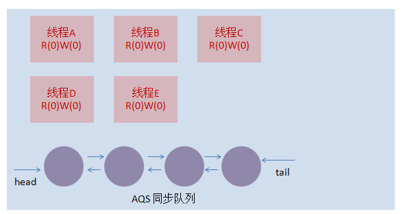
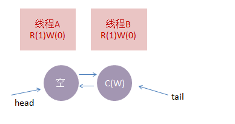
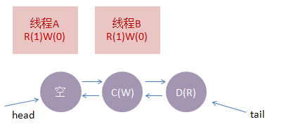

## Lock锁
Java 5 中引入了新的锁机制——java.util.concurrent.locks 中的显式的互斥锁：Lock 接口，它提供了比synchronized 更加广泛的锁定操作。Lock 接口有 3 个实现它的类：**ReentrantLock**、**ReetrantReadWriteLock.ReadLock** 和 **ReetrantReadWriteLock.WriteLock**，即重入锁、读锁和写锁。

lock必须被显式地创建、锁定和释放，为了可以使用更多的功能，一般用ReentrantLock为其实例化。为了保证锁最终一定会被释放（可能会有异常发生），要把**互斥区放在try语句块内，并在finally语句块中释放锁**，尤其当有return语句时，return语句必须放在try字句中，以确保unlock（）不会过早发生，从而将数据暴露给第二个任务。因此，采用lock加锁和释放锁的一般形式如下：

``` java
Lock lock = new ReentrantLock();//默认使用非公平锁，如果要使用公平锁，需要传入参数true
........
lock.lock();
try {
     //更新对象的状态
    //捕获异常，必要时恢复到原来的不变约束
   //如果有return语句，放在这里
 finally {
       lock.unlock();        //锁必须在finally块中释放
     }
```

具体的我们来看看Lock这个接口
``` java
//尝试获取锁，获取成功则返回，否则阻塞当前线程
void lock(); 

//尝试获取锁，线程在成功获取锁之前被中断，则放弃获取锁，抛出异常 
void lockInterruptibly() throws InterruptedException; 

//尝试获取锁，获取锁成功则返回true，否则返回false 
boolean tryLock(); 

//尝试获取锁，若在规定时间内获取到锁，则返回true，否则返回false，未获取锁之前被中断，则抛出异常 
boolean tryLock(long time, TimeUnit unit) 
                                   throws InterruptedException; 

//释放锁
void unlock(); 

//返回当前锁的条件变量，通过条件变量可以实现类似notify和wait的功能，一个锁可以有多个条件变量
Condition newCondition();
```


### ReentrantLock对比synchronized

 在JDK1\.5，synchronized是性能低效的。因为这是一个重量级操作，它对性能最大的影响是阻塞的是实现，挂起线程和恢复线程的操作都需要转入内核态中完成，这些操作给系统的并发性带来了很大的压力。到了JDK1\.6，发生了变化，对synchronize加入了很多优化措施，有自适应自旋，锁消除，锁粗化，轻量级锁，偏向锁等等。导致在JDK1\.6上synchronize的性能并不比Lock差。

基本语法上，ReentrantLock与synchronized很相似，它们都具备一样的线程重入特性，只是代码写法上有点区别而已，一个表现为API层面的互斥锁（Lock），一个表现为原生语法层面的互斥锁（synchronized）。

ReentrantLock相对synchronized而言还是增加了一些高级功能，主要有以下三项:

1. 等待可中断：当持有锁的线程长期不释放锁时，正在等待的线程可以选择放弃等待，改为处理其他事情，它对处理执行时间非常上的同步块很有帮助。而在等待由synchronized产生的互斥锁时，会一直阻塞，是不能被中断的。**意即lock锁可以实现退出机制并进行其他后续操作**
2. 可实现**公平锁**：多个线程在等待同一个锁时，必须按照申请锁的时间顺序排队等待，而非公平锁则不保证这点，在锁释放时，任何一个等待锁的线程都有机会获得锁。synchronized中的锁是非公平锁，ReentrantLock默认情况下也是非公平锁，但可以通过构造方法ReentrantLock（ture）来要求使用公平锁。
3. 锁可以绑定多个条件：ReentrantLock对象可以同时绑定多个Condition对象（名曰：条件变量或条件队列），而在synchronized中，锁对象的wait（）和notify（）或notifyAll（）方法可以实现一个隐含条件，但如果要和多于一个的条件关联的时候，就不得不额外地添加一个锁，而ReentrantLock则无需这么做，只需要多次调用newCondition（）方法即可。而且我们还可以通过绑定Condition对象来判断当前线程通知的是哪些线程（即与Condition对象绑定在一起的其他线程）。


### 读写锁
为了提高性能，Java提供了读写锁，在读的地方使用读锁，在写的地方使用写锁，灵活控制，如果没有写锁的情况下，读是无阻塞的,在一定程度上提高了程序的执行效率。

``` java
public class Cache { 
  static Map<String, Object> map = new HashMap<String, Object>(); 
  static ReentrantReadWriteLock rwl = new ReentrantReadWriteLock(); 
  static Lock r = rwl.readLock(); 
  static Lock w = rwl.writeLock(); 
  // 获取一个key对应的value 
  public static final Object get(String key) { 
    r.lock(); 
    try { 
      return map.get(key); 
    } finally { 
      r.unlock(); 
    } 
  } 
  // 设置key对应的value，并返回旧有的value 
  public static final Object put(String key, Object value) { 
    w.lock(); 
    try { 
      return map.put(key, value); 
    } finally { 
      w.unlock(); 
    } 
  } 
  // 清空所有的内容 
  public static final void clear() { 
    w.lock(); 
    try { 
      map.clear(); 
    } finally { 
      w.unlock(); 
    } 
  } 
} 
```

以上是典型读写锁的使用，总而言之就是，读和读之间不阻塞，写和任何操作之间都阻塞。

#### 公平读写锁的机制
读写锁实质上底层通过一个队列来维护。


首先维护一个ABS空队列，假如线程A要进行读操作，则线程A先获得一个读锁，接着B也要进行读操作，由于读读不互斥，所以B也获得一个读锁。

此时状态图


接着C来请求一个写锁，由于读写互斥，所以



ABS队列的C请求入队，接着如果D想获取读锁，此时判定D并没有获得过锁，不是**可重入**状态，且由于公平性，必须遵从队列的顺序。所以有



如果同一个线程再次请求锁，则在读写锁对应的计数器上+1即可，以此类推直至执行完毕。
