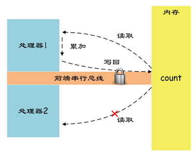

## 原子操作的实现原理
32位IA-32处理器使用基于**对缓存加锁**或**总线加锁**的方式来实现多处理器之间的原子操作。

### 处理器自动保证基本内存操作的原子性

首先处理器会自动保证基本的内存操作的原子性。处理器保证从系统内存当中读取或者写入一个字节是原子的，意思是**当一个处理器读取一个字节时，其他处理器不能访问这个字节的内存地址**。奔腾6和最新的处理器能自动保证单处理器对同一个缓存行里进行16/32/64位的操作是原子的，但是复杂的内存操作处理器不能自动保证其原子性，比如跨总线宽度，跨多个缓存行，跨页表的访问。但是处理器提供总线锁定和缓存锁定两个机制来保证复杂内存操作的原子性。

### 单处理器保证原子性
Intel x86指令集支持内存操作数的inc操作，这样“count++;”操作可以在一条指令内完成。因为进程的上下文切换是在总是在一条指令执行完成后，所以不会出现上述的并发问题。**对于单处理器来说，一条处理器指令就是一个原子操作**。

### 多处理器原子操作
在多处理器的环境下，前面结论不再成立。
我们知道“inc [count]”指令的执行过程分为三步：

1. 从内存将count的数据读取到cpu。
2. 累加读取的值。
3. 将修改的值写回count内存。

这又回到前面并发问题类似的情况，只不过此时并发的主题不再是进程，而是处理器。

Intel x86指令集提供了指令前缀lock用于锁定前端串行总线（FSB），保证了指令执行时不会受到其他处理器的干扰。

使用lock指令前缀后，处理器间对count内存的并发访问（读/写）被禁止，从而保证了指令的原子性。

### 使用总线锁保证原子性
之前提到的，第一个机制是通过总线锁保证原子性。如果多个处理器同时对共享变量进行读改写（i++就是经典的读改写操作）操作，那么共享变量就会被多个处理器同时进行操作，这样读改写操作就不是原子的，操作完之后共享变量的值会和期望的不一致，举个例子：如果i=1,我们进行两次i++操作，我们期望的结果是3，但是有可能结果是2。

原因是有可能多个处理器同时从各自的缓存中读取变量i，分别进行加一操作，然后分别写入系统内存当中。那么想要保证读改写共享变量的操作是原子的，就必须保证CPU1读改写共享变量的时候，CPU2不能操作缓存了该共享变量内存地址的缓存。

处理器使用总线锁就是来解决这个问题的。所谓总线锁就是使用处理器提供的一个LOCK＃信号，当一个处理器在总线上输出此信号时，其他处理器的请求将被阻塞住（无法操作内存）,那么该处理器可以独占使用共享内存。

### 使用缓存锁保证原子性(原子一致性)
第二个机制是通过缓存锁定保证原子性。在同一时刻我们只需保证对某个内存地址的操作是原子性即可，但总线锁定把CPU和内存之间通信锁住了，这使得锁定期间，其他处理器不能操作其他内存地址的数据，**所以总线锁定的开销比较大**，最近的处理器在某些场合下使用缓存锁定代替总线锁定来进行优化。

本质上，就是使用**缓存一致性协议**--见计组笔记，避免同时修改被两个以上处理器缓存的内存区域数据。当其他处理器回写已被锁定的缓存行的数据时，会使得当前缓存行失效(I标记)。
