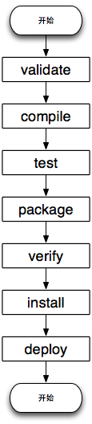
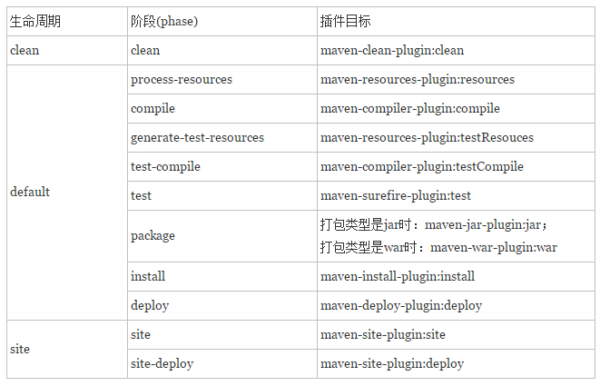

## Maven构建生命周期
Maven 构建生命周期就是 Maven 将一个整体任务划分为一个个的阶段，类似于流程图，按顺序依次执行。也可以指定该任务执行到中间的某个阶段结束。
Maven 的内部有**三个构建生命周期**，分别是 **clean, default, site**，**每个周期又被分成不同的阶段**。

其中 default(build)生命周期的核心阶段如下所示：



**注意一点，上面只是列出了default的核心阶段，其实default不止这些，还包括一些generate-sources等多个阶段，具体的可去官网文档查阅。**


clean的阶段则有3个：

1. pre-clean
2. clean
3. post-clean

site则是4个：
1. pre-site
2. site
3. post-site
4. site-deploy


可以通过命令来指定运行到哪个生命周期

```
mvn install
```

执行 mvn install 命令，将完成 validate, compile, test, package, verify, install 阶段，并将 package 生成的包发布到本地仓库中。

```
mvn clean deploy
```

执行 mvn clean deploy 命令，首先完成的 clean lifecycle，将以前构建的文件清理，然后再执行 default lifecycle 的 validate, compile, test, package, verify, insstall, deploy 阶段，将 package 阶段创建的包发布到远程仓库中。

### 阶段与插件
如上所述，Maven 将构建过程定义为 default lifecycle，并将 default lifecycle 划分为一个个的阶段 phase，这一系列 phase 仅仅是规定执行顺序，至于每个阶段做什么工作？由谁来做？答案就在 插件（plugins） 中。

Maven 对工程的所有操作实实在在的都是由 插件 来完成的。一个插件可以支持多种功能，**称之为目标（goal）**。例如：compiler 插件有两个目标：compile 和 testCompile，分别实现编译源代码 和 编译测试代码。

通过将插件的目标（goal）与 lifecycle(生命周期) 中 某一个phase(阶段) 绑定到一起，这样，当要执行某个 phase 时，就调用插件来完成绑定的目标。

如下图所示：从图中可以看出，每一个阶段可以绑定0 个 或 多个目标，每个插件可以提供 1 个或多个目标。


插件需要和阶段绑定起来。Maven已经事先将很多核心插件绑定到对应的阶段，这样用户几乎不用配置就有构建Maven项目。Maven的内置绑定如下：



不同的周期的不同阶段，都默认绑定了一些插件，和插件对应的目标(功能)。

在 pom.xml 文件中， \<build\> \<plugins\> 元素下可以添加 \<plugin\>，通过指定 goal 和 phase 来进行绑定。
例如：将插件 modello-maven-plugin 的 java 目标绑定到 generate-sources 阶段。

``` xml
<plugin>
   <groupId>org.codehaus.modello</groupId>
   <artifactId>modello-maven-plugin</artifactId>
   <version>1.8.1</version>
   <executions>
     <execution>
       <configuration>
         <models>
           <model>src/main/mdo/maven.mdo</model>
         </models>
         <version>4.0.0</version>
       </configuration>
       <phase>generate-sources</phase>
       <goals>
         <goal>java</goal>
       </goals>
     </execution>
   </executions>
 </plugin>

```
