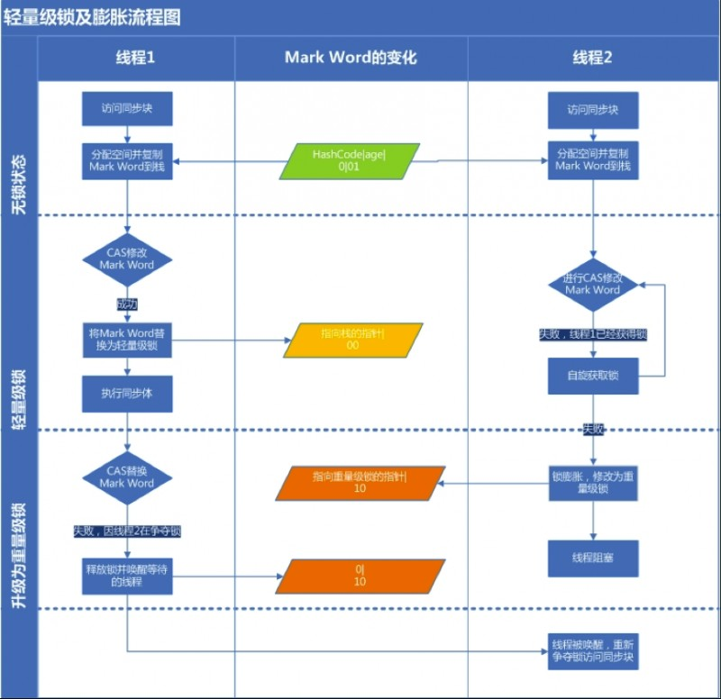

## jvm锁与并发

### 对象头
java对象头：所有锁的实现都依赖于对象头
锁是存在Java对象头里的。如果对象是数组类型,则虚拟机用3个字宽(Word)存储对象头,如果对象是非数组类型,则用2字宽存储对象头。在32位虚拟机中,1字宽等于4字节,即32bit,如表

Java对象头里的**Mark Word**里默认存储对象的HashCode、分代年龄和锁标记位。32位JVM的Mark Word的默认存储结构如表

java中锁一共有4种状态,级别从低到高依次是:**无锁状态、偏向锁状态、轻量级锁状态和重量级锁状态**,这几个状态会随着竞争情况逐渐升级。**锁可以升级但不能降级**,意味着偏向锁升级成轻量级锁后不能降级成偏向锁。这种锁升级却不能降级的策略,目的是为了提高获得锁和释放锁的效率

### 偏向锁（Biased Locking）
大多数情况下,锁不仅不存在多线程竞争,而且总是由同一线程多次获得

偏向锁是JDK 1.6 提出的一种锁优化方式。其核心思想是，如果程序没有竞争，则取消之前已经取得锁的线程同步操作。也就说，若某一锁被线程获取后，便进入偏向模式，**当线程再次请求这个锁时，无需进行相关的同步操作**，从而节省了操作时间。如果在此之前有其他线程进行了锁请求，则锁退出偏向模式。在JVM中使用-XX:+UseBiasedLocking可以设置启用偏向锁。

过程：一个线程访问同步块并获取锁时,会在对象头和栈帧中的锁记录里存储锁偏向的线程ID,以后该线程在进入和退出同步块时不需要进行CAS操作来加锁和解锁,只需简单地测试一下对象头的Mark Word里是否存储着指向当前线程的偏向锁。如果**测试成功,表示线程已经获得了锁**。如果测试失败,则需要再测试一下Mark Word中偏向锁的标识是否设置成1(表示当前是偏向锁):如果没有设置,则使用CAS竞争锁;如果设置了,则尝试使用CAS将对象头的偏向锁指向当前线程。

偏向锁在锁竞争激烈的场合没有太强的优化效果，因为大量的竞争会导致持有锁的线程不停地切换，锁也很难一直保持在偏向模式，此时，使用锁偏向不仅得不到性能的优化，反而有可能降低系统性能。

### 轻量级锁
线程在执行同步块之前,JVM会先在当前线程的栈桢中**创建用于存储锁记录的空间**,并将对象头中的Mark Word复制到锁记录中,官方称为Displaced Mark Word。然后线程尝试使用CAS将对象头中的Mark Word替换为指向锁记录的指针。如果成功,当前线程获得锁,如果失败,表示其他线程竞争锁,**当前线程便尝试使用自旋来获取锁**。

**轻量级解锁时**,会使用原子的CAS操作将Displaced Mark Word替换回到对象头,如果成功,则表示没有竞争发生。**如果失败,表示当前锁存在竞争,锁就会膨胀成重量级锁**。

图是两个线程同时争夺锁，导致锁膨胀的流程图。

### 重量级锁

重量锁在JVM中又叫**对象监视器Monitor**，它很像C中的Mutex，除了具备Mutex互斥的功能，它还负责实现了Semaphore的功能，也就是说它至少包含一个竞争锁的队列，和一个信号阻塞队列（wait队列），前者负责做互斥，后一个用于做线程同步。

### 对比

### 锁在应用层的优化思路

#### 减小锁粒度
典型的场景就是ConcurrentHashMap类的实现。ConcurrentHashMap将整个HshMap分成若干段(Segment)，每个段都是一个子HashMap。

如果需要在ConcurrentHashMap中增加一个新的表项，并不是将整个HashMap加锁，而是首先根据hashcode得到该表项应该被存放到哪个段中，然后对该段加锁，并完成put()操作。在多线程环境中，如果多个线程同时进行put()操作，只要被加入的表项不存放在同一个段中，则线程间可以做到真正的并行。

#### 锁分离
锁分离是**减小锁粒度的一个特例**。他依据应用程序的功能特点，将一个独占锁分成多个锁。

最常见的锁分离就是读写锁ReadWriteLock，根据功能进行分离成读锁和写锁，这样读读不互斥，读写互斥，写写互斥，即保证了线程安全，又提高了性能

读写分离思想可以延伸，只要操作互不影响，锁就可以分离。

在LinkedBlockingQueue的实现中，take()函数和put()函数分别实现了从队列中取得数据和往队列中增加数据的功能。虽然两个函数都对当前队列进行了修改操作，但由于LinkedBlockingQueue是基于链表的，因此，两个操作分别作用于队列的前端和尾端，从理论上来说，两者并不冲突。

#### 锁粗化

通常情况下，为了保证多线程间的有效并发，会要求每个线程持有锁的时间尽量短，即在使用完公共资源后，应该立即释放锁。只有这样，等待在这个锁上的其他线程才能尽早的获得资源执行任务。但是，凡事都有一个度，如果对同一个锁不停地进行请求、同步和释放，其本身也会消耗系统宝贵的资源，反而不利于性能的优化。

为此，虚拟机在遇到一连串连续的对同一锁不断进行请求和释放的操作时，便会把所有的锁操作整合成对锁的一次请求，从而减少对锁的请求同步次数。这个操作叫做锁的粗化。
