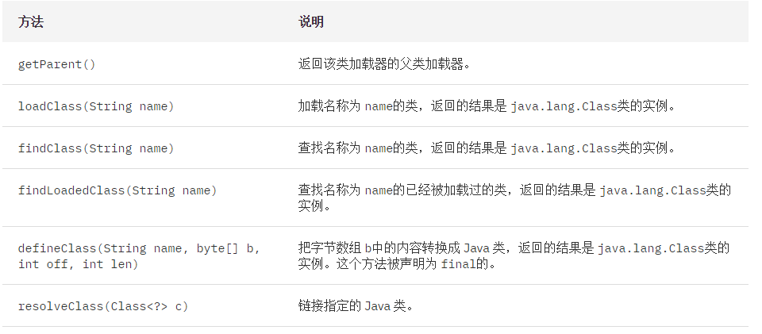

## 类加载器ClassLoader
大概了解了类加载机制以后，我们还必须了解，java代码中ClassLoader的使用。

顾名思义，类加载器（class loader）用来加载 Java 类到 Java 虚拟机中。一般来说，Java 虚拟机使用 Java 类的方式如下：Java 源程序（.java 文件）在经过 Java 编译器编译之后就被转换成 Java 字节代码（.class 文件）。类加载器负责读取 Java 字节代码，并转换成 java.lang.Class类的一个实例。每个这样的实例用来表示一个 Java 类。通过此实例的 newInstance()方法就可以创建出该类的一个对象。实际的情况可能更加复杂，比如 Java 字节代码可能是通过工具动态生成的，也可能是通过网络下载的。

基本上所有的类加载器都是 java.lang.ClassLoader类的一个实例。下面详细介绍这个 Java 类。

### 介绍
**java.lang.ClassLoader类的基本职责就是根据一个指定的类的名称，找到或者生成其对应的字节代码，然后从这些字节代码中定义出一个 Java 类，即 java.lang.Class类的一个实例。**

除此之外，ClassLoader还负责加载 Java 应用所需的资源，如图像文件和配置文件等。不过本文只讨论其加载类的功能。

### ClassLoader中加载类的方法

对于图中给出的方法，**表示类名称的 name参数的值是类的二进制名称**。需要注意的是内部类的表示，如 com.example.Sample$1和 com.example.Sample$Inner等表示方式。

### 类加载器的树状组织结构
Java 中的类加载器大致可以分成两类，一类是系统提供的，另外一类则是由 Java 应用开发人员编写的。系统提供的类加载器主要有下面三个：

 - 引导类加载器（bootstrap class loader）：它用来加载 Java 的核心库，是用**原生代码**来实现的，**并不继承自 java.lang.ClassLoader**。

 - 扩展类加载器（extensions class loader）：它用来加载 Java 的扩展库。Java 虚拟机的实现会提供一个扩展库目录。该类加载器在此目录里面查找并加载 Java 类。

 - 系统类加载器（system class loader）：它根据 Java 应用的类路径（CLASSPATH）来加载 Java 类。一般来说，Java 应用的类都是由它来完成加载的。可以通过 ClassLoader.getSystemClassLoader()来获取它。

除了系统提供的类加载器以外，开发人员可以通过继承 java.lang.ClassLoader类的方式实现自己的类加载器，以满足一些特殊的需求。

除了引导类加载器之外，所有的类加载器都有一个父类加载器。通过getParent()方法可以得到。**系统类加载器的父类加载器是扩展类加载器，而扩展类加载器的父类加载器是引导类加载器；**

对于开发人员编写的类加载器来说，其父类加载器是加载此类加载器 Java 类的类加载器。**一般来说，开发人员编写的类加载器的父类加载器是系统类加载器**。类加载器通过这种方式组织起来，形成树状结构。树的根节点就是引导类加载器。

下图中给出了一个典型的类加载器树状组织结构示意图，其中的箭头指向的是父类加载器。

**每个 Java 类都维护着一个指向定义它的类加载器的引用，通过 getClassLoader()方法就可以获取到此引用。**

### 类加载器的代理模式
类加载器在尝试自己去查找某个类的字节代码并定义它时，会先代理给其父类加载器，由父类加载器先去尝试加载这个类，依次类推。

在介绍代理模式背后的动机之前，首先需要说明一下 Java 虚拟机是如何判定两个 Java 类是相同的。

#### 判断类相同

Java 虚拟机不仅要看类的全名是否相同，还要看加载此类的类加载器是否一样。只有两者都相同的情况，才认为两个类是相同的。即便是同样的字节代码，被不同的类加载器加载之后所得到的类，也是不同的。比如一个 Java 类 com.example.Sample，编译之后生成了字节代码文件 Sample.class。两个不同的类加载器 ClassLoaderA和 ClassLoaderB分别读取了这个 Sample.class文件，并定义出两个 java.lang.Class类的实例来表示这个类。这两个实例是不相同的。对于 Java 虚拟机来说，它们是不同的类。试图对这两个类的对象进行相互赋值，会抛出运行时异常 ClassCastException。

了解了这一点之后，就可以理解代理模式的设计动机了。

**代理模式是为了保证 Java 核心库的类型安全(重)**。所有 Java 应用都至少需要引用 java.lang.Object类，也就是说在运行的时候，java.lang.Object这个类需要被加载到 Java 虚拟机中。如果这个加载过程由 Java 应用自己的类加载器来完成的话，很可能就存在多个版本的 java.lang.Object类，而且这些类之间是不兼容的。

**通过代理模式，对于 Java 核心库的类的加载工作由引导类加载器来统一完成，保证了 Java 应用所使用的都是同一个版本的 Java 核心库的类，是互相兼容的。**

#### defineClass和loadClass
在前面介绍类加载器的代理模式的时候，提到过类加载器会首先代理给其它类加载器来尝试加载某个类。这就意味着真正完成类的加载工作的类加载器和启动这个加载过程的类加载器，有可能不是同一个。

也就是说，类加载的时候，首先有一个启动加载的过程，然后再具体加载。启动的时候，用的是loadClass，然后具体加载进去的时候，用的是defineClass

一个称为类的定义加载器（defining loader），另一个称为初始加载器（initiating loader）

在 Java 虚拟机判断两个类是否相同的时候，**使用的是类的定义加载器**。也就是说，哪个类加载器启动类的加载过程并不重要，重要的是最终定义这个类的加载器。

两种类加载器的关联之处在于：**一个类的定义加载器是它引用的其它类的初始加载器**。如类 com.example.Outer引用了类 com.example.Inner，则由类 com.example.Outer的定义加载器负责启动类 com.example.Inner的加载过程。

也就是说Outer类里，有个Inner类，那么Inner类是默认由define Outer类的加载器来启动(并且定义加载)的。

#### 线程上下文类加载器
线程上下文类加载器（context class loader）是从 JDK 1.2 开始引入的。**类 java.lang.Thread中的方法** getContextClassLoader()和 setContextClassLoader(ClassLoader cl)用来获取和设置线程的上下文类加载器。

如果没有通过 setContextClassLoader(ClassLoader cl)方法进行设置的话，线程将继承其父线程的上下文类加载器。Java 应用运行的初始线程的上下文类加载器是系统类加载器。在线程中运行的代码可以通过此类加载器来加载类和资源。

**前面提到的类加载器的代理模式并不能解决 Java 应用开发中会遇到的类加载器的全部问题**。Java 提供了很多服务提供者接口（Service Provider Interface，SPI），允许第三方为这些接口提供实现。常见的 SPI 有 JDBC、JCE、JNDI、JAXP 和 JBI 等。

**也就是官方提供了许多接口，给第三方实现。**这就遇到了很多问题，比如A接口是官方定义的一个接口，这个接口当然属于Java核心库的一部分，所以这个接口的加载是由引导类加载器完成的。但是A接口里又有一个newInstance方法，用来创建一个具体的实例，这个实例是由第三方写的类完成的。这时就有问题了，第三方类是用系统类加载器完成的，而官方接口用的是引导类，引导类根据委派模型，已经处于root的位置，不可能向下委派。为了解决这个无法代理的问题，才有了上下文类加载器。

线程上下文类加载器正好解决了这个问题。如果不做任何的设置，Java 应用的线程的上下文类加载器默认就是系统上下文类加载器。在 SPI 接口的代码中使用线程上下文类加载器，就可以成功的加载到 SPI 实现的类。线程上下文类加载器在很多 SPI 的实现中都会用到。

#### Class.forName
Class.forName是一个静态方法，同样可以用来加载类。该方法有两种形式：Class.forName(String name, boolean initialize, ClassLoader loader)和 Class.forName(String className)。第一种形式的参数 name表示的是类的全名；initialize表示是否初始化类；loader表示加载时使用的类加载器。第二种形式则相当于设置了参数 initialize的值为 true，loader的值为当前类的类加载器。Class.forName的一个很常见的用法是在加载数据库驱动的时候。如 Class.forName("org.apache.derby.jdbc.EmbeddedDriver").newInstance()用来加载 Apache Derby 数据库的驱动。

### 开发自定义类
虽然在绝大多数情况下，系统默认提供的类加载器实现已经可以满足需求。但是在某些情况下，您还是需要为应用开发出自己的类加载器。比如您的应用通过网络来传输 Java 类的字节代码，为了保证安全性，这些字节代码经过了加密处理。这个时候您就需要自己的类加载器来从某个网络地址上读取加密后的字节代码，接着进行解密和验证，最后定义出要在 Java 虚拟机中运行的类来。
