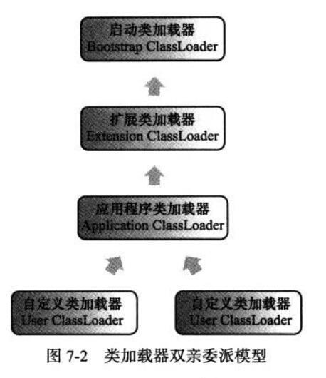

## 概述

java虚拟机程序可以实现“一次编写，到处运行”。不同平台的虚拟机可以载入和执行一种平台无关的字节码。虚拟机定义规范时分成了java语言规范和虚拟机规范。jvm不和任何包括java文件在内的任何语言绑定，它只是解释执行class文件这种特定的二进制字节流。虚拟机有定义读取和解释class文件的规范，不仅仅java其他语言类似Groovy，JRuby，Jython都可以被解释成class字节码

## 类加载时机

类从被加载到虚拟机内存，到卸载出去为止，整个生命周期包括：加载，验证，准备，解析，初始化，使用和卸载。其中验证，准备，解析3个部分统称为连接。如图

## 类的初始化时机

严格规定，有且有且仅有五种情况立即开始**初始化**，自然前三个步骤要在更早进行，但虚拟机没有明确规范。

1. 遇到new，getstatic，putstatic，invokestatic四条指令时，如果**类没有进行过初始化**则先触发使其初始化。
2. 反射调用的时候，未初始化要初始化
3. 初始化一个类时，先触发其父类的初始化
4. main方法的类率先初始化
5. jdk1.7动态语言支持，如果一个java.lang.invoke.MethodHandle实例最后解析的结果REF_getstatic,REF_putstatic,REF_invokeStatic的方法句柄

其他情况，引用类都不会进行初始化，称为被动引用。
比如，类加载时会先把一些类常量进行类传播优化存储到常量池中，所以调用每个类的静态常量未必会加载那个类。

## 虚拟机加载过程

### 加载
加载阶段，虚拟机完成三件事
1. 通过类全名来获得类的二进制流
2. 将这个字节流代表的静态存储结构转化为**方法区的运行时数据结构**
3. 在内存中生成一个java.lang.Class对象，作为方法区这个类的各种数据访问入口

加载和验证顺序可能是交叉运行

### 验证
连接阶段第一步，确保字节流包含的信息符合虚拟机要求，不会危害虚拟机自身安全。

### 准备

这个阶段正式为类变量分配内存和设置初始值。这些变量所使用的内存都在方法区分配。注意，这个阶段进行的内存分配仅仅包括类变量（static修饰的变量），而不是实例变量，实例变量在对象实例化时随着堆一起分配在java堆中。而初始化只是初始化数据类型的0值，而不是定义的值。

public static int value = 123;

value在准备阶段过后的初始值为0而不是123,而把value赋值的putstatic指令将在初始化阶段才会被执行

### 解析

解析过程将虚拟机常量池内的符号引用替换为直接引用。

符号引用是一组符号,用来描述引用的目标，与虚拟机内存布局无关，引用目标也不一定已加载到内存中。直接引用是直接指向目标的指针，相对偏移量，或者句柄，与内存布局直接相关。有了这个，引用目标必定已经存在。

#### 符号引用和直接引用
通俗的来说，符号引用就是一个字符串标记。比如org.simple.People类引用了org.simple.Language类，在编译时People类并不知道Language类的实际内存地址，因此只能使用符号org.simple.Language（假设是这个，当然实际中是由类似于CONSTANT_Class_info的常量来表示的）来表示Language类的地址(做标记)。

解析便是将符号引用(这个字符串标记)，转换为偏移量(其实也相当于内存地址了)，通过偏移量虚拟机可以直接在该类的内存区域中找到方法字节码的起始位置。

### 初始化
类加载过程的最后一步，到了初始化阶段才真正执行java程序代码。在准备阶段已经赋过系统初始值，而这个阶段将会根据程序员制定的主观计划去初始化变量。

初始化阶段是执行类构造器\<clinit\>方法的过程。\<clinit\>方法是由编译器自动收集类中的所有类变量赋值动作和静态语句块(static块)合并产生的【说白就是static变量语句的赋值】，**顺序是由语句在源文件中的出现顺序所决定的**。且父类的\<clinit\>方法必定先于子类

#### 另加解释

如图，class文件会被加载到方法区当中。当你下次再new一个对象的时候，会首先去方法区看看这个大类有没有被加载，如果有则进行初始化(初始化则是执行具体对应代码比如new语句)

因此类加载流程简单就是归纳为，先把class二进制流加载到内存区域的方法区中。这个方法区中的这个对应Class对象记录着这个大类的各种信息比如构造信息，类名信息。而我们要构造这个大类的实例，就要依赖这个方法区中的Class类来实现。

## 类加载器
对于任何一个类，都由加载它的类加载器，和这个类本身两者一起确定它在虚拟机中的唯一性。否则，就算两个类来自同一个class文件，类加载器不同，两个类也不相等。(instanceof的值为false)

### 双亲委派模型

从虚拟机角度讲只有两种不同的类加载器，启动类加载器和其他类加载器。前者是虚拟机内部，后者是外部独立的。后者都继承自抽象类java.lang.ClassLoader

从Java程序员角度来看，则会使用到三种类加载器。
1. 启动类加载器，这个类负责将存放在\<JAVA_HOME\>\\lib目录中的并且被虚拟机识别的类库加载到虚拟机内存中。
2. 扩展类加载器，负责加载\<JAVA_HOME\>\\lib\\ext目录里的类，开发者可以直接使用扩展类加载器。
3. 应用程序类加载器，由于是由ClassLoader中的getSystemClassLoader()方法的返回值，所以也称为系统加载器，负责加载用户路径指定的类库，开发者可以直接使用，如果程序中没有自定义类加载器，一般情况下这就是程序中默认的类加载器。

如图就是双亲委派模型

类加载器之间不会用继承的关系来实现，都是以组合的方式。

如果一个类加载器收到了类加载请求，他首先不会自己尝试加载这个类，而是把这个请求委派个父类加载器去完成，每一个层次类加载器都是如此。因此所有的加载请求最终都应该传送到底层的启动类加载器里，只有父类无法完成这个请求时，子加载器才会尝试自己去加载

这种优先级层次关系很好的避免了一些，加载出的类不同的情况
