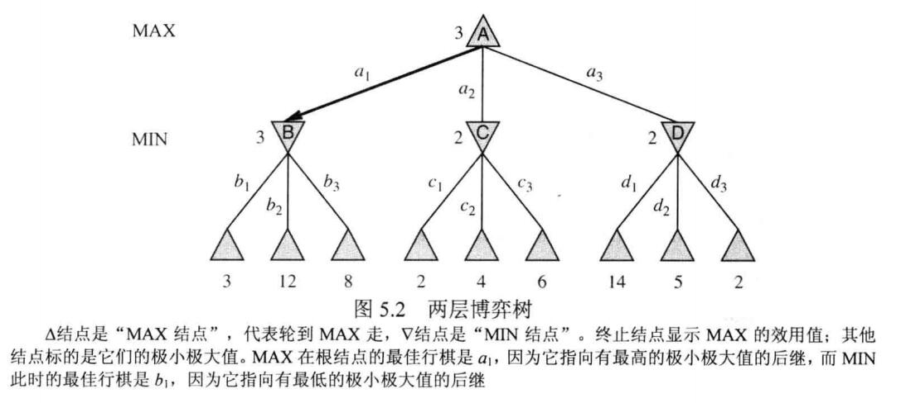
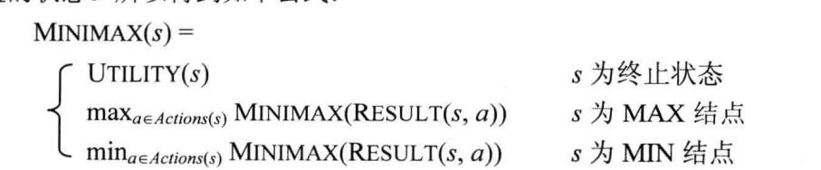
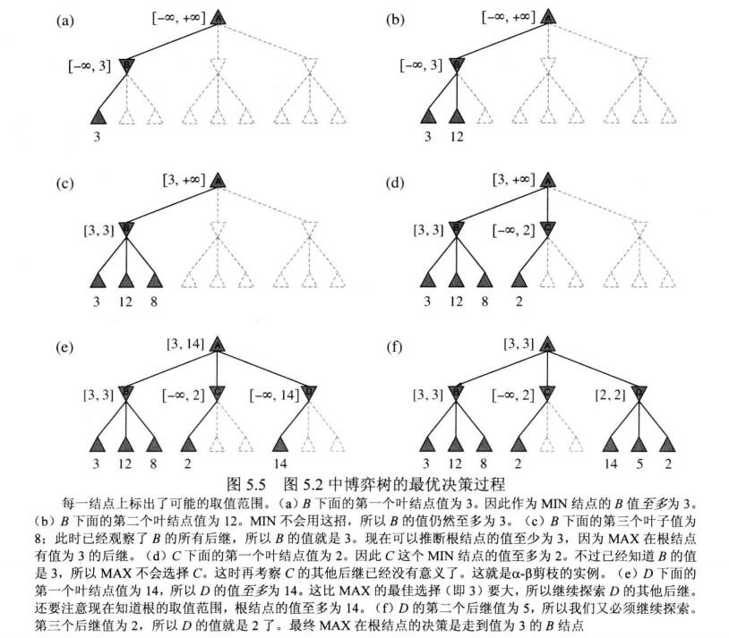
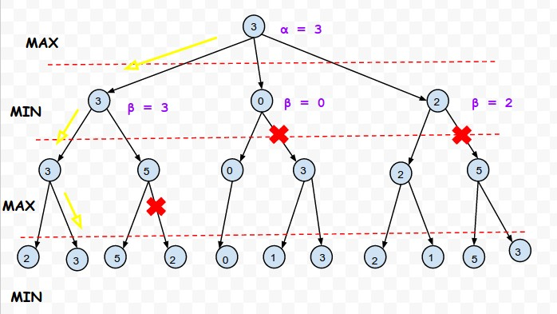
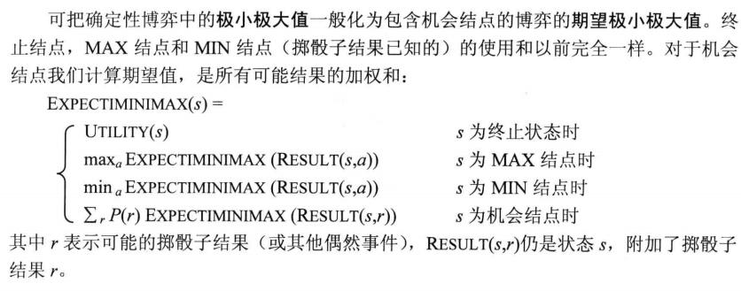
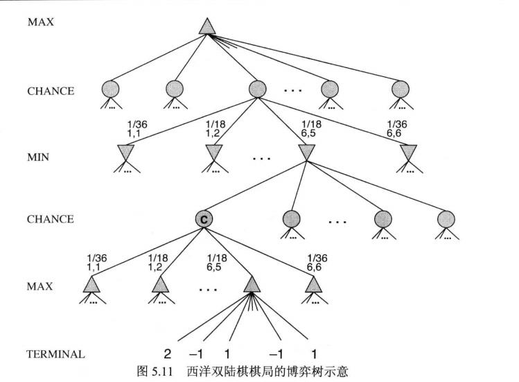

## 对抗搜索(Adversarial Search)
对抗搜索，说白了就是博弈，之前的搜索都是自己一个人闷头干，不关别人事，也不管别人的事。但是对抗搜索中，就相当于我们的下棋，不仅要考虑自己，也要考虑其他智能体的行为对自己的影响。
搜索过程中，需要牢记的一点就是总是做最坏打算，在决策的时候，总是认为对方会作出最佳决策。

适用于完全信息，无概率因素，轮流操作的双人零和(即双方利益完全对立)博弈

### 极小极大值算法(Minimax Algorithm)
极大值极小值策略是一种最优策略。**当对手不犯错误时，最优策略能够导致至少不比其它任何其它策略差的结果**。

给定一颗博弈树：

上图博弈树的意思就是，假设有两个对手，MAX和MIN，轮流决策进行一个游戏，这个游戏只需双方每人进行一步，先MAX后MIN,叶节点是MAX的效用值，也就是结果。

那么显然MAX知道MIN会做出最优选择，也就是MIN会从叶节点里，选择一个最小的方向(MAX效用值最低)走，这就是极小值。所以在这种完全信息状态下，MAX只需要向极小值最大的方向走即可，即可对抗这种最优策略博弈。

如上图，我们从后往前推，知道B肯定会走3，C走2，D走2，那么MAX只需要走最大的B就可以保证自己起码取到3了。

**这意味着，在一颗完整的博弈树下，我们有以下策略**

具体到博弈树种，就是从叶节点往前推，轮流赋予极小值和极大值，如果是MAX的角色(也就是根节点主视角),那就选下一步的最大值，MIN角色(对手视角)则每次都选下一步(子节点)的最小值。叶节点代表的就是结束状态的**效用值Utility**。

**zwlj:效用值Utility就是走到某个目标状态的权益。**

需要注意的是，最优策略针对的是最优化对手：如果使用极大值极小值策略对付非最优化对手，可能没有使用其它策略好，但是使用那些策略对付最优化对手必定要比极大值极小值策略差。

代码实现可以使用递归回溯完成。

**不难发现使用极小值极大值策略实际完成的是对策略空间的一种深度优先搜索。需要整一个完成的博弈树(因为必须知道叶节点的效用值)**

如果树的最大深度为m，基于深搜，则时间复杂度为O(b^m),空间复杂度为m.

#### 总结
在有**完整信息的两人零和游戏**中，极小极大算法可以通过对博弈树的深度优先枚举选出最优招数。注意，完整信息，两人，零和游戏，三个条件。

### α-β剪枝(α-β Pruning)
极小值极大值节点需要搜索出所有叶节点，需要耗费大量的时间。指数增长无法消除，但我们可以用α-β剪枝有效将其减半。

其思想无非是：

 - 每个MAX结点设置一个目前已知下界 alpha
 - 每个MIN结点设置一个目前已知上界 beta
 - 当计算到一般MIN结点时，若其beta小于等于其父节点(MAX结点)的alpha值时 (α剪枝)
 - 当计算到一般MAX结点时，若其alpha大于等于其父节点(MIN结点)的beta值时，不再扩展 (β剪枝)

原理就是已经有了更好的选择了，而你这个分支最好的情况都已经都已经不会再走，所以将你剪去。下面看两个博弈树的α-β剪枝图

只要子节点和父节点，域错开了，就要剪，比如beta小于父节点阿尔法，或者阿尔法大于父节点beta。

上图又是一个例子，MAX维护alpha下界，MIN维护beta上界。一旦出域错开，就剪枝。

#### 行棋排序
α-β剪枝很依赖后续状态的顺序，试想如果我们一开始就走了最好的分支，那其他大部分分支都可以减掉了。反过来如果我们一开始走的是最差的分支，那几乎无法剪枝。

因此我们可以采用动态行棋方案，比如用启发式，或者用以前走的最好的棋等等，来进行一个顺序分配。

### 不完美的实时策略

#### 截断搜索
由于博弈树不能很好的搜索完，所以我们有时应该及时截断。比如，**限制搜索博弈树的深度**。

这样会导致 **地平线效应(Horizon Effect)**，也就是在有限的步数下，怎么走都是怀棋，无论如何也无法打开局面(走出地平线)。

这样的情况下，我们可以进行**单步延伸**。意思就是到达深度限制时，我们发现有棋在历史记录中或公式中有很明显打开局面，或者比下其他棋好的情况，我们允许打破深度限制继续扩展下去。

#### 前向剪枝
在某些节点无需考虑进一步而直接剪去一些子节点。比如在某一层只考虑走的最好的n步行棋。这种剪法相当危险。

### 随机博弈

#### 期望极小值极大值(Expectimax)
博弈不可预测时，我们可以使用这种方法代替极大极小值方法。

我们除了MAX节点和MIN节点之外，还插入了机会节点，用来对结果进行期望汇总。比如西洋双陆棋，我们知道各个部分的概率，所以我们也可以进行加权期望。

