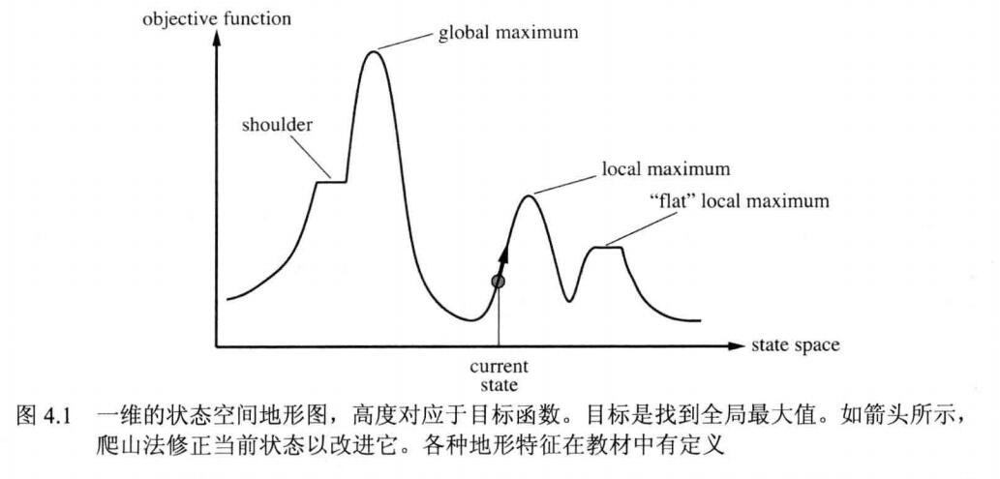
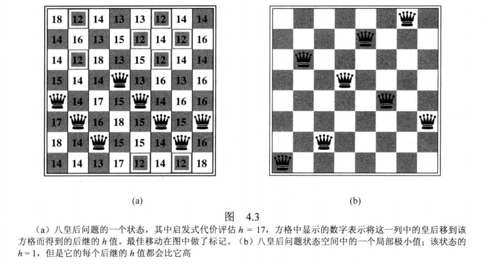

## 局部搜索
局部搜索算法从一个初始解开始，通过邻域动作，产生其邻居解，判断邻居解的质量，根据某种策略，来选择邻居解，重复上述过程，至到达终止条件。

zwlj：局部搜索不保留全局信息，不保留搜索路径，只在乎目标状态。所以它每次只会选择一个看上去最接近目标状态的邻近状态移动。

如图，总是往最好的方向走，总是能到达一个局部最优值。虽然不是全局最优。

### 爬山法(贪婪最优搜索)
所以显然，我们可以用贪心解决这个问题。

假定我们有一个已有的八皇后摆盘状态，想要搜索出一个解。我们可以想出一个启发式函数，比如h(x)是形成攻击对的皇后对数。显然，最终解的攻击对会是0.那么我们就可以从当前开始，找出下一步皇后可能的摆法，然后找出攻击对数h(x)最小的那个状态移动。

最后我们也很容易会陷入窘境，只能找出一个局部最优解。
