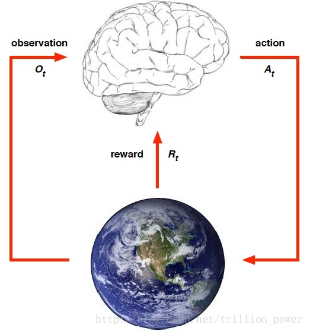
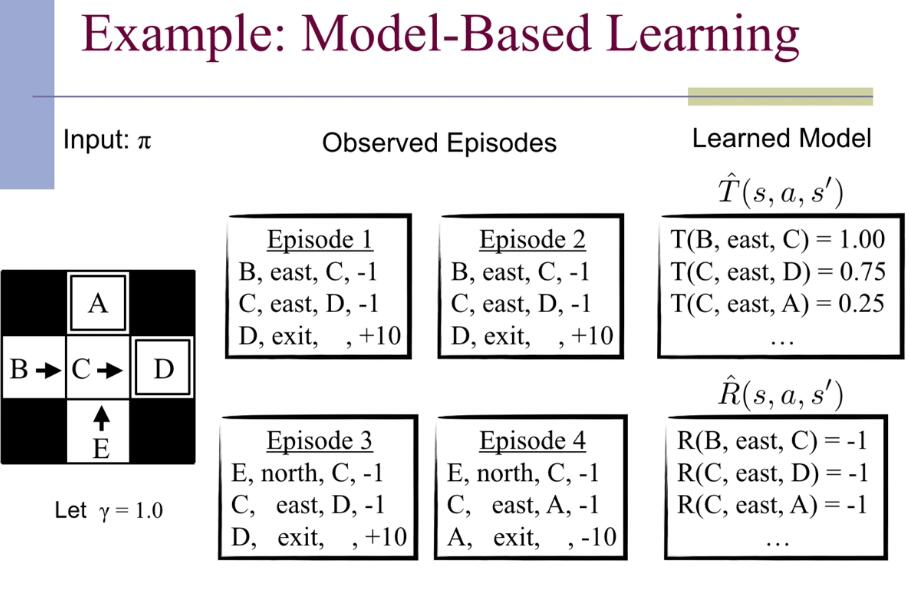
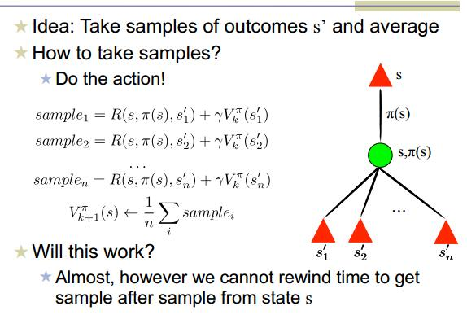
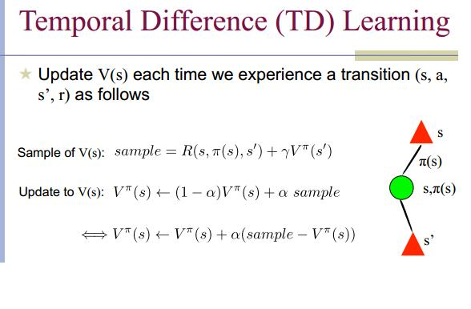
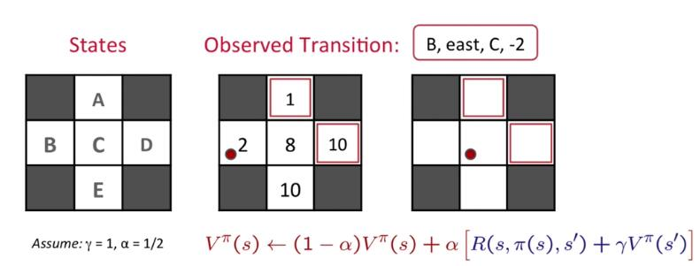
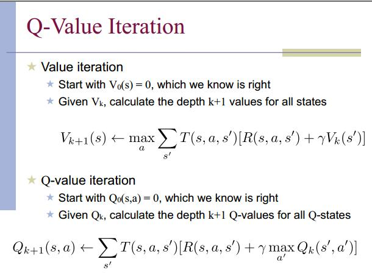
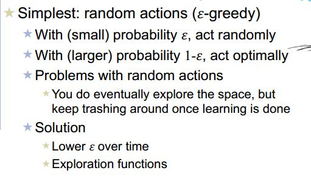
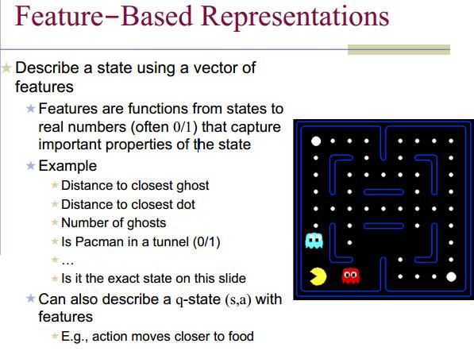
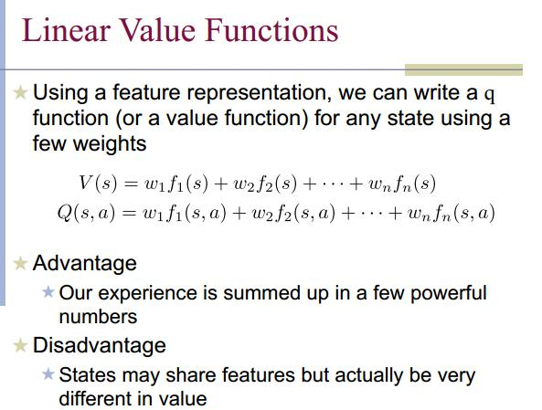
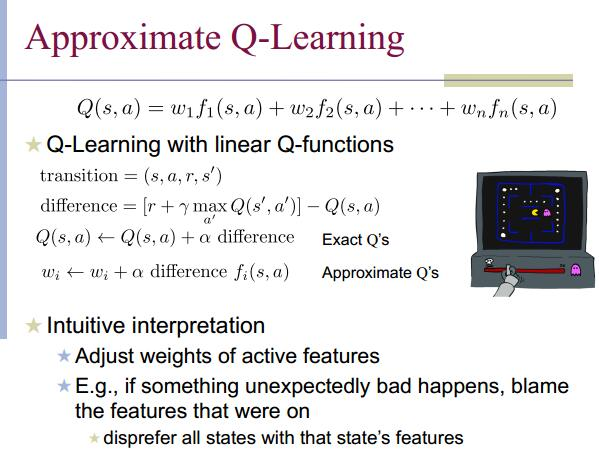

## 强化学习
 机器学习一共有三个分支，有监督学习、无监督学习和强化学习。强化学习是系统从环境学习以使得奖励最大的机器学习。强化学习和有监督学习的不同在于教师信号。强化学习的教师信号是动作的奖励，有监督学习的教师信号是正确的动作。

强化学习解决的问题是，针对一个具体问题得到一个最优的policy，使得在该策略下获得的reward最大。**所谓的policy其实就是一系列action**。也就是sequential data。

强化学习可用下图来刻画，都是要先从要完成的任务提取一个环境，**从中抽象出状态(state) 、动作(action)、以及执行该动作所接受的瞬时奖赏(reward)**。

zwlj:也就是说用强化学习建模时，我们要有环境(分解为一个个state),动作(action)，以及某个state下执行某个action(到达某个状态)得到的奖励。

### example 强化模型学习

如上图，左边那个图。假如我们观察到了4个样本，分别是中间4个episode，比如Episode1，B到C得了-1分，C到D得了-1分，D中逃离得了10分。

综合4个Episode，我们就可以建立强化学习的模型了。比如T，是我们下面MDP会讲到的(先看马尔科夫决策过程笔记)，T是行动时结果转移的概率。比如4个episode中，B点一共做出两次east行动，都是到达C点，所以B->C的转移概率是1。而对于在C点做出east行动，前三个Episode，都是C->D,最后一个C->A。所以可知C->D的转移概率是四分之三，也就是0.75.

R则是从模型中观察到的效益值。

根据上图我们甚至可以直接计算某点的效用值(**Direct Evaluation**)，比如C点，C点开始出发的话，三种情况是从D走得9分，最后一种情况是从A走，得-11分。所以`V(C)=(9+9+9-11)/4`

### sample based policy evaluation
基于样例的强化学习评估。

如图中间的公式，思想其实不复杂，就是跟前面example中说的一样，计算某点衍生出的所有结果的sum和，最后除以样本数量作为V值。

### 更新V值(Temporal Difference Learning)
每次我们完成了一次转移得出了结果，可以用以更新模型，公式如下图，设置了一个参数阿尔法调整权重。

基于这一个公式，我们就可以不断的随机行动试错，然后对于每个state都收敛于一个权益值。(Mar24 lecture)

来看下面一个例子

观察到了B->C要扣两分，而且已知初始的每个格子的V值为中间图。则我们可以知道，当B走到C时，会更新格子里的值(Temporal Difference Learning),利用公式计算α为0.5，γ为1

`(1-0.5)*2+0.5*(-2+1*8)=4`

更新后B点的V值为4.不断迭代这样的过程即是强化学习。

### Q值迭代

简而言之就是让各个状态起始初值为0，然后不停行动迭代V值和Q值。

### 如何行动
之前提到了，我们需要进行行动，才能不停的对每个状态的V值和Q值进行更新。那么我们如何行动(Explore)呢？

最简单的当然就是random action，也就是随机行动。

如上图，可以用一定的概率随机走，一定的概率走最佳的方向。

但是有时候显然，想走完所有可能性(试错足够多)，确立所有状态是不可能的。我们有时候必须要归纳出一些状态才可以

归纳出一些feature，并作出一些组合定义。

这个特征Q值也不是一成不变的，需要我们及时更新。

上面公式的意思是，我们每次行动试错计算出一个实际值之后，减去我们猜测的Q值，得出一个difference差异值，然后更新我们现有的Q总结特征值。可以理解成我们在训练Q值。
