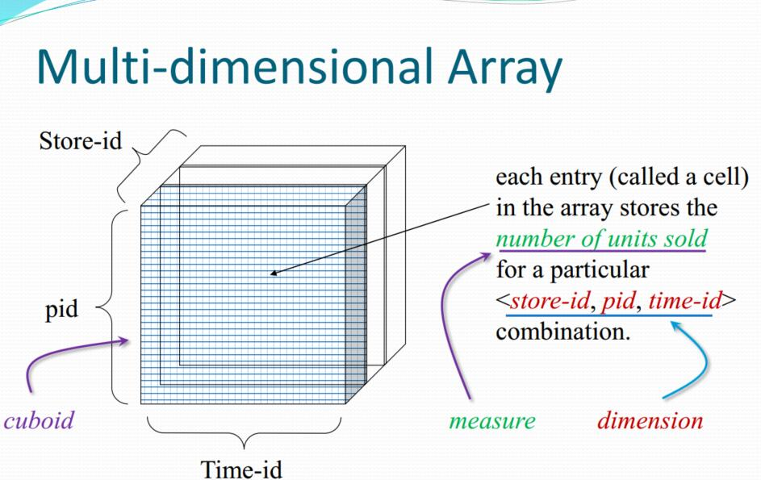

## OLAP
联机分析处理OLAP是一种软件技术，它使分析人员能够迅速、一致、交互地从各个方面观察信息，以达到深入理解数据的目的。

OLAP（On-Line Analysis Processing）在线分析处理是一种 **共享多维信息的快速分析技术**；OLAP利用多维数据库技术使用户从不同角度观察数据；OLAP用于支持复杂的分析操作，侧重于对管理人员的决策支持，可以满足分析人员快速、灵活地进行大数据复量的复杂查询的要求，并且以一种直观、易懂的形式呈现查询结果，辅助决策。

#### 关系型数据库模型
关系型数据库对于user分析人员来说，往往过于细节了。user需要通过写sql语句，从db中获取数据。

### OLAP特性

#### 多维分析
多维分析是一种数据分析过程，在此过程中，将数据分成两类：**维度（dimensions)和度量(metrics/measurements)**。维度和度量的概念都出自于图论(graph theory)，维度指能够描述某个空间中所有点的最少坐标(coordinate)数，即空间基数；度量指的是无向图中顶点(vertices)间的距离。在多维分析领域，维度一般包括字段值为字符类或者字段基数值较少且作为约束条件的离散数值类型；而度量一般包括基数值较大且可以参与运算的数值类字段，一般也称为指标。

具体的numeric属性，在OLAP模型中即是measure属性。也就是度量。

而维度，就想象成是编程中，多维数组的index，比如存在一个关系型数据库，对应的pid,store-id，time-id构成一个具体的事务。那么在OLAP模型中，对应多维数组的index就是`a[pid][store-id][time-id]`,此时维度相当于一个三维变量。

**这样的一个多维数组，在OLAP模型中，被称为cuboid，长方体。**

数组中每个元素，就是一个cell
