## OLAP
联机分析处理OLAP是一种软件技术，它使分析人员能够迅速、一致、交互地从各个方面观察信息，以达到深入理解数据的目的。

OLAP（On-Line Analysis Processing）在线分析处理是一种 **共享多维信息的快速分析技术**；OLAP利用多维数据库技术使用户从不同角度观察数据；OLAP用于支持复杂的分析操作，侧重于对管理人员的决策支持，可以满足分析人员快速、灵活地进行大数据复量的复杂查询的要求，并且以一种直观、易懂的形式呈现查询结果，辅助决策。

#### 关系型数据库模型
关系型数据库对于user分析人员来说，往往过于细节了。user需要通过写sql语句，从db中获取数据。

### OLAP特性

#### 多维分析
多维分析是一种数据分析过程，在此过程中，将数据分成两类：**维度（dimensions)和度量(metrics/measurements)**。维度和度量的概念都出自于图论(graph theory)，维度指能够描述某个空间中所有点的最少坐标(coordinate)数，即空间基数；度量指的是无向图中顶点(vertices)间的距离。在多维分析领域，维度一般包括字段值为字符类或者字段基数值较少且作为约束条件的离散数值类型；而度量一般包括基数值较大且可以参与运算的数值类字段，一般也称为指标。

具体的numeric属性，在OLAP模型中即是measure属性。也就是度量。

而维度，就想象成是编程中，多维数组的index，比如存在一个关系型数据库，对应的pid,store-id，time-id构成一个具体的事务。那么在OLAP模型中，对应多维数组的index就是`a[pid][store-id][time-id]`,此时维度相当于一个三维变量。

**这样的一个多维数组，在OLAP模型中，被称为cuboid，长方体。**

数组中每个元素，就是一个cell

#### 数据仓库和OLAP
通常关系型数据库是建立在数据仓库这个level的，而OLAP则逻辑上建立在数据仓库之上，也就是说可以理解成把关系型数据库，转换成一个多维数组。

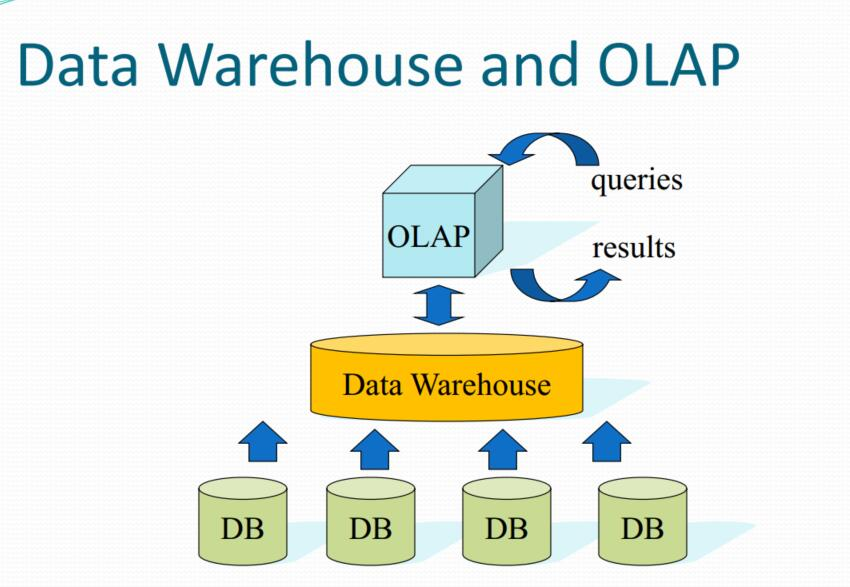

#### 维度模型
维度模型的概念出自于数据仓库领域，是数据仓库建设中的一种数据建模方法。维度模型主要由 **事实表和维度表这两个基本要素构成**。

##### 事实表fact table

事实表是维度模型的基本表，用于存放大度量值，术语“事实”代表了一个度量值。举一个例子：查询某个客户在某个机构下某个产品合约账户的某个币种的某个时点余额，在各维度值(客户、产品合约、账户、机构、币种、日期)的交点处就可以得到一个度量值。维度值的列表定义了事实表的粒度，同时又确定了度量值的取值范围。

事实表也叫fact table：

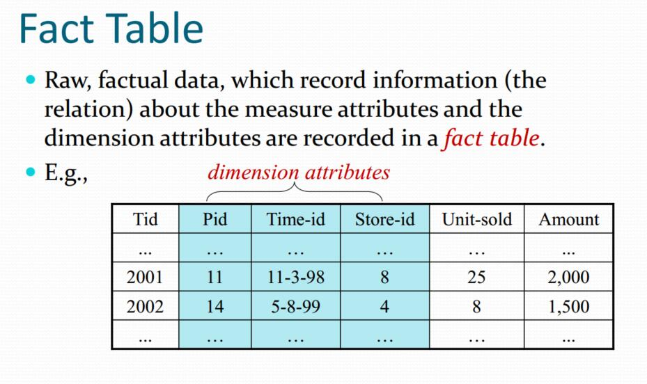

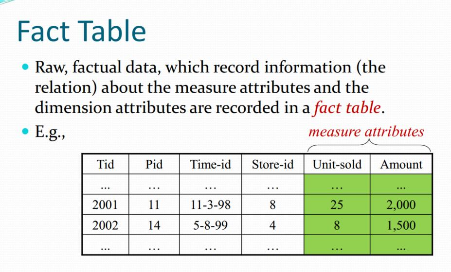

事实表fact table下，我们就能得到度量和维度。

每一条记录都有：
 - 维度变量(key)
 - 度量变量

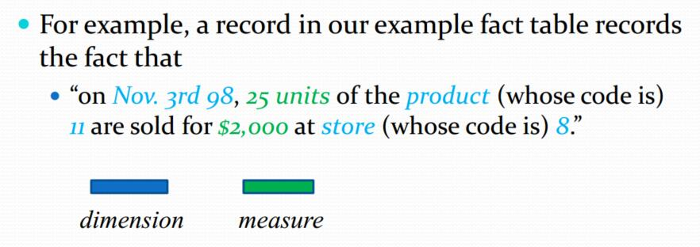

##### 维度表dimension table
所有事实表有两个或者两个以上的外关键字，外关键字用于连接到维度表的主关键字。

如果事实表中的所有关键字都能分别与对应维度表中的主关键字正确匹配，就可以说这些表满足引用完整性的要求。事实表要通过与之相连的维度表进行存取。

维度表是事实表不可分割的部分。联系之前的例子,store-id属于一个维度变量，那么就有相关的维度表：

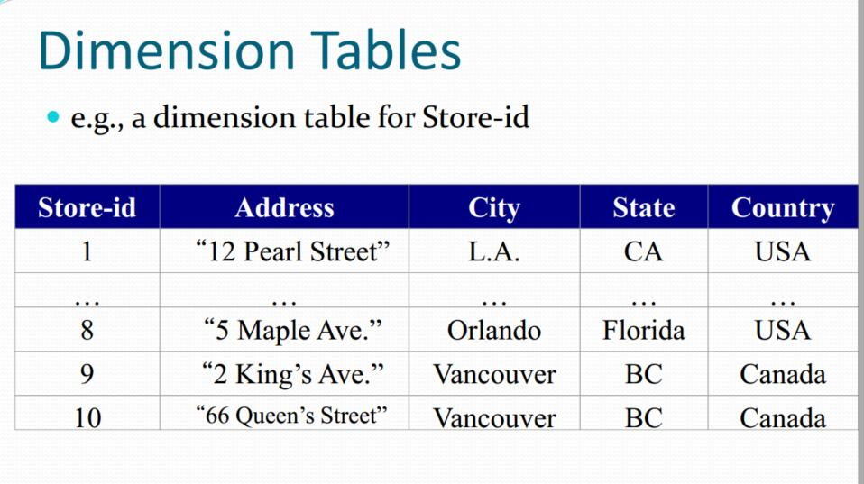

维度表是进入事实表的入口。丰富的维度属性给出了丰富的分析切割能力。维度给用户提供了使用数据仓库的接口。最好的属性是文本的和离散的。属性应该是真正的文字而不应是一些编码简写符号。应该通过用更为详细的文本属性取代编码，力求最大限度地减少编码在维度表中的使用。

##### 星型模式Star Schema
人们画图的时候，用这个模式来联系事实表和维度表。

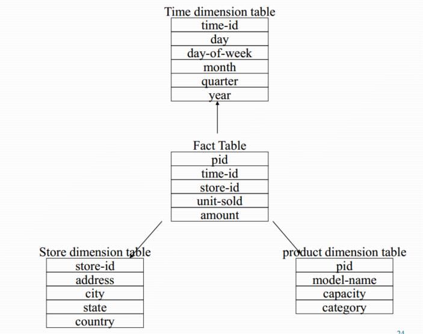

其实也就是把fact table放中间，画箭头指向其他dimension table

##### 雪花模式Snowflake Schema
星型模式下，一个维度表对应一个维度变量，可能会有冗余存在。维度表也是可以分割的

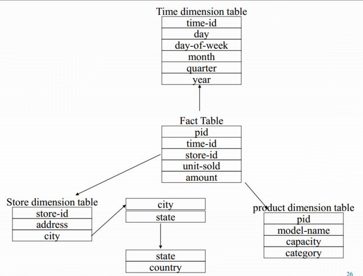

##### Time dimension
这里也注意一下，上图中那些time-id对应的维度表。实际实现中，其实并不存在，而是使用一个function来进行实时转换，不实际存储。

#### 层级概念Concept Hierarchy
之前提到过，OLAP把数据仓库抽象成一个cube长方体。那么根据维度变量的不同，长方体相当于可以被切割成不同的方方面面：

维度表里，是维度相关，更加细致的内容，相当于再做了一个层级细化。

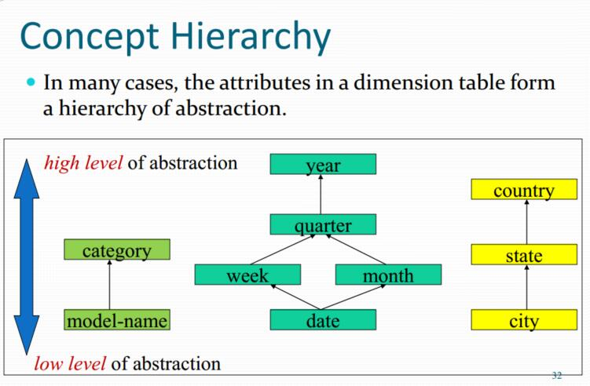

#### 基本操作
OLAP允许用户从多种角度分析多维数据，主要包括以下五种基本操作：上卷(consolidation/roll-up)、下钻(drill-down)、切片(slice)、切块(dice)和旋转(pivot)。

##### 上卷roll-up
上卷表示沿着某一维度按照一定的规则(rule)对数据进行聚合(aggregation)操作，沿着某一维度，即按照层级关系从子类维度向父类维度作聚合。

##### 下钻(Drill-down)
下钻和上卷正好相反，允许用户从已聚合的数据集中提取出所关注的细节。下图表示了从“Outdoor-Schutzausrüstung”这个父类维度中抽取出三个子类维度的下钻过程。

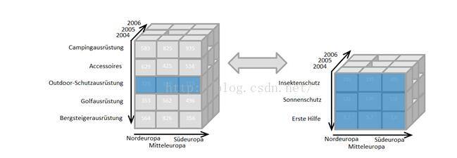

zwlj：每个维度就是一个维度变量嘛，然后一个维度变量有一个维度表，相当于对这个维度细化了，下钻就是对某一个维度，进行细化抽取出子维度(不知是否理解有误)

##### 切片(Slice)
切片表示通过选择某个维度的单一值(value)，从OLAP cube中抽取出一个分片的过程。下图表示了从原始OLAP cube中抽取出time = 2004分片的过程。

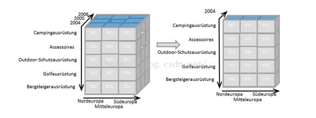

##### 切块(Dice)
切块表示通过选择多个维度的某些值（或者区间），从OLAP cube中抽取出子cube的过程。下图表示了从原始OLAP cube中抽取某个维度中多值对应的子cube的过程。

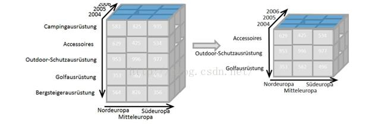

##### 旋转(pivot)
旋转操作允许用户通过旋转(rotate)OLAP cube，重新选择目标分析维度，通常表现为交换坐标轴操作。在下图中，原始的OLAP cube的X轴是产品名称，Y轴是地区名称，Z轴是年份；经过旋转操作后cube表示了每个产品在不同年份、不同地区的统计情况。

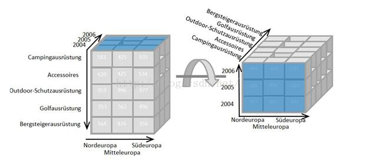

#### OLAP查询(OLAP queries)
大部分的OLAP查询都涉及到
 - selecting 选择
 - grouping 分组
 - aggregating 聚合

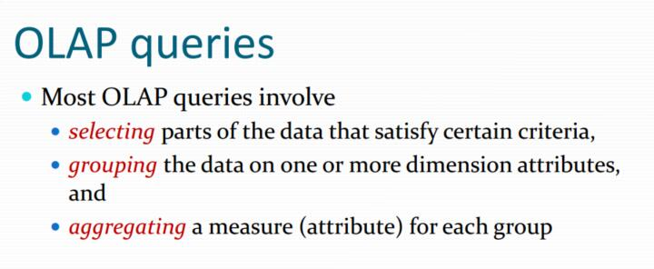

下面看一个query示例：

`Query: “Compute the total sales of vans in each state
during the first quarter of 2000.`

 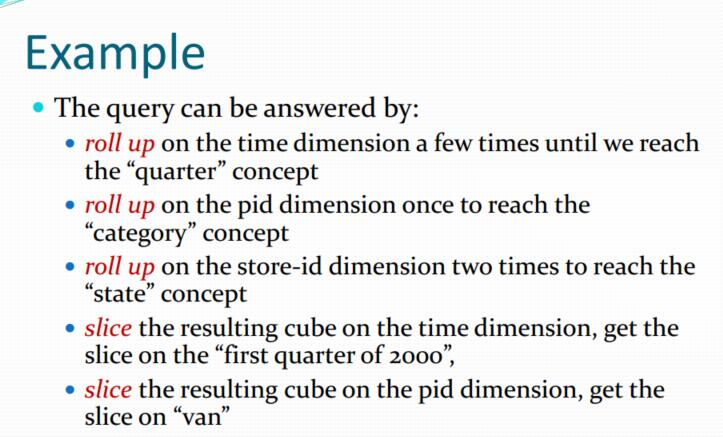

不断进行rollup，然后slice，取出想要的cell。

#### Cubooid的预计算(pre-computing)
每次query都用basic quboid来进行计算，复杂度太高了，我们可以提前把一下quboid就算好。

不过这确实也要很多存储空间和开销。
