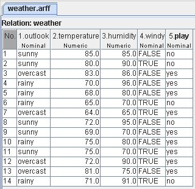
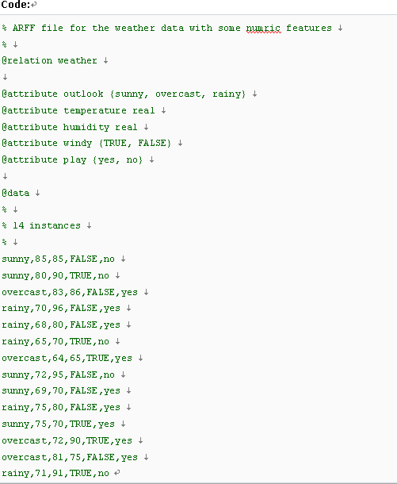

## weka
WEKA的全名是怀卡托智能分析环境（Waikato Environment for Knowledge Analysis），它的源代码可通过http://www.cs.waikato.ac.nz/ml/weka得到。同时weka也是新西兰的一种鸟名，而WEKA的主要开发者来自新西兰。

WEKA作为一个公开的数据挖掘工作平台，集合了大量能承担数据挖掘任务的机器学习算法，包括对数据进行预处理，分类，回归、聚类、关联规则以及在新的交互式界面上的可视化。

### 数据集

跟很多电子表格或数据分析软件一样，WEKA所处理的数据集是图1那样的一个二维的表格。

表格里的一个横行称作一个实例（Instance），相当于统计学中的一个样本，或者数据库中的一条记录。竖行称作一个属性（Attrbute），相当于统计学中的一个变量，或者数据库中的一个字段。这样一个表格，或者叫数据集，在WEKA看来，呈现了属性之间的一种关系(Relation)。图1中一共有14个实例，5个属性，关系名称为“weather”。

WEKA存储数据的格式是ARFF（Attribute-Relation File Format）文件，这是一种ASCII文本文件。图1所示的二维表格存储在如下的ARFF文件中。这也就是WEKA自带的“weather.arff”文件，在WEKA安装目录的“data”子目录下可以找到。

