# 关联分析
关联分析是一种发现隐藏在大型数据集中有意义的数据联系的方法。

关联分析的一个典型例子是**购物篮分析**。该过程通过发现顾客放入其购物篮中的不同商品之间的联系，分析顾客的购买习惯。通过了解哪些商品频繁地被顾客同时购买，这种关联的发现可以帮助零售商制定营销策略。

## 问题定义

### 二元表示

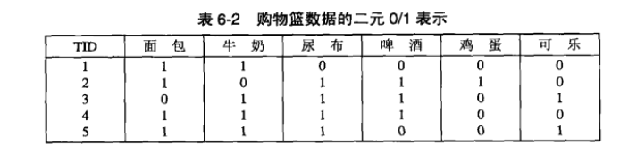

如图1所示，购物车数据可以用二元形式来表示，其中每行对应一个**事务Transaction T**，每列对应一个**项Item I**。项用二元变量表示，如果在事务中出现，值为1，否则为0。


令I={i1,i2,⋯,id}是购物车数据中所有项的集合，而T={t1,t2,⋯,tN}是所有事务的集合。每个事务ti包含的项集都是I的子集。在关联分析中，包含0个或者多个项的集合被称为**项集itemset**。如果一个项集包含k个项，就称为k−项集。例如,{啤酒，尿布，牛奶}是一个3-项集。

项集的一个重要性质是**支持度计数sup**，即**包含特定项集的事务个数**。数学上，项集XX的支持度计数σ(X)可以表示为：

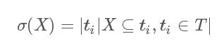

例如在图1中，项集{啤酒，尿布，牛奶}的支持度计数为2，因为只有2个事务包含这3 个项。σ(X)也可以写作sup(X)

### 关联规则
关联规则是形如**X→Y**的表达式，其中X和Y是不相交的项集，即X∩Y=∅。关联规则的强度可以用**支持度和置信度confidence衡量**。

支持度确定规则可以用于给定数据集的频繁程度，而置信度确定Y在包含X的事务中出现的频繁程度。支持度(s)和置信度(c)的形式定义如下：

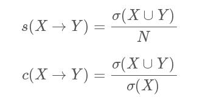

支持度是一种重要度量，因为支持度低的规则可能只是偶然出现。另一方面，置信度通过规则推理具有可靠性。

通过设置threshold可以找到关联关系


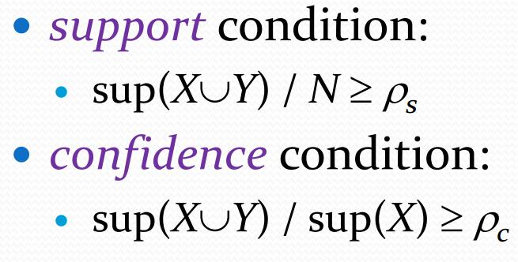

因为计算**每个可能规则**的支持度和置信度方法的代价很高，所以大多数关联挖掘算法采取的策略是将任务分解为**如下两个主要子任务**:

1. **频繁项集产生**：其目标是发现满足最小支持度阈值的所有项集，这些项集称做**频繁项集**（frequent itemset)。

2. **规则的产生**：其目标是从上一步发现的频繁项集中**提取所有高置信度的规则**，这些规则称做强规则(strong rule)。

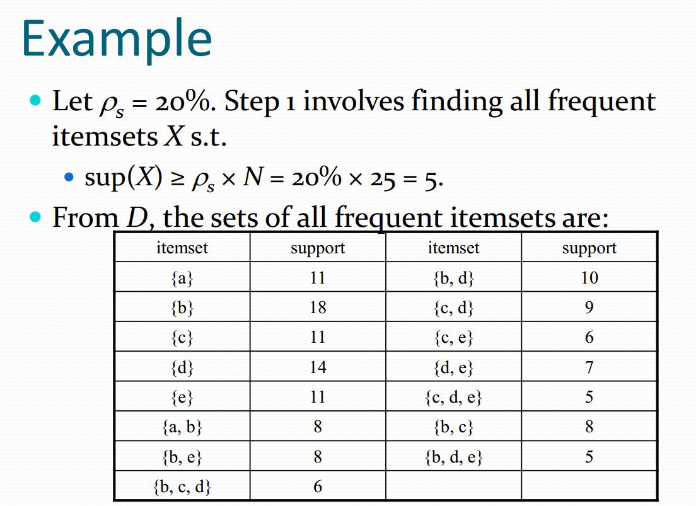

找频繁项集的时候，先找一个项支持度高的，然后再慢慢往上找多项的支持度。

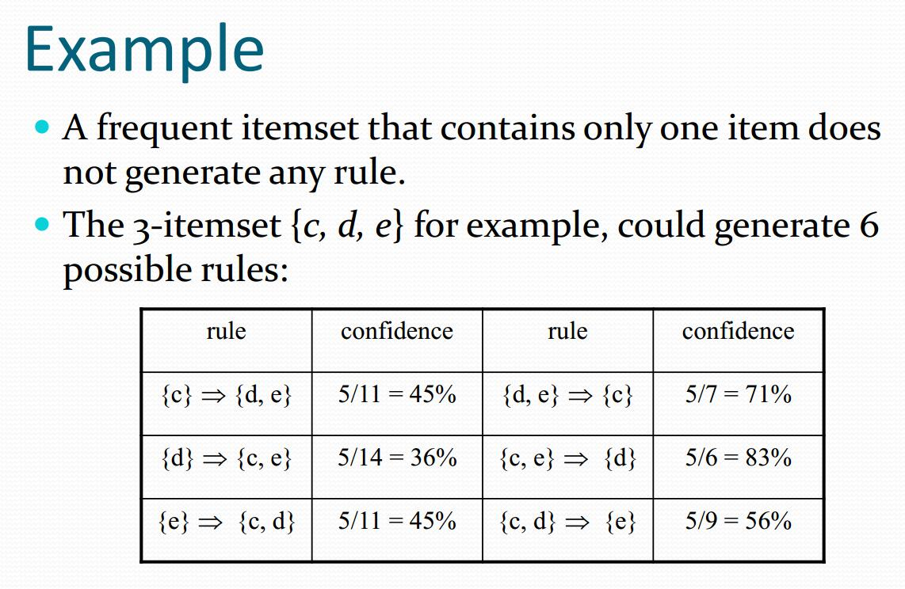

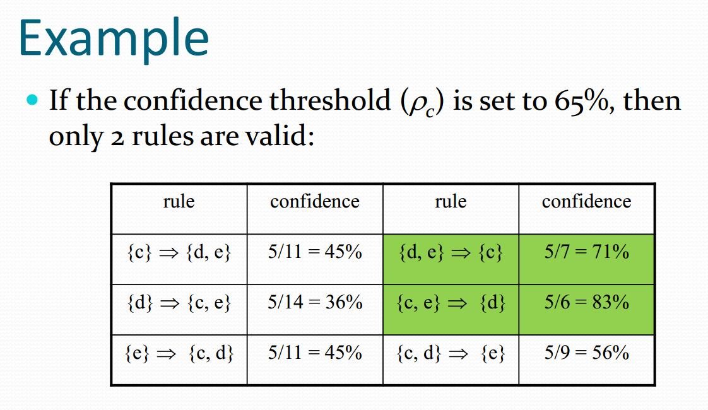

### 产生频繁项集
格结构(lattice structure)常常被用来枚举所有可能的项集。图2显示I={a,b,c,d,e}的项集格。

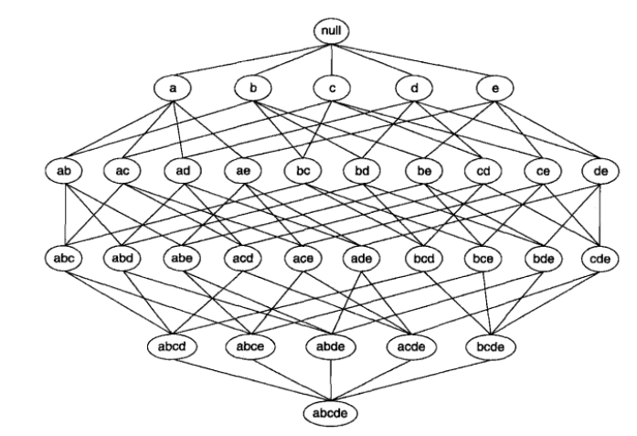

发现频繁项集的原始方法是确定格结构中每个候选项集的支持度计数。为了完成这一任务，必须将每个候选项集与每个事务作比较，这种方法的开销非常大。

可以使用apriori算法进行优化。

#### Apriori算法
Apriori算法是第一个关联规则挖掘算法，它开创性地使用基于支持度的剪枝技术。支持度的剪枝是基于一个先验原理:**如果项集是频繁的，那么它的所有子集也是频繁的**。

Apriori算法初始时每个项都被看做候选1-项集。对它们的支持度计数并筛选后，利用产生的频繁1-项集来产生候选2-项集，以此类推。图3给出了Apriori算法的例子。

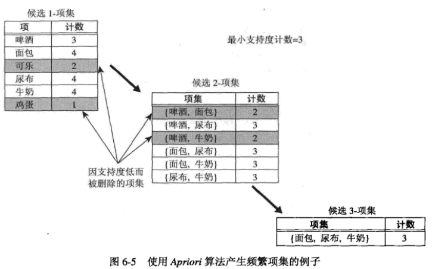

Apriori算法有2个重要的特点。 1.逐层算法，从频繁1-项集到最长的频繁项集，每次遍历项集格中的一层。 2.每次迭代之后，新的候选项集都有前一次迭代的频繁项集产生。

**apriori-gen函数** 采用的方法是Fk−1×Fk−1。由前k−2个项相同的一对k−1项集**合并产生**

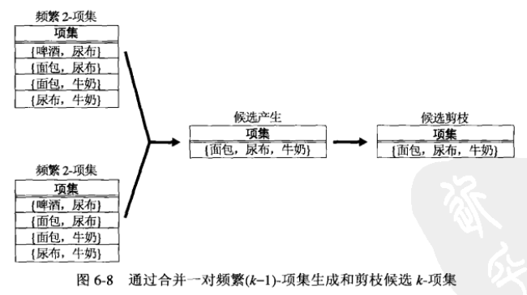

所以是逐层迭代，每次找到每层只有一个不同项的，将其合并。

#### 支持度计数

支持数计数过程确定在候选项剪枝步骤保留每个候选项集出现的频繁程度。原始的做法是，**将每个事务与所有的候选项集比较**，并跟更新包含在事务中的候选项集支持度计数，这样的计算**代价太昂贵**。现在使用的方法是枚举每个事务包含的项集，并利用它们更新对应的候选项集支持度。

zwlj:原本是对每个事务都去扫一遍候选集更新，现在则不去扫，是分解事务的项，然后分解完以后直接去更新对应计数。

比如已经迭代到第三层了，要找到候选三项集的支持度计数，则对每个事务分解三项集。


#### hash优化
我们在做上面支持度计数步骤的时候，数据结构可以用哈希表，比如12356计算子项的支持度的时候则可以h(123)所在计数加一，底层数据结构采用哈希表。

#### 分布式算法
我们还可以采用分布式算法来计算支持度。

我们把事务数据集分成n个部分，分给不同的节点进行支持度计算。对于每个节点，如果支持度达到treshold要求，则是locally frequently,如果全局符合要求，则是globally frequently。

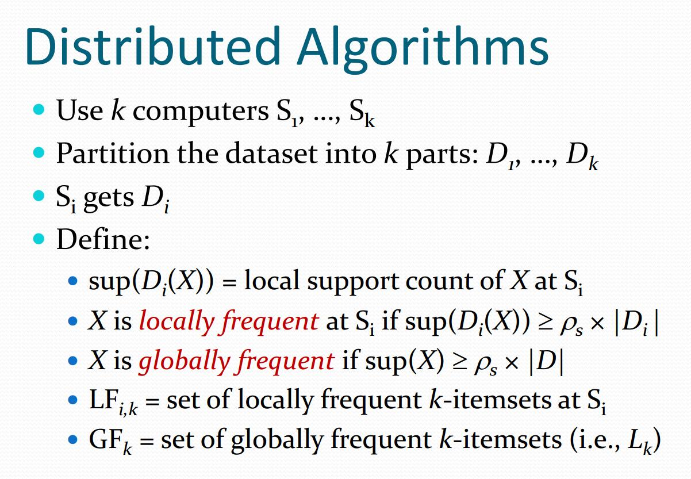

所以原则上，就是每个节点计算自己的局部频繁项集，然后再从其他节点获取每个节点的局部计算信息，最后计算出全局的频繁项集。

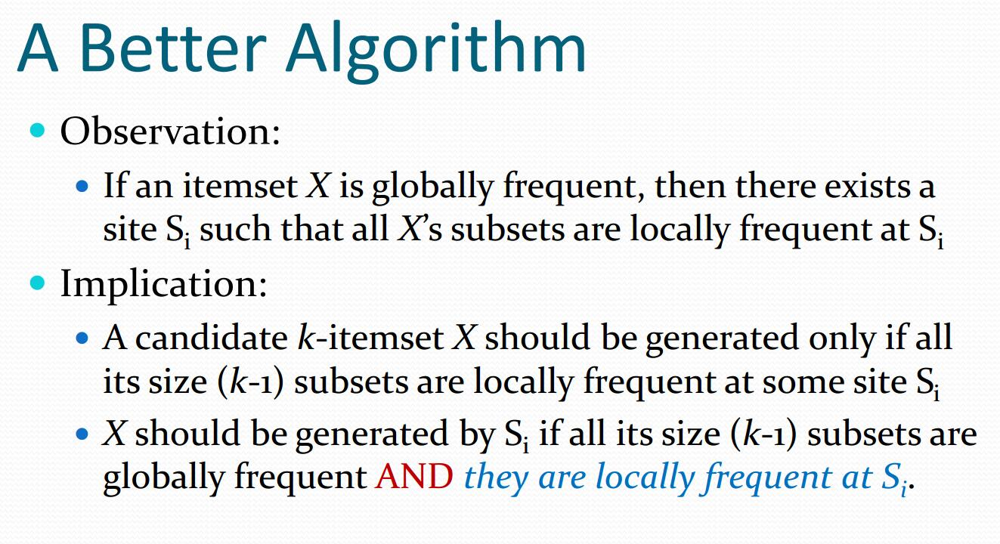

有隐性原则，如果一个k项集是全局频繁，那他的所有k-1项集必定全局频繁，并且他们局部频繁在某si节点。

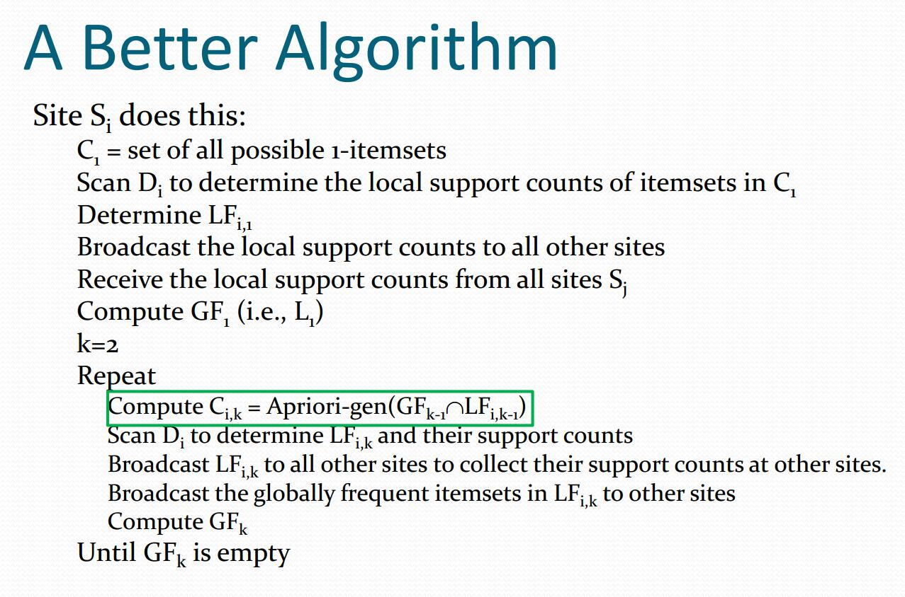

算法框架如上，无非就是计算局部频繁，然后接受其他节点信息，然后计算全局。但要注意的是，由于有隐性原则，所以上图打框那个部分，每次只需要计算全局频繁k-1项集和局部频繁项集k-1的(k-1)交集产生k频繁项集即可。其他不满足条件的都不可能是全局频繁。

### 紧凑频繁项集表示

#### 极大频繁项集(Maximal Frequent Itemset)
通俗的讲，就是某个项集是频繁的，但是这个项集之后的所有衍生集都不再频繁了。

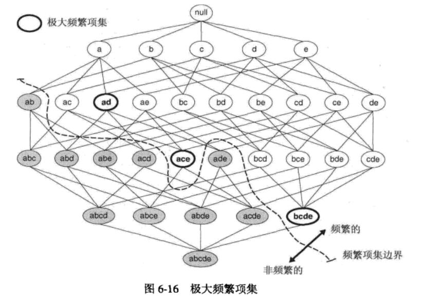

如上图，阴影是非频繁项集，虚线是边界，白色都是频繁项集。由图可以知道，ad，ace，bcde是极大频繁项集。他们衍生出来的项集全都不频繁了，但ac不是极大，因为ace是频繁项集。

#### 闭频繁项集(Closed Itemset)
如果一个项集的直接超集(衍生项集)都和他的支持度计数不一样，那么这个项集就是闭合的。

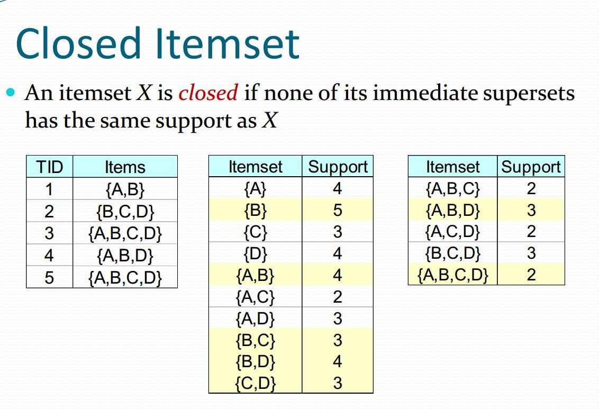

如上图，打黄色的就是闭频繁项集。

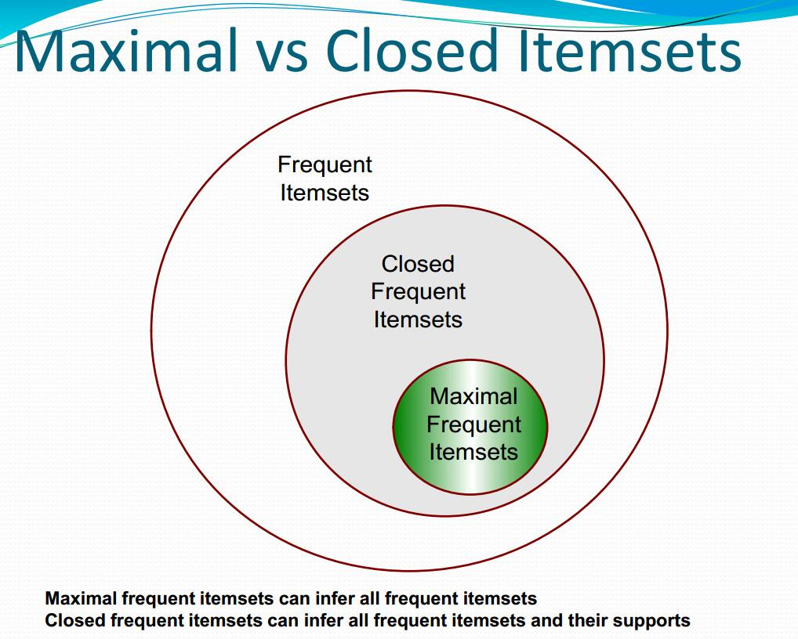

不难想象极大频繁项集和闭频繁项集的包含关系。

### 项集utility计算


除了支持度，我们还可以计算项集的utility

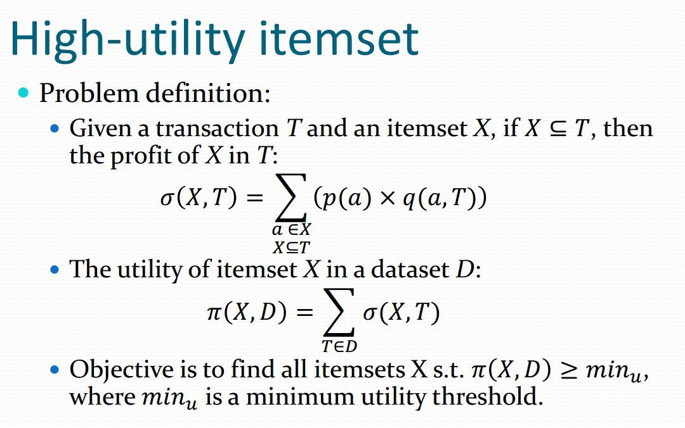

公式看上去很复杂，其实就是对于某个项集，找出所有包含它的事务条目，依次计算profit然后求和。


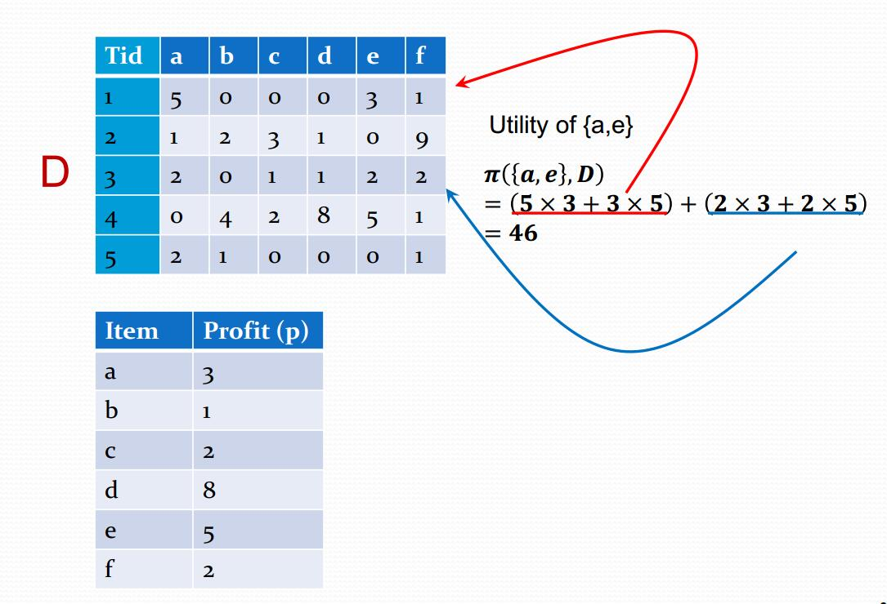

如上图，ae只在条目1和3里同时出现，事务1买了5个a和3个e,下表是profit表，所以有5\*3+3\*e，计算profit和作为utility。


### FP树增长算法
FP-Growth，一种不同于Aprior的算法用来产生频繁项集。采用紧凑的数据结构。

FP-growth算法通过构建FP-tree来压缩事务数据库中的信息，从而更加有效地产生频繁项集。FP-tree其实是一棵前缀树，按支持度降序排列，支持度越高的频繁项离根节点越近，从而使得更多的频繁项可以共享前缀。


上图表示用于购物篮分析的事务型数据库。其中，a，b，...，p分别表示客户购买的物品。首先，对该事务型数据库进行一次扫描，计算每一行记录中各种物品(也就是1项集)的支持度，然后按照支持度降序排列，仅保留频繁项集，剔除那些低于支持度阈值的项

这里支持度阈值取3，从而得到<(f:4)，(c:4)，(a:3)，(b:3)，(m:3，(p:3)>,也就是说少的那些商品比如g，k这些就从事务购物篮里删除，然后把每个条目里商品按频繁度排序。

然后就可以开始fp树的构建了：

FP-tree的根节点为null，不表示任何项。接下来，对事务型数据库进行第二次扫描，从而开始构建FP-tree：

第一条记录\<f，c，a，m，p\>对应于FP-tree中的第一条分支<(f:1)，(c:1)，(a:1)，(m:1)，(p:1)>：

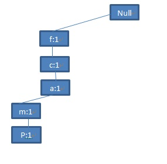

由于第二条记录\<f，c，a，b，m\>与第一条记录有相同的前缀\<f，c，a\>，因此\<f，c，a\>的支持度分别加一，同时在(a:2)节点下添加节点(b:1)，(m:1)。所以，FP-tree中的第二条分支是\<(f:2)，(c:2)，(a:2)，(h:1)，(m:1)\>：

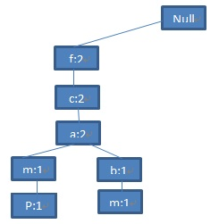

每个事务都依次构树，重叠的路径就加一。最后就能构建出下面的树

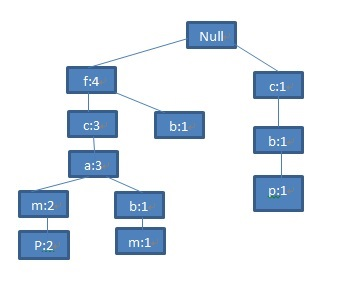

为了便于对整棵树进行遍历，建立一张**项的头表item header table**。这张表的第一列是按照降序排列的频繁项。第二列是指向该频繁项在FP-tree中节点位置的指针。FP-tree中每一个节点还有一个指针，用于指向相同名称的节点

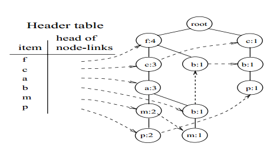

我们从头表的底部开始挖掘FP-tree中的频繁模式。在FP-tree中以p结尾的节点链共有两条，分别是\<(f:4)，(c:3)，(a:3)，(m:2)，(p:2)\>和\<(c:1)，(b:1)，(p:1)\>。其中，第一条节点链表表示客户购买的物品清单\<f，c，a，m，p\>在数据库中共出现了两次。需要注意到是，尽管\<f，c，a\>在第一条节点链中出现了3次，单个物品\<f\>出现了4次，但是它们与p一起出现只有2次，所以在条件FP-tree中将\<(f:4)，(c:3)，(a:3)，(m:2)，(p:2)\>记为\<(f:2)，(c:2)，(a:2)，(m:2)，(p:2)\>。同理，第二条节点链表示客户购买的物品清单\<c，b，p\>在数据库中只出现了一次。

我们将p的前缀节点链\<(f:2)，(c:2)，(a:2)，(m:2)\>和\<(c:1)，(b:1)\> 称为p的**条件模式基conditional pattern base**。

我们将p的条件模式基作为新的事务数据库，每一行存储p的一个前缀节点链，根据第二节中构建FP-tree的过程，计算每一行记录中各种物品的支持度，然后按照支持度降序排列，仅保留频繁项集，剔除那些低于支持度阈值的项，建立一棵新的FP-tree，这棵树被称之为**p的条件FP-tree**：

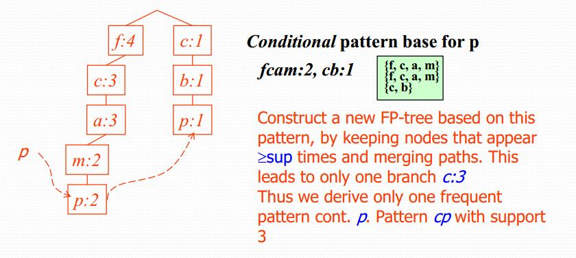

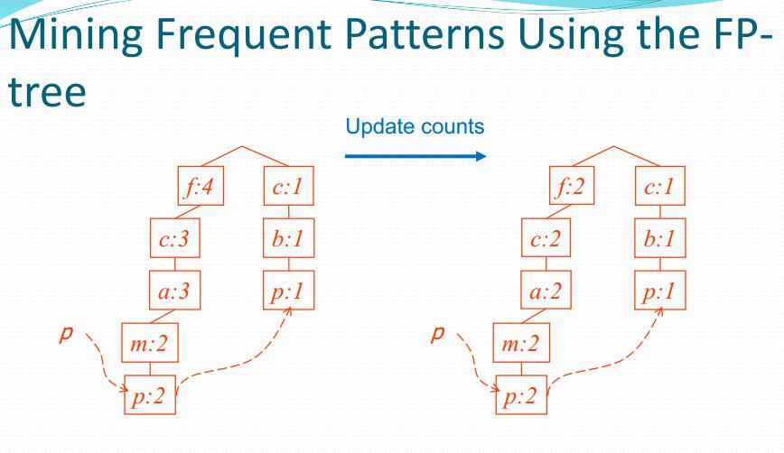

如上图，得到条件模式基之后，我们继续应用treshhold sup=3，也就是对每一条新链继续计算支持度，支持度低于3的节点删掉，然后再重新排序。

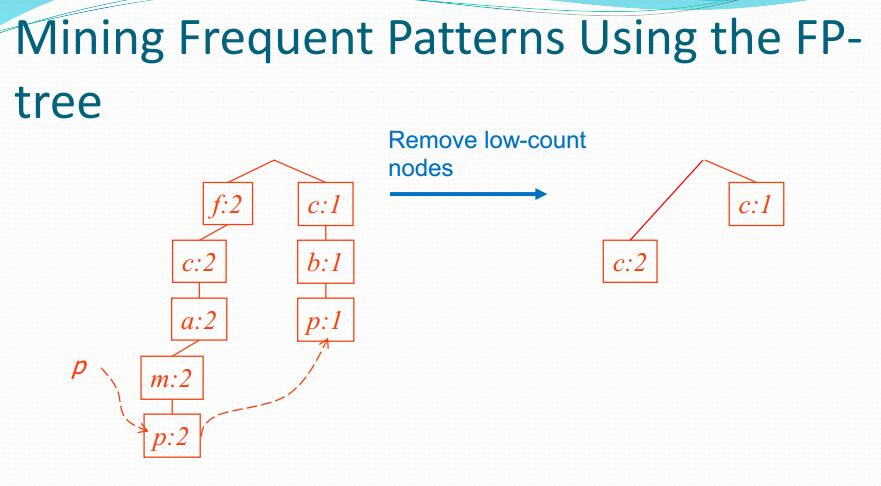

然后合并

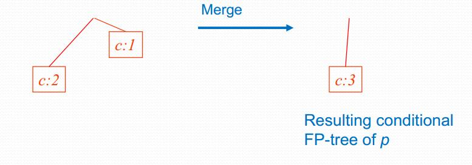

这就是p的条件FP树。**所以以p结尾的频繁项集有(p:3)，(cp:3)。由于c的条件模式基为空，所以不需要构建c的条件FP-tree**。

#### 多节点的情况
上面的介绍只是简单的一种情况，下面看一个稍微复杂一些的。

在FP-tree中以m结尾的节点链共有两条，分别是\<(f:4)，(c:3)，(a:3)，(m:2)\>和\<(f:4)，(c:3)，(a:3)，(b:1)，(m:1)\>。所以**m的条件模式基**是\<(f:2)，(c:2)，(a:2)\>和\<(f:1)，(c:1)，(a:1)，(b:1)\>。我们将m的条件模式基作为新的事务数据库，每一行存储m的一个前缀节点链，计算每一行记录中各种物品的支持度，然后按照支持度降序排列，仅保留频繁项集，剔除那些低于支持度阈值的项，建立m的条件FP-tree:

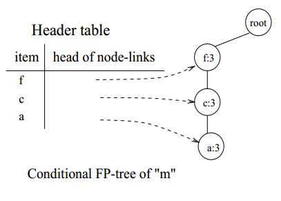

与p不同，m的条件FP-tree中有3个节点，所以需要多次递归地挖掘频繁项集mine(\<(f:3)，(c:3)，(a:3)|(m:3)\>)。按照\<(a:3)，(c:3)，(f:3)\>的顺序递归调用mine(\<(f:3)，(c:3)|a，m\>)，mine(\<(f:3)|c，m\>)，mine(null|f，m)。由于(m:3)满足支持度阈值要求，所以以m结尾的频繁项集有{(m:3)}。

**zwlj:也就是此时我们以m为底，给a加前缀，然后一个一个往上加节点，先是(fc|am)，然后是(f|cm)，然后算(null|fm)**

我们看看节点am的条件fp树。之后显然还要算(null|fam)和(f|cam)

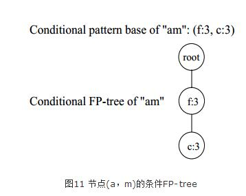

递归所有可能的条件fp树，可以找到所有频繁项集：

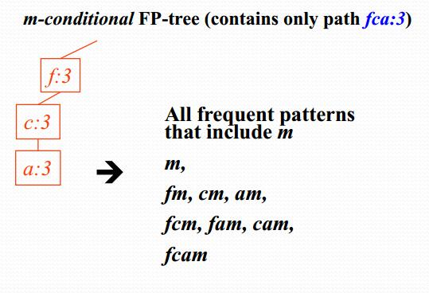

Apriori及其变形算法需要多次扫描数据库，并需要生成指数级的候选项集，性能并不理想。**FP-growth算法提出利用了高效的数据结构(紧凑的数据结构)FP-tree，不再需要多次扫描数据库，同时也不再需要生成大量的候选项**。

**但是FP-growth也优缺点，就是吃内存，需要把整一棵树都塞进内存。对于非常大的数据库，也许并不适用FP算法**。

### 关联模式评估Pattern Evaluation
模式评估指的是根据某种兴趣度度量，识别代表知识的真正有趣的模式。

我们之前通过support-confidence association rule mining framework得到的强规则**不一定是有趣的**，所以它不足以进行模式评估，甚至在一些情况下，甚至常用的lift和chi-square measures也没有很好的效果。

```
Redundant if {A,B,C} -> {D} and {A,B} -> {D}
have same support & confidence
```

如上例子，如果知道了AB就可以关联D,那多一个C是多余

#### 相依表contingency table

客观度量常常用相依表


#### Statistical Independence(统计独立性)

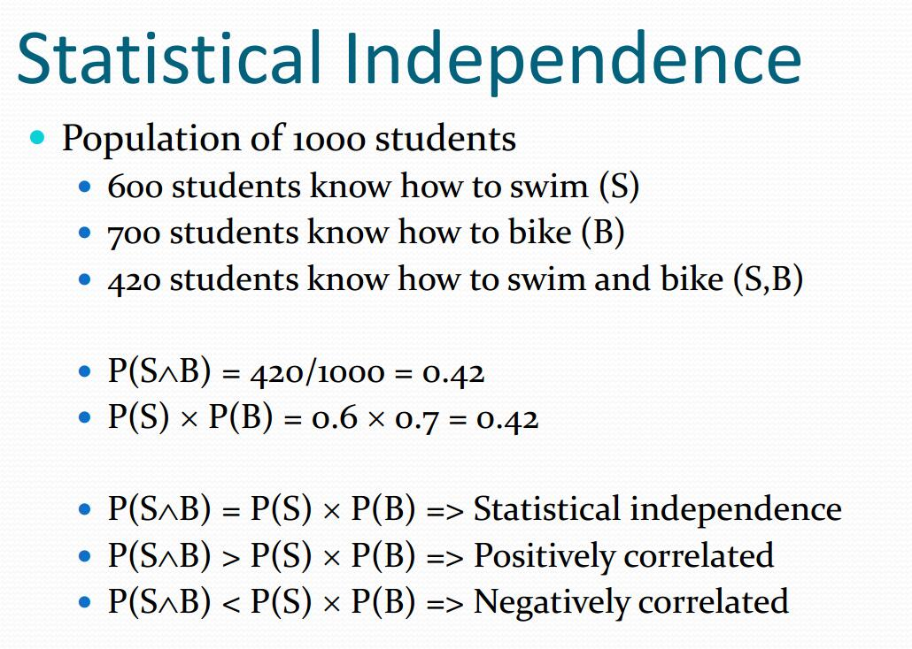

通过计算AB两者的概率来计算二者独立性，看看是正相关还是负相关。

#### 客观兴趣度量
支持度缺陷：许多潜在的有意义的模式由于包含支持度小而被删去了。

置信度缺陷：忽略了规则后件中项集的支持度。

例如，{tea}-->{coffee}，支持度15%，置信度75%，都很高，这条规则似乎可以接受；但是喝咖啡的人的比例为80%，所以如果一个人喝茶，则他喝咖啡的可能性由80%降到75%，这是一个误导。针对这个问题，一种简单方法是**提升度(lift)的度量**：lift(A-->B) = c(A-->B)/s(B)，考察规则置信度和规则后件支持度的比率。

#### lift
Lift 是用于判断事件的独立与相关性的，在一定程度上非常类似概率论中证明两个事件独立性的方法。其具体定义如下：

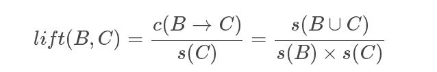

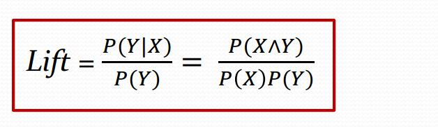

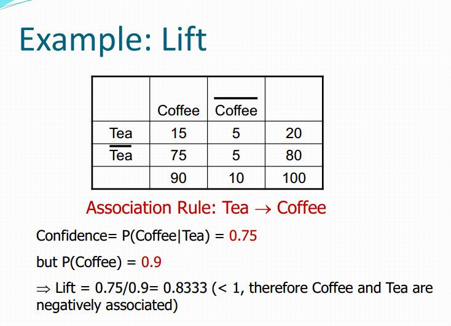

=1 : B 和 C 是独立的

\>1: 正相关

\<1: 负相关


#### QAR问题定义
量化关联分析(Quantitative Association Rules)

可以帮助我们分析不仅仅是二元关系，还能分析变量之间的数值关系。

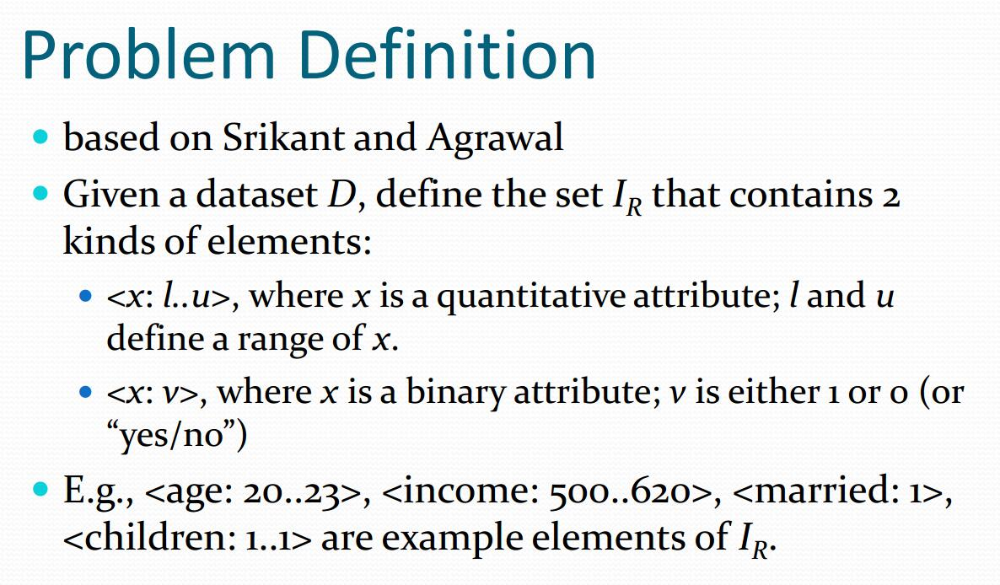

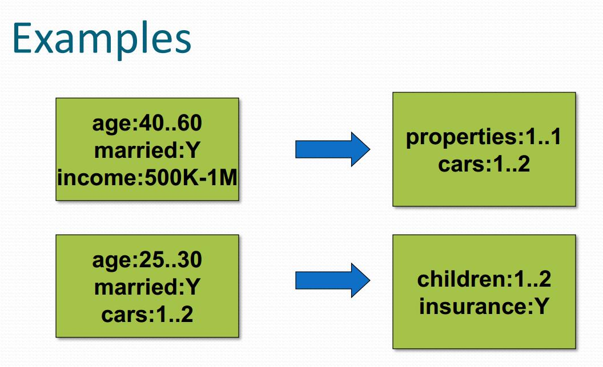

定义成QAR问题，则甚至可以通过值区间来推测出某种关系。只不过如何对连续的值划分区间，也是个要考虑的问题。

#### 基于密度区域的规则发现方法

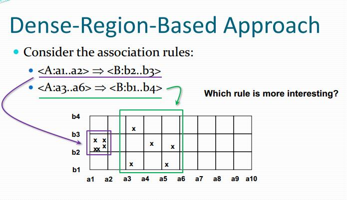

值域做成一个二元轴，然后就可以圈定了。每个圈定的矩形就可以代表一个规则。不过也要注意，点的数量要满足threshold。

### 序列模式挖掘sequence data

购物篮数据常常包含关于商品何时被顾客购买的时间信息，可以使用这种信息，将顾客在一段时间内的购物拼接成事务序列，这些事务通常基于时间或空间的先后次序。

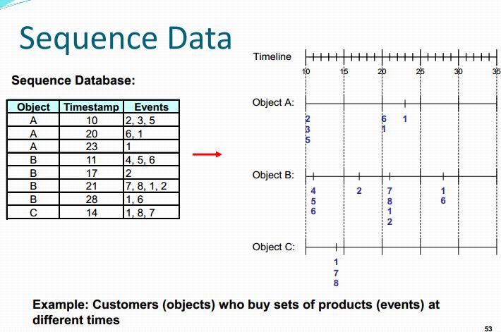

#### 正式定义

一个sequence data set是一个有序表ordered list。

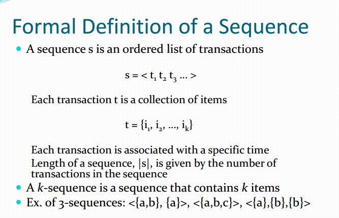


#### 包含
如果有两个数据集，一个数据集可能是另一个数据集的子序列。

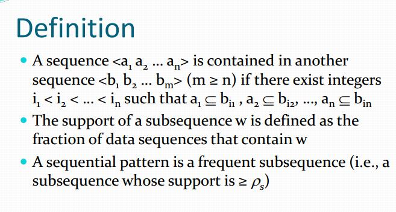


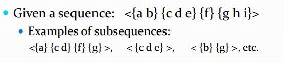

如何在一个sequence数据集里抽取出一个k项sequence子集，这是一个非常有挑战的任务。


#### 序列模式发现

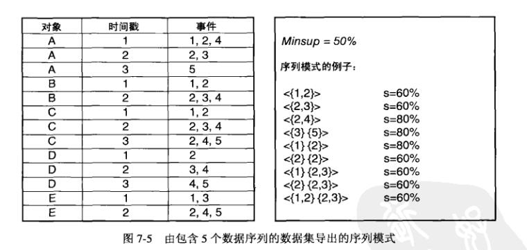

如图左边是一个sequence data数据集，以对象ABCDE来分，这个数据集其实可以分为5个数据序列。比如A的事务数据序列(按时间顺序)就是A={(1,2,4),(2,3),(5)}

那么suport就好算了，显然\<(1,2)\>这个项属于A，属于B，属于C，那么ABCDE里占三个，支持度support就是60%。

然后我们就可以设定一个threshold，从而找出频繁frequent的数据序列。

#### 产生序列模式(Generalized Sequential Pattern)
项集和序列要区分开来。

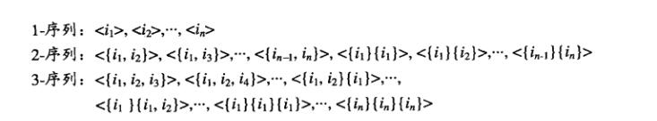

从1序列产生2序列，不仅仅是产生一个二项集，比如i1和i2，可能会产生{(i1,i2)}也可以产生{(i1,i2)}.

 - 一个项在项集中最多出现一次，但是一个时间可以在序列中出现多次，如给定的两个项i1和i2，可以产生许多候选2-序列，如<i1,i2>,<i2,i1>,<i1,i1><i1,i2>,<i1,i2>,<i2,i1>,<i1,i1>。
 - 次序在序列中很重要，但是在项集中不重要。如{1, 2}和{2, 1}表示同一个项集，但是<i1i2><i1i2>和<i2i1><i2i1>表示不同序列。

**先验原理Apriori对于序列数据成立**

该算法迭代地产生新的候选k序列，减掉那些(k-1)序列非频繁的候选，然后对保留的候选计数，识别序列模式。

#### 序列合并过程

序列合并和Apriori很相向，只不过这次亦要分类讨论。假如A序列和B序列合并，主要就是看A去掉第一个元素(不是项),和B去掉最后一个元素之后是否元素一致。

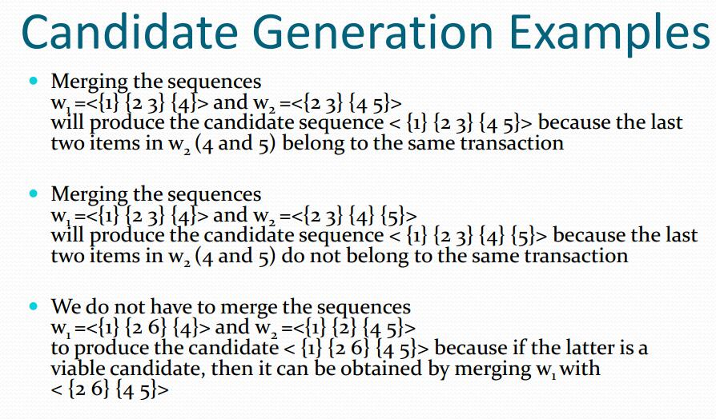

第一个例子，如果序列A去头1，和序列B去尾5，其余数字相等，那就可以合并了，由于w2是{4,5},4和5是本来就合并了的，所以产生的候选序列数据就是\<(1),(2,3),(4,5)\>

同理，第二个例子，w2的4和5不在一起，则最后则是分开成\<(1),(2,3),(4),(5)\>


例子3，去头去尾，数字(项)不完全相等，可以不合并。

**以上就是GSP(Generalized Sequential Pattern)的合并过程**

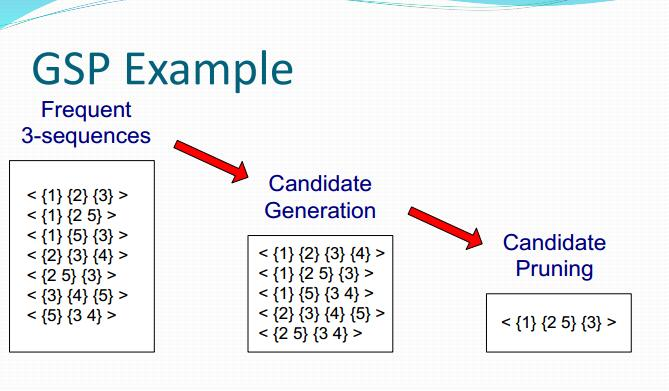

#### 候选减枝
候选剪枝，如果候选k-序列至少有一个是非频繁的，那么它将被减掉。

#### 支持度计数
在支持度计数期间，算法将枚举属于特定数据序列的所有候选k-序列，这些候选的支持度将增值。计数之后，算法识别出频繁k-序列，并舍弃支持度小于阈值的候选。
