## 决策树Decision-Tree Classifier
决策树是一种简单但广泛使用的分类器，它通过训练数据构建决策树，对未知的数据进行分类。决策树的每个内部节点表示在一个属性上的测试，每个分枝代表该测试的一个输出，而每个叶结点存放着一个类标号。

决策树由节点（node）和有向边（directed edge）组成。节点的类型有两种：内部节点(internal node)和叶子节点(leaf node)。其中，内部节点表示一个特征或属性的测试条件（用于分开具有不同特性的记录），叶子节点表示一个分类。

如上图，流程上就像是用if语句进行一层一层的条件判断(rule)，最后得到分类结果。

### 信息熵Entropy
信息熵（entropy）。在信息论中，熵是表示随机变量不确定性的度量。熵的取值越大，随机变量的不确定性也越大。

**zwlj：也就是数据的混乱程度，数据中类别越多，说明越不纯，越混乱，所以信息熵越大。**

信息熵的公式为：

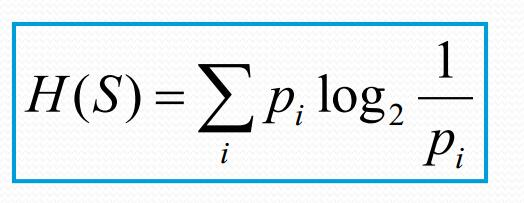

熵是平均信息量，也可以理解为不确定性。例如进行决赛的巴西和南非，假设根据经验判断，巴西夺冠的几率是80%，南非夺冠的几率是20%，则谁能获得冠军的信息量就变为 - 0.8 * log2 0.8 - 0.2 * log2 0.2 = 0.257 + 0.464 = 0.721

几率越大，不确定性就越少。

#### 判断划分好坏

如何判定一个划分好还是不好，也看信息熵，如果一个划分在划分之后，仍然非常模糊，难以分类，那这个划分的信息熵必然很高，也就是效果很差。

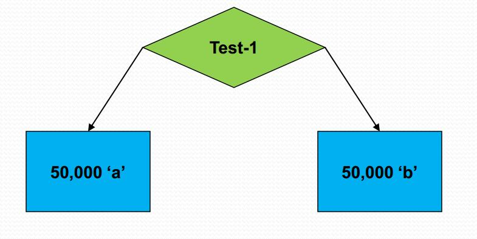

上图Test-1是一个分类条件，相当于if语句，把100000个数据分成了左右两边。我们发现50000个a被分到了左边，50000b分到了右边，此时可以说分类已经完成了。

此时左右两边的熵都为 1*log1 = 0

所以这个条件是个非常好的划分。接下来看一个不是这么好的划分。

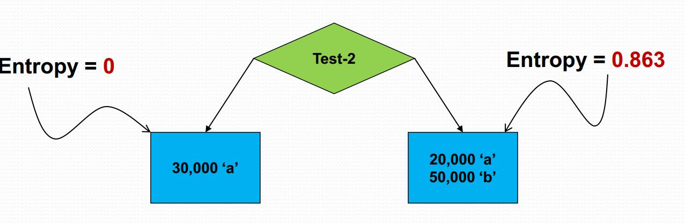

上图可知，只要被分到左边就是对的，但是分到右边之后就还要继续再分。左边信息熵为0，右边信息熵为 -2/7\*log2/7-5/7\*log5/7 = 0.863

最后平均熵则为：

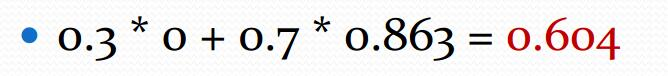

划分之前，信息熵为1，那么划分之后就使得熵从1减少到了0.604.这就是我们后面讲的信息增益。
### 信息增益information gain
而我们的信息增益恰好是：信息熵-条件熵。

**换句话说，信息增益代表了在一个条件下，信息复杂度（不确定性）减少的程度。**

在决策树算法中，我们的关键就是每次选择一个特征，特征有多个，那么到底按照什么标准来选择哪一个特征。如果选择一个特征后，信息增益最大（信息不确定性减少的程度最大），那么我们就选取这个特征。

#### 例子
我们有如下数据：

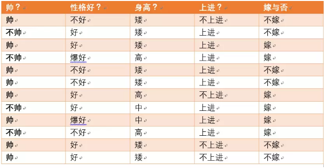

可以求得随机变量X（嫁与不嫁）的信息熵为：
嫁的个数为6个，占1/2，那么信息熵为-1/2log1/2-1/2log1/2 = -log1/2=0.301

现在假如我知道了一个男生的身高信息。

身高有三个可能的取值{矮，中，高}

矮包括{1,2,3,5,6,11,12}，嫁的个数为1个，不嫁的个数为6个

中包括{8,9} ，嫁的个数为2个，不嫁的个数为0个

高包括{4,7,10}，嫁的个数为3个，不嫁的个数为0个

我们先求出公式对应的:

H(Y|X = 矮) = -1/7log1/7-6/7log6/7=0.178

H(Y|X=中) = -1log1-0 = 0

H(Y|X=高） = -1log1-0=0

p(X = 矮) = 7/12,p(X =中) = 2/12,p(X=高) = 3/12

则可以得出条件熵为：
7/12\*0.178+2/12\*0+3/12\*0 = 0.103

那么我们知道信息熵与条件熵相减就是我们的信息增益，为
0.301-0.103=0.198

所以我们可以得出我们在知道了身高这个信息之后，信息增益是0.198

### 决策树构建
建立决策树，使用Hunt算法，流程如下

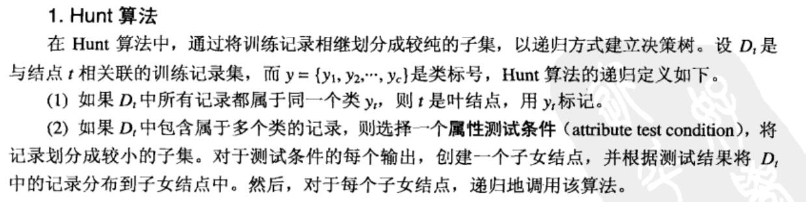

简而言之就是每次都贪心选一个信息熵减少最大的属性进行划分。构建树

#### 属性分裂
我们选定属性之后如何分裂，也有许多方式

如上图，比如如婚姻，我们既可以进行二元划分Binary split，也可以进行多路划分multi-way split。此外，数值属性也可以进行区域划分。

对连续数值属性，我们可以采用
 - 离散化：转化为ordinal 属性
 - 二元决策：(A>v) or (A<=v)

其中，二元决策通过穷举，找到一个最好的分割点。显然这需要大量的计算。

#### Gini系数和classification error
除了信息熵作为判断划分效果意外，还有gini系数和classfication error可以作为这个不纯性度量，

以下是公式：

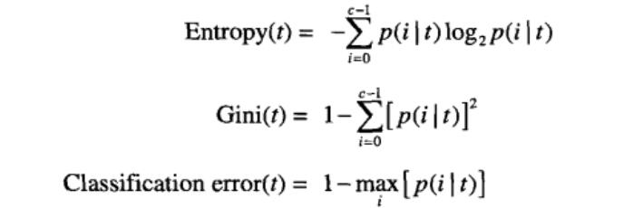

下面是计算的例子：

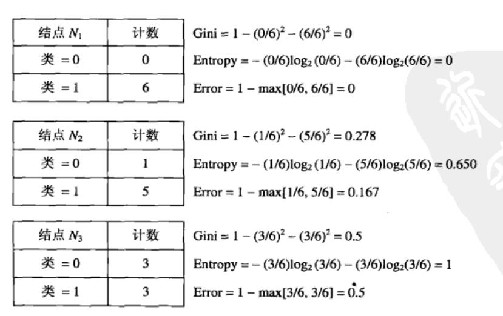

三种方法都在均匀分布时达到最大值，样本最不纯，最混乱。只有单一样本时，都为0.

#### GainRatio

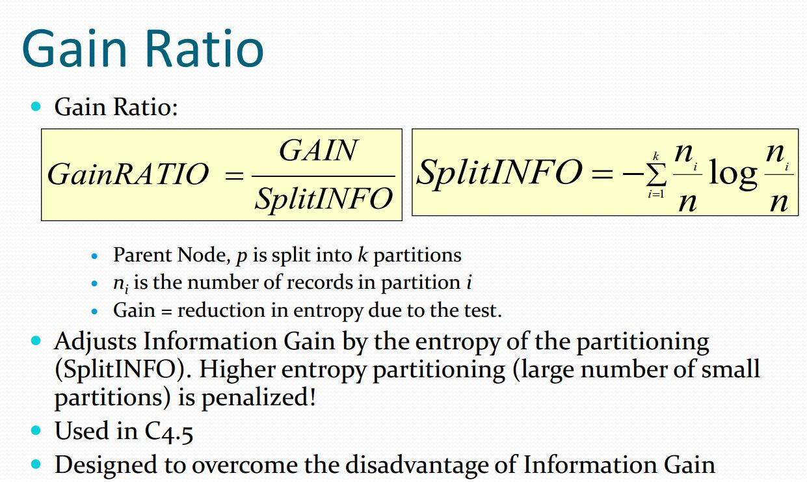

不同决策树就是用的不同算法

 - Entropy: ID3
 - Gini:CART
 - Gain Ratio:C4.5

### 交叉验证cross validation
把数据集划分成k份(k-fold),用k-1份作为训练集，剩余的一份作为测试集。我们枚举这一份测试集，然后循环k次，最后取k次计算accuracy的平均值。

### 剪枝(handling overfitting)
决策树对训练属于有很好的分类能力，但是对于未知的测试集未必有好的分类能力，泛化能力弱，即可能发生过拟合现象。为**防止过拟合**，我们需要进行剪枝。

#### 预剪枝：

 - 每一个结点所包含的最小样本数目，例如10，则该结点总样本数小于10时，则不再分；
 - 指定树的高度或者深度，例如树的最大深度为4；
 - 指定结点的熵小于某个值，不再划分。

一旦停止，节点就是树叶，**该树叶持有子集元祖最频繁的类**。

#### 后剪枝
决策树构造完成后进行剪枝。剪枝的过程是对拥有同样父节点的一组节点进行检查，判断如果将其合并，熵的增加量是否小于某一阈值。如果确实小，则这一组节点可以合并一个节点，其中包含了所有可能的结果。后剪枝是目前最普遍的做法。

后剪枝的剪枝过程是删除一些子树，然后用其叶子节点代替，这个叶子节点所标识的类别通过大多数原则(majority class criterion)确定。所谓大多数原则，是指剪枝过程中, 将一些子树删除而用叶节点代替,这个叶节点所标识的类别用这棵子树中大多数训练样本所属的类别来标识,所标识的类 称为majority class ，（majority class 在很多英文文献中也多次出现）。

### 准确度度量

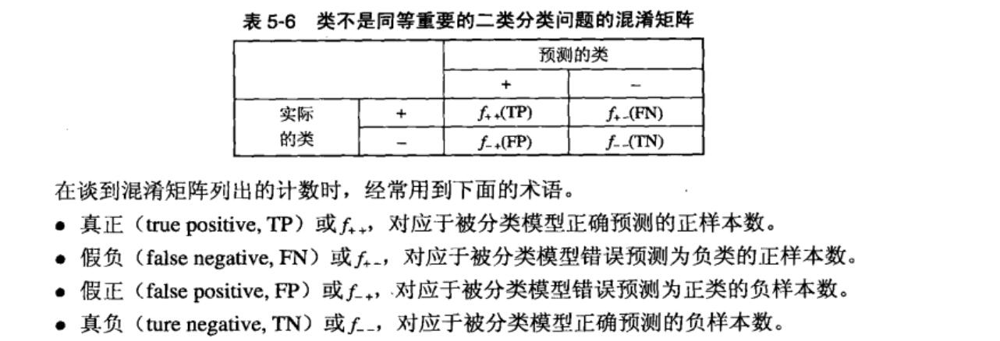

**accuracy = (TP+TN)/(TP+TN+FP+FN)**

准确率和召回率为：

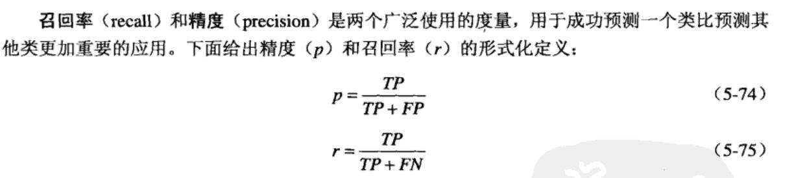

召回率代表的是，分类器正确预测中正样本占原来数据集正样本中的的比例。

召回率和准确率结合成为F1度量(两个的调和均值)

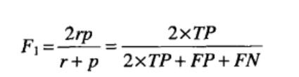
