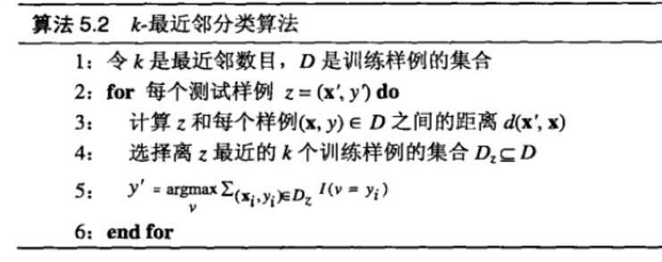
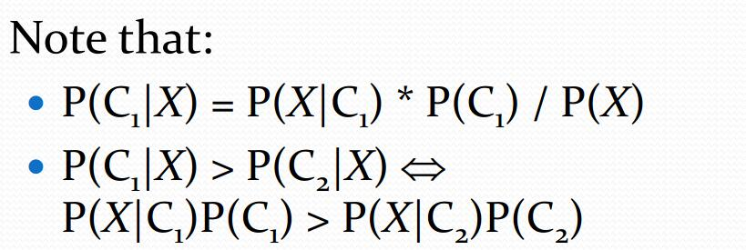
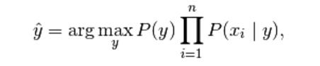
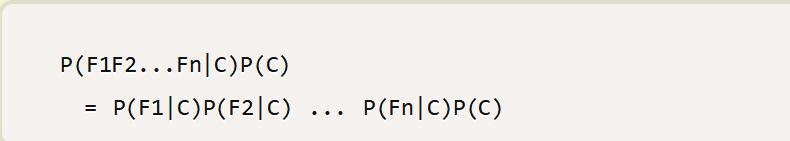

# 分类
对现有数据进行学习，得到一个目标函数或规则，把每个属性集x映射到一个预先定义的类标号y (即最终分为的几个类别)

是有监督的学习，需要训练集。

现有的分类方法有许多种，现一一介绍。

## 决策树
见决策树分类笔记

## 最近邻分类
决策树和基于规则的分类器都是**积极学习方法eager learner**的例子，因为一旦训练数据可用，他们就开始学习从输入属性到类标号的映射模型。一个相反的策略是推迟对训练数据的建模，直到需要分类测试样例时再进行。采用这种策略的技术被称为**消极学习法lazy learner**。最近邻分类器就是这样的一种方法。

K最近邻(k-Nearest Neighbor，KNN)分类算法，是一个理论上比较成熟的方法，也是最简单的机器学习算法之一。该方法的思路是：如果一个样本在特征空间中的k个最相似(即特征空间中最邻近)的样本中的大多数属于某一个类别，则该样本也属于这个类别。KNN算法中，所选择的邻居都是已经正确分类的对象。该方法在定类决策上只依据最邻近的一个或者几个样本的类别来决定待分样本所属的类别。

k值对模型的预测有着直接的影响，**如果k值过小，预测结果对邻近的实例点非常敏感**。如果邻近的实例**恰巧是噪声数据，预测就会出错**。也就是说，k值越小就意味着整个模型就变得越复杂，越容易发生过拟合。

### 朴素贝叶斯
有关贝叶斯原理和贝叶斯分类器·可看概率论和机器学习相关笔记。

朴素贝叶斯分类是一种十分简单的分类算法，**对于给出的待分类项，求解在此项出现的条件下各个类别出现的概率，哪个最大，就认为此待分类项属于哪个类别**。

假定x是特征，C是类。我们关心的是P(C|x)的值

如上图，第一条是贝叶斯公式，想要对比第二条不等式P(C1|X)和P(C2|X)的大小，由贝叶斯公式分母相等，我们只需对比分子部分就可以了。

所以分类器最终的构造就可以是：

各种各样的朴素贝叶斯分类器的不同之处在于，他们对 P(x|y) 的分布的认识和假设不同，**朴素贝叶斯假定各个特征之间相互独立**。

由此：

我们只需计算，各个特征的条件概率，然后最后乘以C类的概率即可。这就可以代表后验概率P(C|X)
