# 数据与数据集
讨论数据集，一般讨论它三个特性：

 - **维度(dimensionality)**,数据集**属性的数目**。往往数据处理的一个重要动机就是减少维度，也就是维归约(**dimensionality reduction**)

 - **稀疏性(sparsity)**,看数据集是否很多数据在某个属性上都为0.

 - 分辨率(resolution),就是取得数据的全局程度(根据单位)。比如是选择以几米的单位看地球，还是以几十公里为单位看。是以几小时为间隔检测天气数据，还是几个月为单位。精确度不同，反映的模式也大不同。

## 数据类型

### 记录数据Record

在记录数据中，每个记录有固定的属性字段。记录之间常有联系。记录数据一般放在平展文件或者数据库当中。

记录数据有几种典型的类型，比如下图四种。

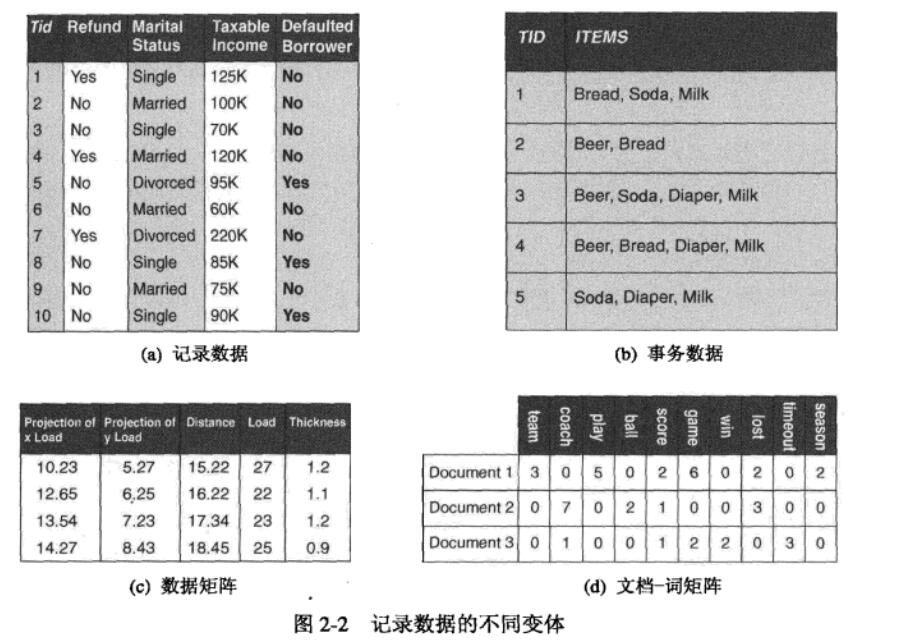

 - a是普通的记录数据，有固定字段
 - b叫 **事务数据(transaction data，or Set-valued data)**,也叫**购物篮数据**,是特殊的记录类型数据。ITEMS栏是一系列数据项的集合，且 **其中记录的字段是非对称属性(就是只有非0或空值才是重要的)**。
 - **数据矩阵(data matrix)**，如果每个字段类型相同(比如都是整数)，则每个数据可以看成一个向量。那么这个数据集就可以看成是一个数据矩阵或者叫 **模式矩阵(pattern matrix)**.由此可以用标准的矩阵操作对其进行处理。
 - 稀疏数据矩阵，数据矩阵的特例。也就是说只有非0值是重要的。比如文档-词矩阵。

### 基于图形的数据(Graph data)

具有图形一般数据结构的数据，比如不同website之间的超链接关系。可以做成一张无向图，并采用page rank算法。

### 有序数据(ordered data)
跟时间和空间有关的数据。

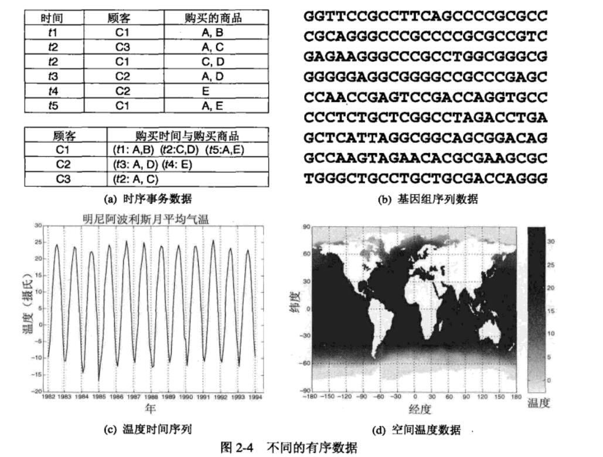

## 数据质量

### 噪声noise

数据毫无疑问，经常存在噪声(noise)

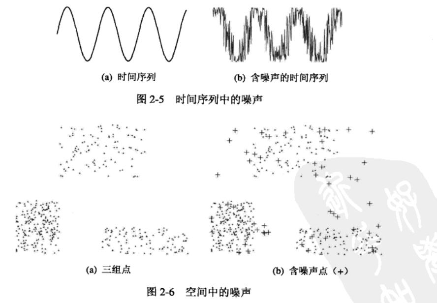

#### 处理noise
no good way，手动清理。

### 离群点outlier

有时候，某些数据对象在某种意义上不同于数据集中大部分其他数据。这些数据对象被称为**离群点outlier**。

#### 检测离群点
使用聚类算法，相似的点都会被聚集成一个cluster，如果一个点不落入任何一个cluster，那么就可以被标记为离群点。

### 遗漏值Missing values
有时候，某些对象可以回遗漏一个或者多个属性。这些就是遗漏值，比如某些人拒绝填写表格中的某些隐私属性而导致的。

我们有时可以删除或者忽略这些遗漏值多的对象。

我们也许可以

 - 忽略遗漏值
 - 用平均值填充遗漏值
 - 用特殊符号，比如null替代。

### 错误值和重复值(Errorneous and duplicate data)

顾名思义，错误的属性(比如邮编和城市不对应)，和重复的数据对象。

## 数据预处理
为了数据挖掘任务更好的进行，我们当然需要进行一定的数据预处理。

### 1.聚集Aggregation
将多个对象合并成单个对象。

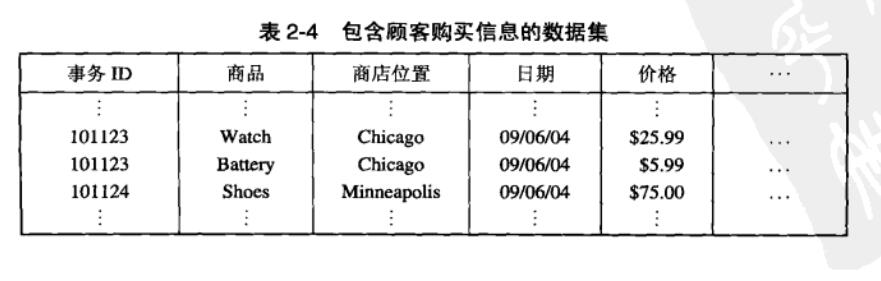

比如上图对象，我们可以把相同事务ID的数据压缩，最后形成一个事务数据(Transaction data).一个事务ID对应多个商品。

### 2.抽样Sampling
抽样当然就是集中典型的抽样方法，从大数据中选取出代表的样本。

有

 - 简单随机抽样Simple Random Sampling，随机抽取。分两种，a放回抽样，对象被选中以后依旧放回。b无放回抽样,选后不放回。
 - 分层抽样

### 3.维归约Dimensionality	Reduction
数据属性(维度)太多，所以我们要降维。

### 4.主成分分析Principal	Components Analysis

主成分分析（Principal Component Analysis，PCA）， 是一种统计方法。通过正交变换将一组可能存在相关性的变量转换为一组线性不相关的变量，转换后的这组变量叫主成分。

zwlj:在数据集中，找出相关性大且重要的属性组。

### 5.特征选择和创建Feature Creation
可以从原来属性创建新的属性。

选择属性中重要的属性，抛弃和分析主题相关性低的属性。

### 6.离散化和二元化Discretization	and	Binarization

有些数据挖掘算法，特别是某些分类算法，要求数据是分类属性形式。发现关联模式的算法要求数据是 **二元属性形式--0或者1**。这样，常常需要将连续属性变换成分类属性（离散化，discretization），并且连续和离散属性可能都需要变换成一个或多个二元属性（二元化，binarization）。

#### 二元化

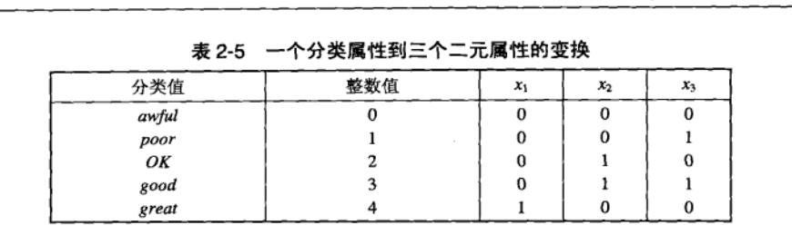

如上图，有几个分类属性值，我们可以用连续的整数0-4，对其表示，但是同时我们还想进一步把它转换为二元值，所以我们可以把对应整数转换为二进制，用x1，x2,x3，来表示。

#### 离散化
比如可以对连续的值换分区间，然后指定对应的分类值。

##### 非监督离散化Unsupervised	Discretization

用于分类的离散化方法之间的根本区别在于使用类信息（监督，supervised）还是不使用类信息（非监督，unsupervised）。如果不使用类信息，则常使用一些相对简单的方法。例如，等宽（equal width）方法将属性的值域划分成具有相同宽度的区间，而区间的个数由用户指定。这种方法可能受离群点的影响而性能不佳，因此等频率（equal frequncy）或等深（equal depth）方法通常更为可取。

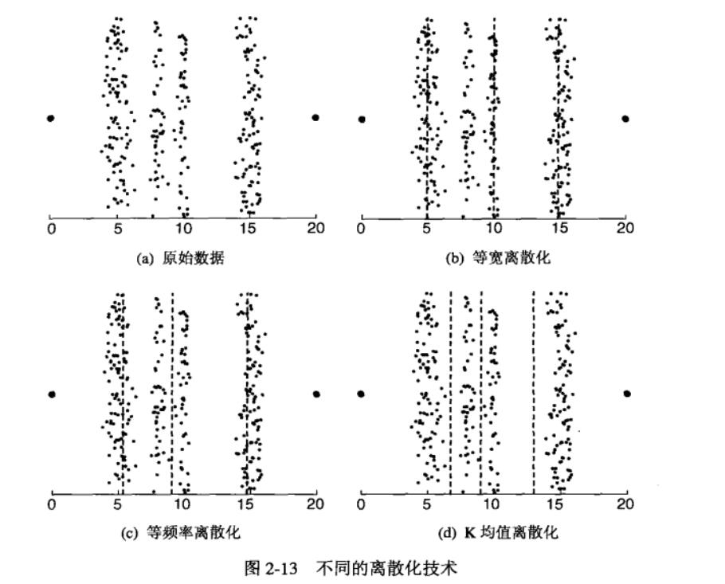

如上图，通过不同额划竖线来划分区间，达到分类。会受离群点的影响。

##### 监督离散化supervised	Discretization

简单理解就是可以对区间进行加权，或者自定义区间。

### 7.规范化Normalization
对数据进行规范化，也就是说根据数据挖掘需要进行一些变量转换。

比如是否用中位数取代平均数，用美元单位取代rmb单位等。总之就是进行变量转换。

### 8.相似性与相异性Similarity	and	Dissimilarity

除了相似度和相异性之外，我们还可以用术语**邻近度proximity**，来表示这两个概念。

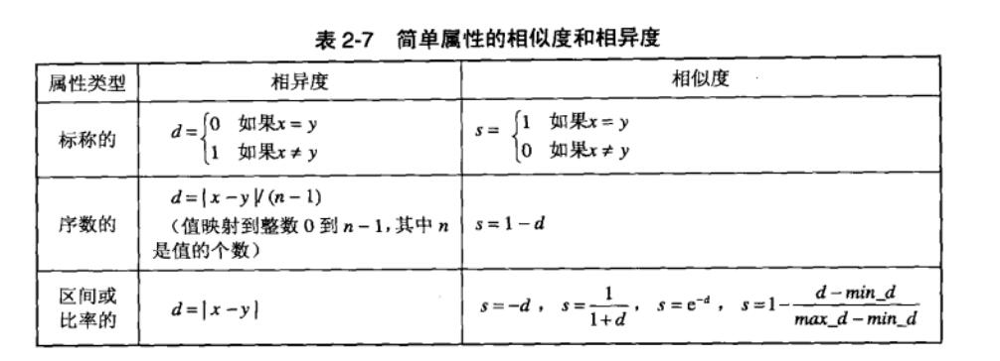

**上图是一些简单的度量方法(重)。**

三种度量方法，**标称的(Nominal),序数的(Ordinal)，区间划分的(Numerical)**,都符合distance度量性质。

序数的度量方法适用于评判标准映射到0-n-1离散值的时候，比如0代表不行,1代表啊OK,2代表很棒。则d(不行,很棒)=(2-1)/3 3就是序数值的映射个数值。

当然我们还得了解一些通用的计算方法：

#### 距离Distance

##### 欧几里得距离Euclidean Distance
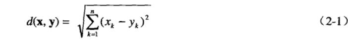

正如计算空间中点的距离。

欧几里得距离是闵可夫斯基距离r取2的结果。

##### 闵可夫斯基距离Minkowski distance

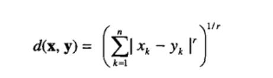

上图是闵可夫斯基距离的公式：

**公式中r取2就是欧几里得距离，r取1就是曼哈顿距离Manhattan。**

##### 切比雪夫距离Chebyshev(Supermum) Distance
切比雪夫距离：各坐标数值差的最大值，在2维空间中的计算公式为：

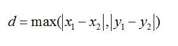

也就是求出某个维度差的最大值即可。

##### 简单匹配系数Simple	Matching	and	Jaccard Coefficients

对于两个对象，假如他们只有二元属性。

则我们有：

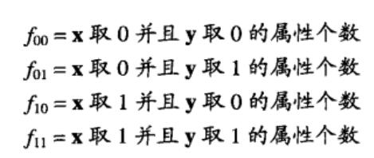

**简单匹配系数SMC的公式为：**

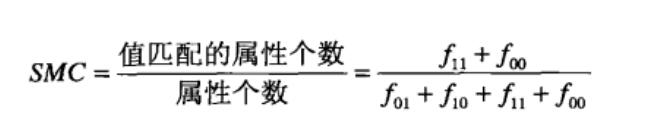

##### Jaccard系数
同理，对于二元属性对象，同上，Jaccard的公式为：

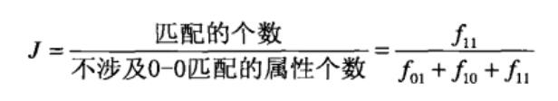

##### 余弦相似度
文档相似性最常用的度量方法，可以处理非二元属性对象。

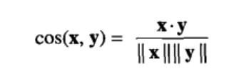

##### TF-IDF
TF-IDF（term frequency–inverse document frequency）是一种用于信息检索与数据挖掘的常用加权技术。TF意思是词频(Term Frequency)，IDF意思是逆向文件频率(Inverse Document Frequency)。

`TF-IDF = TF * IDF`

TF是词在某文档中出现的次数，有时候也可以用下面公式表示

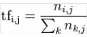

以上式子中分子是该词在文件中的出现次数，而分母则是在文件中所有字词的出现次数之和。

而逆向文件频率（inverse document frequency，IDF）是一个词语普遍重要性的度量。某一特定词语的IDF，可以由总文件数目除以包含该词语之文件的数目，再将得到的商取对数(2为底)得到

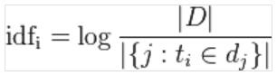

某种意义上说，词语在文档集中出现的越少，则对于持有它的文档，越具有代表性。
