# 聚类分析
聚类分析是没有给定划分类别的情况下，根据样本相似度进行样本分组的一种方法，是一种非监督的学习算法。聚类的输入是一组未被标记的样本，聚类根据数据自身的距离或相似度划分为若干组，**划分的原则是组内距离最小化而组间距离最大化**

Types of Clusters(不同的簇类型):

 - Well-separated clusters
 - Center-based clusters
 - Contiguity-based clusters
 - Density-based clusters

## 不同的簇类型

### 明显分离的簇Well-separated clusters

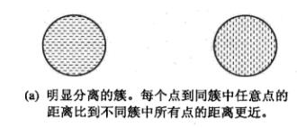

组内距离和组外距离分明。这种簇什么形状都有可能。

### 基于中心的簇Center-based clusters

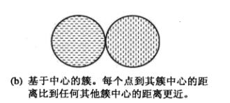

簇的原型(中心)一般是**质心centroid**，即是簇中所有点的平均值。质心没有意义时，原型(中心)则是那些最具有代表性的点**medoid**。这种簇趋向于呈球状。

### 基于邻近的簇Contiguity-Based

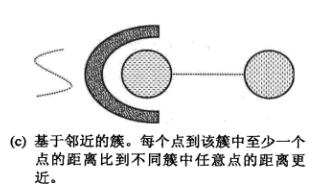

也就是说最近的点，一定跟他在同一个簇里。这种簇对不规则定义的图形是有效的。这个簇其实也趋向于呈球型。

### 基于密度的簇Density-Based

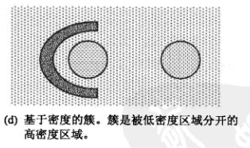

A cluster is a dense region of points, which is separated
by low-density regions, from other regions of high
density.

## 聚类算法

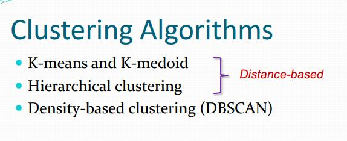

### k-means聚类算法
k-means是划分方法中较经典的聚类算法之一。由于该算法的效率高，所以在对大规模数据进行聚类时被广泛应用。目前，许多算法均围绕着该算法进行扩展和改进。

k-means算法以k为参数，把n个对象分成k个簇，使簇内具有较高的相似度，而簇间的相似度较低。

优点：易于实现
缺点：可能收敛于局部最小值，在大规模数据收敛慢

算法思想较为简单如下所示：

```
选择K个点作为初始质心
repeat
    将每个点指派到最近的质心，形成K个簇
    重新计算每个簇的质心
until 簇不发生变化或达到最大迭代次数
```

由算法我们可知道选中初始的点很重要。当初始质心是随机的进行初始化的时候，K均值的每次运行将会产生不同的SSE,而且随机的选择初始质心结果可能很糟糕，可能只能得到局部的最优解，而无法得到全局的最优解。

这里的重新计算每个簇的质心，如何计算的是根据目标函数得来的，因此在开始时我们要考虑**距离度量和目标函数**。

#### SSE

考虑欧几里得距离的数据，使用误差平方和（Sum of the Squared Error,SSE）作为聚类的目标函数，两次运行K均值产生的两个不同的簇集，我们更喜欢SSE最小的那个。

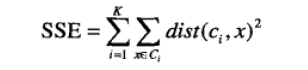

k表示k个聚类中心，ci表示第几个中心，dist表示的是欧几里得距离。**簇的最小化SSE的最佳质心是簇中各点的均值**

#### 处理空簇

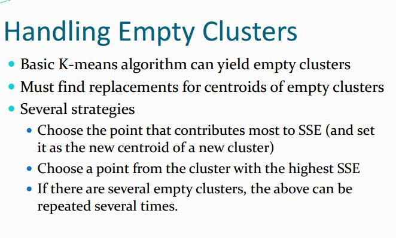

策略有选择一个对SSE贡献最大的点作为新centroid质心，或者选择一个SSE最大的cluster作为centroid质心。

#### 二分K-均值(bisecting K-means)
为了克服K-Means算法收敛于局部最小值的问题，提出了一种二分K-均值(bisecting K-means)

```
将所有的点看成是一个簇
当簇小于数目k时
    对于每一个簇
        计算总误差
        在给定的簇上进行K-均值聚类,k值为2
        计算将该簇划分成两个簇后总误差
    选择使得误差最小的那个簇进行划分
```

简而言之就是每次贪心选择一个簇进行二分，每次都选择那个划分之后使得簇SSE最小的进行划分。

#### K-Means算法的缺陷
k均值算法非常简单且使用广泛，但是其有主要的两个缺陷：

1. **K值需要预先给定，属于预先知识**，很多情况下K值的估计是非常困难的，对于像计算全部微信用户的交往圈这样的场景就完全的没办法用K-Means进行。对于可以确定K值不会太大但不明确精确的K值的场景，可以进行迭代运算，然后找出Cost Function最小时所对应的K值，这个值往往能较好的描述有多少个簇类。

2. K-Means算法对**初始选取的聚类中心点是敏感**的，不同的随机种子点得到的聚类结果完全不同

3. K均值算法并不是很所有的数据类型。它不能处理非球形簇、不同尺寸和不同密度的簇，银冠指定足够大的簇的个数是他通常可以发现纯子簇。

4. 对离群点敏感，对离群点的数据进行聚类时，K均值也有问题，这种情况下，**离群点检测和删除有很大的帮助**。

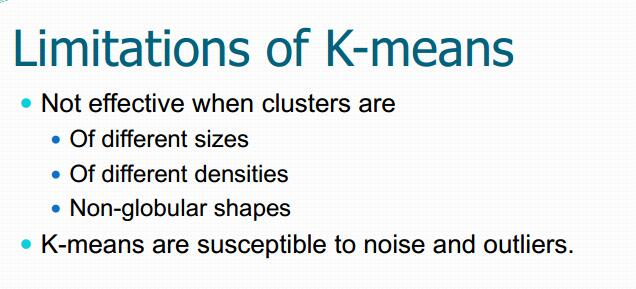

### k-medoids聚类算法
k-medoids聚类算法，即**k-中心聚类算法**，它是基于k-means聚类算法的改进。

我们知道，k-means算法执行过程，首先需要随机选择初始质心，只有第一次随机选择的初始质心才是实际待聚类点集中的点，而后续将非质心点指派到对应的质心点后，重新计算得到的质心并非是待聚类点集中的点，而且**如果某些非质心点是离群点的话，导致重新计算得到的质心可能偏离整个簇**，为了解决这个问题，提出了改进的k-medoids聚类算法。


K中心点算法（K-medoids）提出了新的质点选取方式，而不是简单像k-means算法采用均值计算法。在K中心点算法中，每次迭代后的**质点都是从聚类的样本点中选取**，而选取的标准就是当该样本点成为新的质点后能提高类簇的聚类质量

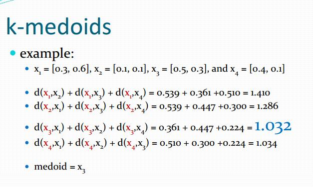

选出一个点，离其他点的距离最小。

The K-medoids method is exactly the same as the Kmeans method except that the “representative” used for a cluster is its medoid (instead of its mean)

The K-medoids method, however, is more
computationally demanding than the k-means
method


核心算法：

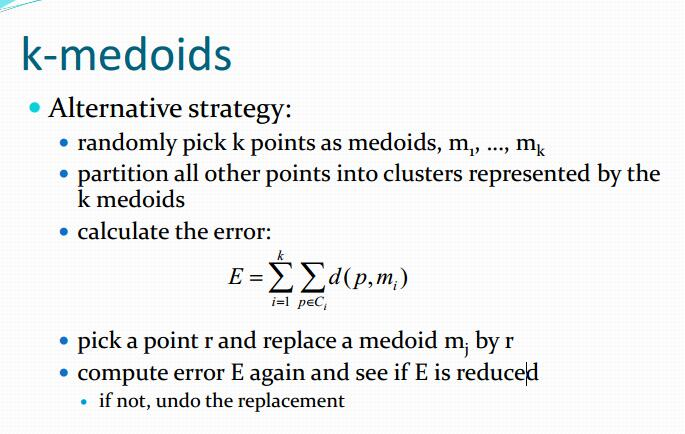


总而言之就是

1. 随机选取k个点作为中心点
2. 将各个点指派到最近的中心店形成簇
3. 计算误差E
4. 选出一个点r和当前簇中心店交换，看看E有没有减少，减少了就交换中心点。循环此过程


### 层次聚类 Hierarchical Clustering
层次聚类(Hierarchical Clustering)是聚类算法的一种，通过计算不同类别数据点间的相似度来创建一棵有层次的嵌套聚类树。在聚类树中，不同类别的原始数据点是树的最低层，树的顶层是一个聚类的根节点。创建聚类树有自下而上合并和自上而下分裂两种方法，本篇文章介绍合并方法。


层次聚类不必再去推测有多少个簇。

层次聚类算法根据层次分解的顺序分为：自下底向上和自上向下，即凝聚的层次聚类算法和分裂的层次聚类算法（agglomerative和divisive）

 - agglomerative(凝聚层次聚类)：自底向上
 - divisive(基于划分的层次聚类)：自顶向下

#### Agglomerative Hierarchical Clustering,AHC 合成聚类算法（自下而上）

层次聚类的合并算法通过计算两类数据点间的相似性，对所有数据点中最为相似的两个数据点进行组合，并反复迭代这一过程。简单的说层次聚类的合并算法是通过计算每一个类别的数据点与所有数据点之间的距离来确定它们之间的相似性，距离越小，相似度越高。并将距离最近的两个数据点或类别进行组合，生成聚类树。

假设有N个待聚类的样本，对于层次聚类来说，基本步骤就是：

 - （初始化）把每个样本归为一类，计算每两个类之间的距离，也就是样本与样本之间的相似度；
 - 寻找各个类之间最近的两个类，把他们归为一类（这样类的总数就少了一个）；
 - 重新计算新生成的这个类与各个旧类之间的相似度；
 - 重复2和3直到所有样本点都归为一类，结束。

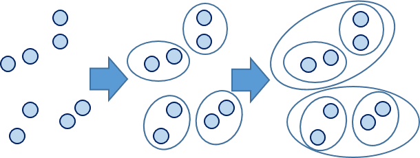

如上图，这是自底向上的算法。

这里又引发了一个问题，点和点之间的距离好算，那么簇之间的距离如何计算呢？

**数据点与组合数据点间的距离计算方式：**

将数据点B与数据点C进行组合后，重新计算各类别数据点间的距离矩阵。数据点间的距离计算方式与之前的方法一样。这里需要说明的是组合数据点(B,C)与其他数据点间的计算方法。当我们计算(B,C)到A的距离时，需要分别计算B到A和C到A的距离均值。比如：

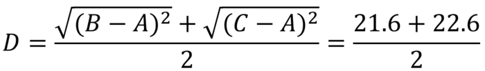

**簇之间的距离就有好几种了：**

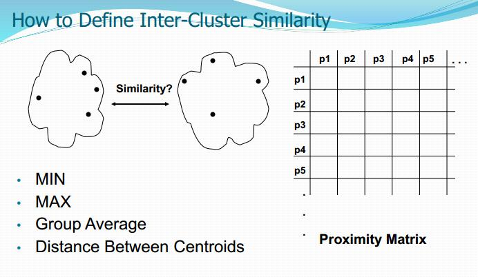

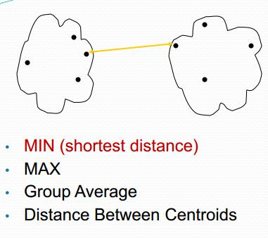

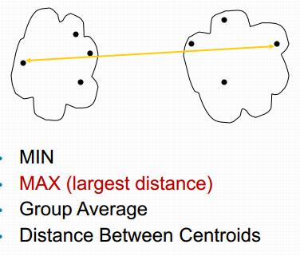

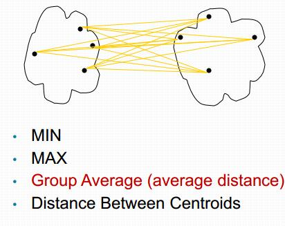

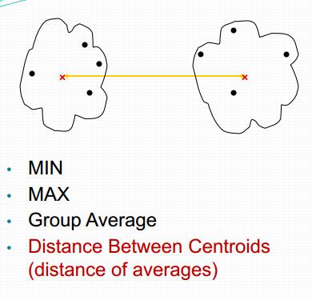

##### MIN(Single Linkage)
Single Linkage的计算方法是将两个组合数据点中距离最近的两个数据点间的距离作为这两个组合数据点的距离。这种方法容易受到极端值的影响。两个很相似的组合数据点可能由于其中的某个极端的数据点距离较近而组合在一起。

##### MAX(Complete Linkage)
Complete Linkage的计算方法与Single Linkage相反，将两个组合数据点中距离最远的两个数据点间的距离作为这两个组合数据点的距离。Complete Linkage的问题也与Single Linkage相反，两个不相似的组合数据点可能由于其中的极端值距离较远而无法组合在一起。

##### Average Linkage
Average Linkage的计算方法是计算两个组合数据点中的每个数据点与其他所有数据点的距离。将所有距离的均值作为两个组合数据点间的距离。这种方法计算量比较大，但结果比前两种方法更合理。
我们使用Average Linkage计算组合数据点间的距离。下面是计算组合数据点(A,F)到(B,C)的距离，这里分别计算了(A,F)和(B,C)两两间距离的均值。

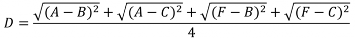

这种聚类的方法描述起来比较简单，但是计算复杂度比较高，为了寻找距离最近/远和均值，都需要对所有的距离计算个遍，需要用到双重循环，每次迭代都只能合并两个子类，**这是非常慢的**。
