## 主成分分析PCA
在用统计分析方法研究多变量的课题时，**变量个数太多就会增加课题的复杂性**。人们自然希望变量个数较少而得到的信息较多。在很多情形，变量之间是有一定的相关关系的，当两个变量之间有一定相关关系时，可以解释为这两个变量反映此课题的信息有一定的重叠。

主成分分析是对于原先提出的所有变量，将重复的变量（关系紧密的变量）删去多余，**建立尽可能少的新变量**，使得这些新变量是两两不相关的，而且这些新变量在反映课题的信息方面尽可能保持原有的信息。

### 基变换

我们都知道在原本坐标系中，向量可以用不同的基向量来进行表示。如，

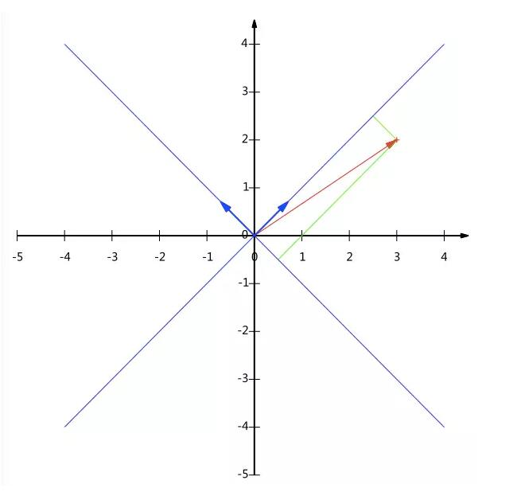

蓝色线是新建立的坐标系。上面的基可以变为。假如图中红色向量为(3,2)，那么转换成以新坐标系为基底怎么表示呢。

已知新的基底向量分别为:

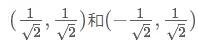

想一下，将(3,2)变换为新基上的坐标，就是用(3,2)与第一个基做内积运算，作为第一个新的坐标分量，然后用(3,2)与第二个基做内积运算，作为第二个新坐标的分量。实际上，我们可以用矩阵相乘的形式简洁的表示这个变换：

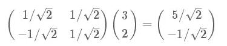

太漂亮了！其中矩阵的两行分别为两个基，乘以原向量，其结果刚好为新基的坐标。可以稍微推广一下，如果我们有m个二维向量，只要将二维向量按列排成一个两行m列矩阵，然后用“基矩阵”乘以这个矩阵，就得到了所有这些向量在新基下的值。例如(1,1)，(2,2)，(3,3)，想变换到刚才那组基上，则可以这样表示：

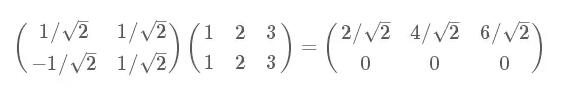

于是一组向量的基变换被干净的表示为矩阵的相乘。

一般的，如果我们有M个N维向量，想将其变换为由R个N维向量表示的新空间中，**那么首先将R个基按行组成矩阵A(R行代表R个基共R维)，然后将向量按列组成矩阵B**，那么两矩阵的乘积AB就是变换结果，其中AB的第m列为A中第m列变换后的结果。

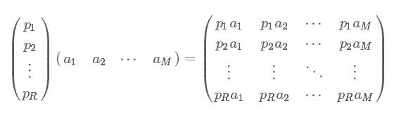

其中pi是一个行向量，表示第i个基，aj是一个列向量，表示第j个原始数据记录
特别要注意的是，这里R可以小于N，而R决定了变换后数据的维数。**也就是说，我们可以将一N维数据变换到更低维度的空间中去，变换后的维度取决于基的数量。因此这种矩阵相乘的表示也可以表示降维变换**。

最后，**上述分析同时给矩阵相乘找到了一种物理解释：两个矩阵相乘的意义是将右边矩阵中的每一列列向量变换到左边矩阵中每一行行向量为基所表示的空间中去**。更抽象的说，一个矩阵可以表示一种线性变换。很多同学在学线性代数时对矩阵相乘的方法感到奇怪，但是如果明白了矩阵相乘的物理意义，其合理性就一目了然了。

### PCA具体计算
根据上面，我们便可知，PCA即是在给出的一组数据中找出最不相关的几种基底，从而来降维。

流程：

总结一下PCA的算法步骤：
设有**m条n维**数据。

1）将原始数据按列组成n行m列矩阵X

2）将X的每一行（代表一个属性字段）进行零均值化，即减去这一行的均值

3）求出协方差矩阵

4）求出协方差矩阵的特征值及对应的特征向量

5）将特征向量按对应特征值大小从上到下按行排列成矩阵，取前k行组成矩阵P

6）Y=PX即为降维到k维后的数据

#### 样例1
假如我们有5条二维数据，打算把它压缩到一维

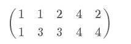

我们首先将每个字段内所有值都减去字段均值

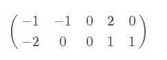

因为这个矩阵的每行已经是零均值，这里我们直接求协方差矩阵：

zwlj:在这里，协方差矩阵的求法是，把上面减去均值矩阵和其转置矩阵相乘，然后除以数据的列数(有多少条)，所以这里是除以5.**但是也要注意了，很多时候是除以N-1，也就是说除以4也经常被被使用**。

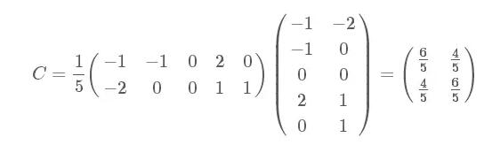

然后求其特征值和特征向量，具体求解方法不再详述，可以参考相关资料。求解后特征值为：

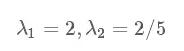

**zwlj:二元协方差矩阵的特征值可以求解以下方程**

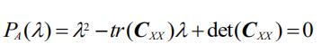

tr是矩阵对角线的和，det是矩阵的行列式，二元矩阵行列式为主对角线积减去非主对角线的差。

所以可求得上述解，求得对应的特征向量分别是：

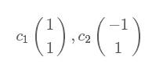

zwlj：已知特征值，求特征向量的方法为，设特征向量为(x,y),然后用矩阵去乘它，解得特征值乘以特征向量。解一个二元方程即可。

其中对应的特征向量分别是一个通解，c1c1和c2c2可取任意实数。那么标准化后的特征向量(新基底向量)为：

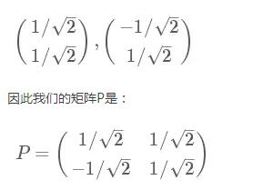

可以验证协方差矩阵C的对角化(这步只作为验证而已)：

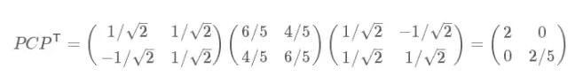

最后我们用P的第一行乘以数据矩阵(要降成多少维就取多少行)，就得到了降维后的表示：

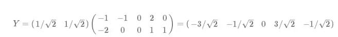

由此我们可得降维投影结果如下图：

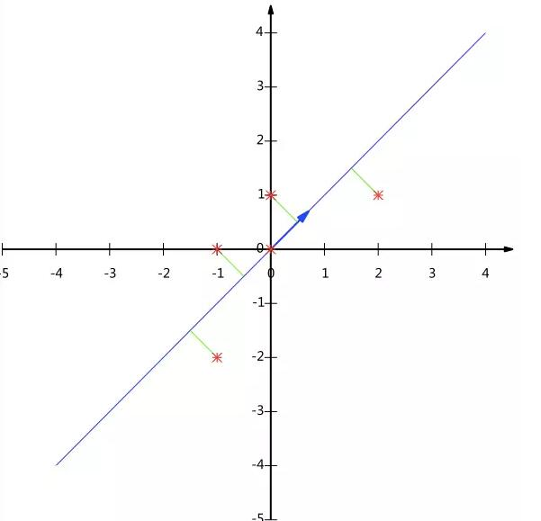
