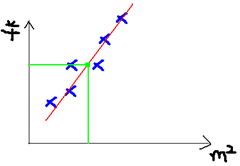
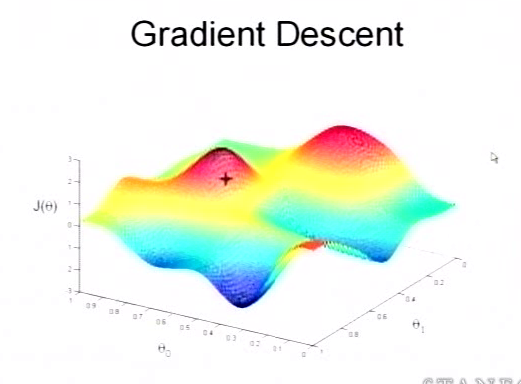

## 回归和梯度下降
回归在数学上来说是给定一个点集，能够用一条曲线去拟合之，如果这个曲线是一条直线，那就被称为线性回归，如果曲线是一条二次曲线，就被称为二次回归，回归还有很多的变种，如locally weighted回归，logistic回归，等等

通俗点说就是，假如在二维平面上给一些点，需要画一条线去取尽量多的点那就是拟合。

比如上图，给定一些房屋面积与价格对应关系的点，画一条直线去拟合，然后就可以进行预测了。这也就是一个典型的机器学习过程

我们可以得出一个估计函数

x1,x2...xn是我们知道的特征(比如房屋面积，房屋朝向)，h函数会帮助我们估计出一个结果(预测值,比如房屋价格)。很显然，这个估计函数好不好，取决于我们的θ值怎么取(相当于给每个特征赋予权重)。将x1....xn写成一个向量的话，我们的式子就可以变为：

一个θ行向量乘以X特征向量

### 损失函数

**我们程序也需要一个机制去评估我们θ是否比较好**，所以说需要对我们做出的h函数进行评估，一般这个函数称为 **损失函数（loss function）或者错误函数(error function)** ，描述h函数不好的程度，在下面，我们称这个函数为**J函数**。J函数的未知量只有θ向量,也就是说这是一个有关θ向量(θ1..θn)的函数。

这个错误估计函数是去对**x(i)的估计值与真实值y(i)差的平方和作为错误估计函数**，前面乘上的1/2是为了在求导的时候，这个系数就不见了

### 梯度下降
对于上面提出的J函数，显然我们的目的就是求得一个合适的θ，使J函数(真实值与估计值之差的平方和)取最小值。梯度下降法是按下面的流程进行的：

1. 首先对θ赋值，这个值**可以是随机的，也可以让θ是一个全零的向量**。

2. 改变θ的值，使得J(θ)**按梯度下降的方向进行减少**。

如上图，我们把J函数放到三维空间里，我们知道红色的部分是表示J(θ)有着比较高的取值，我们需要的是，能够让J(θ)的值尽量的低。也就是深蓝色的部分。

在上面提到梯度下降法的第一步是给θ给一个初值，假设随机给的初值是在图上的十字点。

然后我们将θ按照梯度下降的方向进行调整，就会使得J(θ)往更低的方向进行变化，如图所示，算法的结束将是在θ下降到**无法继续下降为止**。如下图

当然，可能梯度下降的最终点并非是全局最小点，可能是一个局部最小点，可能是下面的情况：

具体到式子中，就是对θ向量的**每一个分量求偏导**(相当于得到不同方向上的斜率)，往这个斜率上减少一定的距离，就是在往最低点走，所以还要有个参数**α表示步长**

概括一下就是下面式子

每次都θ往让J函数下降的地方取，迭代直到无法继续进行为止(小于一定的精度)。
