## 感知机perceptron
在机器学习中，**感知机（perceptron）是二分类的线性分类模型**，属于**监督学习算法**。输入为实例的特征向量，输出为实例的类别（取+1和-1）。比如再二维平面中划分一条线，将平面分成两个部分(类)。

假设输入空间(特征向量)为X⊆Rn，输出空间为Y={-1, +1}。输入x∈X表示实例的特征向量，对应于输入空间的点；输出y∈Y表示示例的类别(-1或者1)。由输入空间到输出空间的函数为：

`f(x)=sign(w⋅x+b)`

称为**感知机perceptron**。其中，参数w叫做权值向量weight，b称为偏置bias。w⋅x表示w和x的点积

sign为符号函数，即

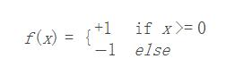

注意上面公式中，x不是单一一个变量x了，而是一个向量，也就是x1...xn。具体到二维平面的点，那就是(x1,x2).当wx+b大于等于0时为一类，小于0时也为一类。

在二分类问题中，f(x)的值（+1或-1）用于分类x为正样本（+1）还是负样本（-1）。感知机是一种线性分类模型，属于判别模型。我们需要做的就是找到一个最佳的满足w⋅x+b=0的w和b值

感知机函数，可以用向量来表示：

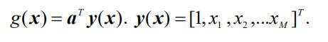

如上，x1...xm就是未知量，而a向量则是对应未知量的系数，也就是上面给出函数的权值w,这里只不过将w写成了向量形式a，此外，注意到y(x)中还有系数1，这样与a向量相乘以后得出的其实就是之前提到的**bias b**。

### 感知机学习Perceptron learning
根据上面的向量公式：

我们可以根据结果大于0还是小于0，把输入划分为两类w1，w2(等于0的情况不分类)。

我们的目的就是找到一个a向量，使得我们划出的这条分类线效果最好。那么我们当然需要想出一个误差函数，来判断一个a向量的效果好还是不好。

为了解决这个问题，我们需要对原来的数据(训练集)进行一下预处理。

#### 符号处理Normalization

我们假如我们原来的数据向量分为两类，w1,w2。根据公式，我们知道，g(x)取值大于0要被分为w1类，g(x)小于0要分为类w2.为了更好处理，我们把把所有被分为w2的向量坐标乘以-1.

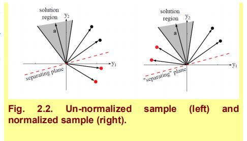

如上图，红色虚线假如是一个正确的感知器线，那我们把红色点(w2)乘以-1,相当于做了一次对称，到了红线的另一边。黑色的点(w1类)**不做处理**。由于训练集是已知了所有点的分类，所以我们完全可以提前做到这样的预处理。

这样一来，我们就可以得到：**假如分类器是正确的话，无论w1的点还是w2的点，都会在同一边(g(x)>0)**.而被误判的点，在另一边的黑色点和被对称过去的红色点，都是小于0的。

总结一下也就是：

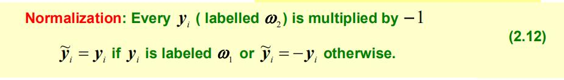

如上，每一个w2类向量乘以-1，w1类的点(向量)不变，这样的形式处理的y向量写作~y。

这么处理的好处是，当我们有一个感知器函数g(x)，那么我们就知道正确分类的点，g(~y)大于0，误判的点都**小于等于0**。如下图，a向量之前说过，就是相当于一个权值向量。

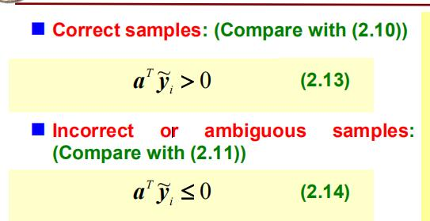

**notice：注意到误判的点和模糊的点，都算是不合格的数据，所以是小于等于0**

#### 求解最优损失函数
那么显然，经过预处理后，我们想要让误判点最少，那么就是说我们要让误判的点尽可能的接近感知机函数线。我们知道误判的点,计算结果都是小于0，所以我们得到以下损失函数(将所有误判点的函数值再乘以一次-1转为正)：

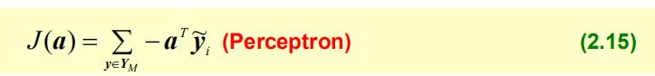

要使的误差尽量小，也就是取上面这个J函数的最小值(让误差点尽量靠近感知机线)。上面公式中YM是误判点和模糊点的集合。

我们对J函数用梯度下降法处理，求导的话，可以得到：

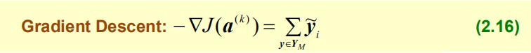

根据梯度下降的公式：

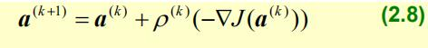

p是步长，每次自变量a向量都要往斜率的方向向最低点下降。结合二者，可知：

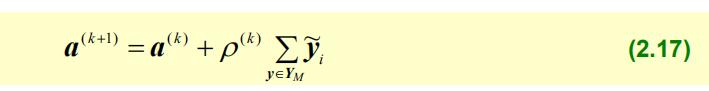

#### 损失函数的选择
除了上述给出的损失函数外，我们也可以用点到感知机线的距离和来当做损失函数，求其中最小值。

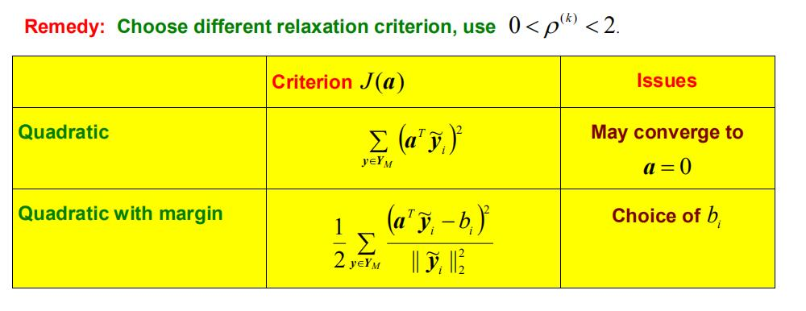

这也被叫做**Relaxed Perception learning**，松弛算法。

### 例题学习
给出一道感知机学习题目：

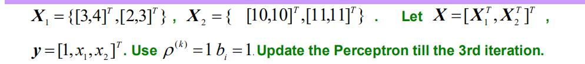

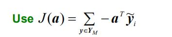

如上，给出训练集，两个类别X1，X2，每个类别分别有两个向量(坐标点)。且步长为1，损失函数J函数给出(使误判点离线尽可能近)，求出迭代第三次时，a向量(权值向量)的值。

#### step1 写出~Y向量

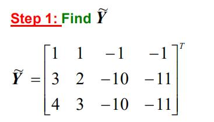

根据分类机函数，X2类要先做预处理，全部取负值，这样就可以得到预处理之后的~Y向量。

#### 开始迭代
根据梯度下降法，我们有

所以我们首要任务是求出误判点和模糊点，然后求他们的向量和。**由于a向量迭代开始时默认为0向量**，所以

`g(x) = a~y(x)` , 结果全为0向量，全为模糊点，所以全部都需要求和，即有以下过程：

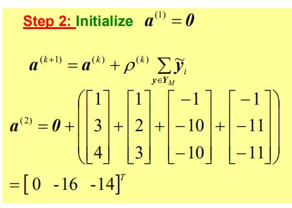

初始a向量为0，然后直接根据梯度下降公式，步长p为1，求和，得出第一次迭代后a2的值。

#### 继续迭代
得出a2的值以后，我们当然还要带回g(x)的函数中，重新计算新的误判点。

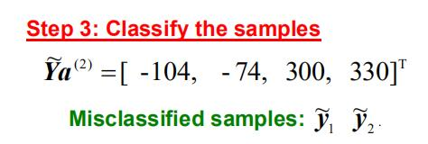

重新计算后(矩阵乘以向量),发现只有前面两个小于0，所以误判点只有y1和y2了，梯度下降的时候可以重新带回。

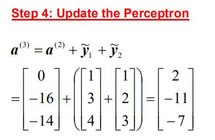

重新迭代以后得到a3的值，即为最终答案。

### 例题2
这里也简易介绍下，假如用点到直线的距离公式，这也叫做**Relaxed Perception learning**

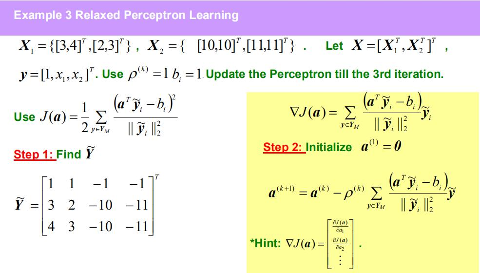

这里注意公式

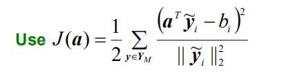

以及求导之后

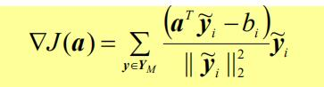

最后得出：

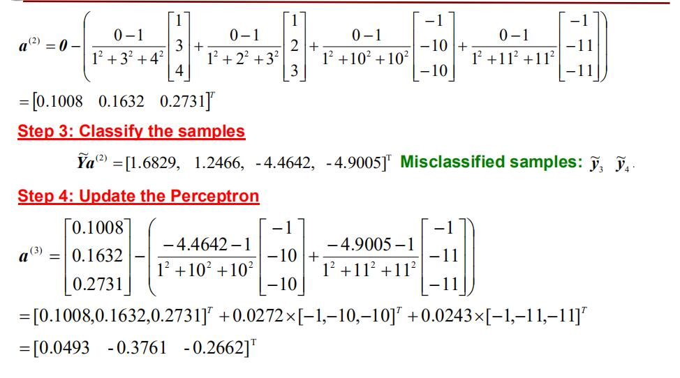

### 感知器的一些问题

如果两个类之间，不是linearly separable，显然就会收敛的非常慢。

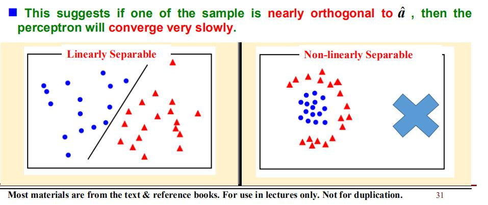

当不完全线性可分的时候，步长就不能取到0。只能逼近0，并且迭代次数足够多。

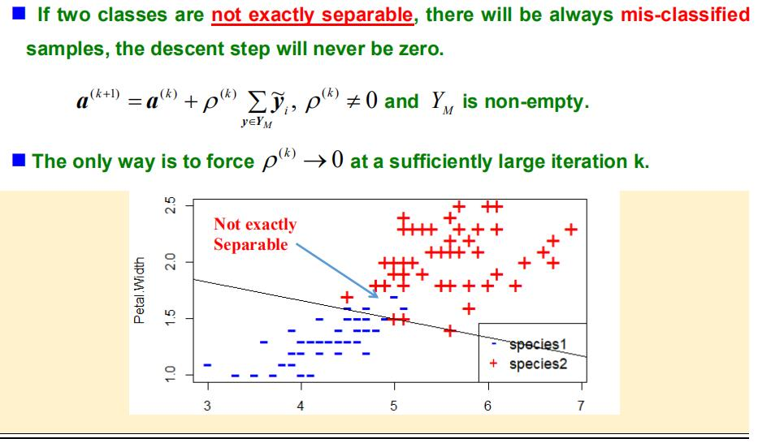
