## 支持向量机
支持向量机（Support Vector Machine，常简称为SVM）是一种**监督式学习的方法**，可广泛地应用于统计分类以及回归分析。支持向量机属于一般化线性分类器，这族分类器的特点是他们能够同时最小化经验误差与最大化几何边缘区，因此支持向量机也被称为最大边缘区分类器。

**SVM常被用于行人图像检测(分类是否行人)和垃圾邮件的分类。**

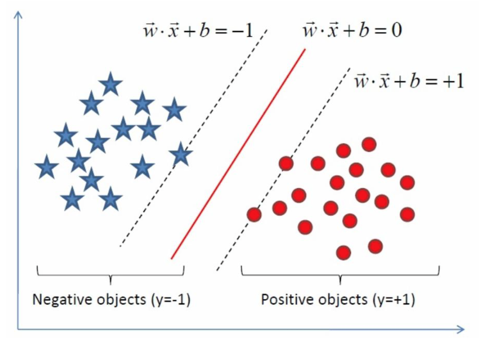

假设给定一些分属于两类的2维点，这些点可以通过直线分割， 我们要找到一条分割线,这条分割线也就是超平面。怎么样使这个分割线最优呢？

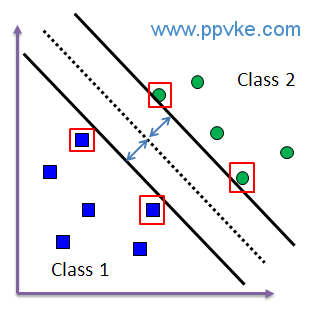

如上图，**支持向量 (Support Vector)是指在训练集 (Training data set)中，在分类时给予最多信息的点集合**，被红色框围起来的这四个训练资料点就被称之为支持向量(距离分类超平面最近的点)。

我们希望不同类之间支持向量间隔最大，也就是我们显然是要把线划在尽量远离支持向量的地方使得间隔最大。

在支持向量机中，分类边界与最近的训练资料点之间的距离称为间隔（margin）；支持向量机的目标即为找出间隔最大的超平面来作为分类边界。

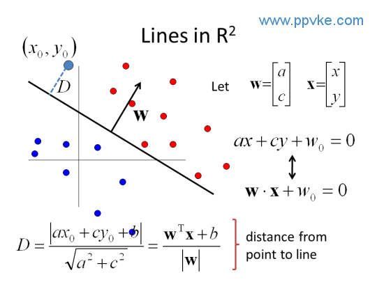

我们可以知道超平面的公式为：

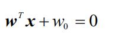

我们知道w和w0都是可以自由缩放的，最好的分类超平面，是居于两个类别支持向量的居中位置，所以我们就可以缩放令两个支持向量(离超平面最近的点)的位置分别是

`wx+w0 =1`和`wx+w0=-1`

有点到超平面的距离公式，我们可以得到

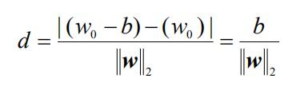

刚才说过b(也就是w0)是可以缩放，随意设定的(b是常数)，为了方便我们常把b定为1.

我们要求上述d的最大值，所以有：

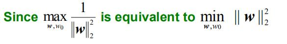

但是注意，求上面最值是有约束条件的，约束条件就是离超平面最近的点是位于那条wx+b=+-1的线上面，也就是说其余的点，都要更远。可以用下面的约束式子来表示

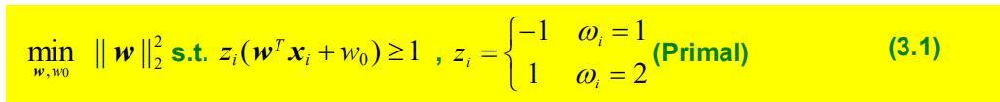

当点为w1类时候，zi=1，所以所有点都满足wx+w0>=1，当点为类2时候，zi=-1，那则负负得正，此时也满足wx+w0>=1.

**这是线性可分情况下的，支持向量机模型。可以用二次规划(Quadratic programming)来求解。**

### 软间隔向量机
上面说了，当两类点线性可分，那么就属于硬间隔，可用二次规划的方式求解。如果存在离群点，那么上面的式子就无效了。

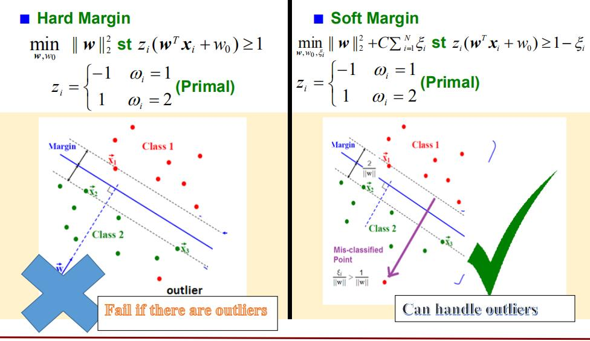

如上图。所以如果存在离群点，就不能用上述公式求解。我们要引入松弛变量来允许误差。

软间隔的目标函数求解表达式如下(要记住)：

这就是软间隔支持向量机。其中C>0是一个常数,ζ则是损失函数，损失函数有以下几种取值。

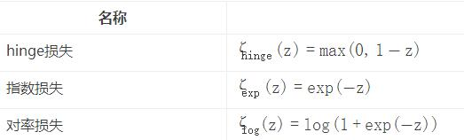

我们一般可以取hinge损失函数

 - **当C值越大，对误分类的惩罚越大**，误分点显得重要，C为无穷大，就与硬间隔SVM一致了
 - **当C值越小，对误分类的惩罚减小**，误分点不是那么重要，允许有分类错误发生。

很多教材里也用ci(a)>=0来笼统表示一个约束不等式，软分隔和硬分隔都用ci(a)>=0表示，如下图的总结。

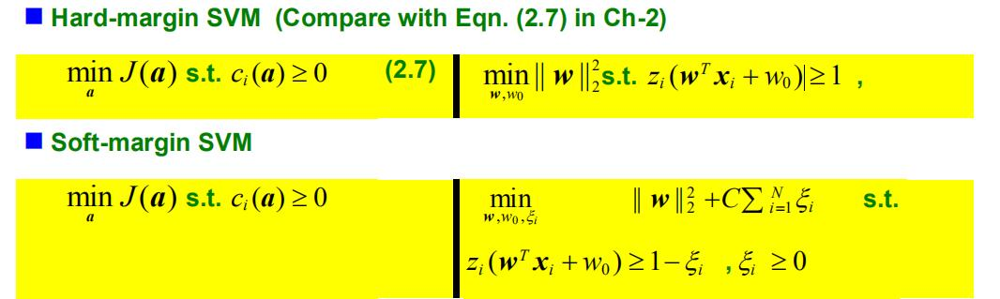

**求解硬分隔问题，我们要采用二次规划(Quadratic Programming)的方法，求解软分隔问题，我们要采用梯度下降的方法(Sub-gradient descent)**

### 二次规划求解硬分隔

遵循二次规划的方式我们来求解硬分隔:

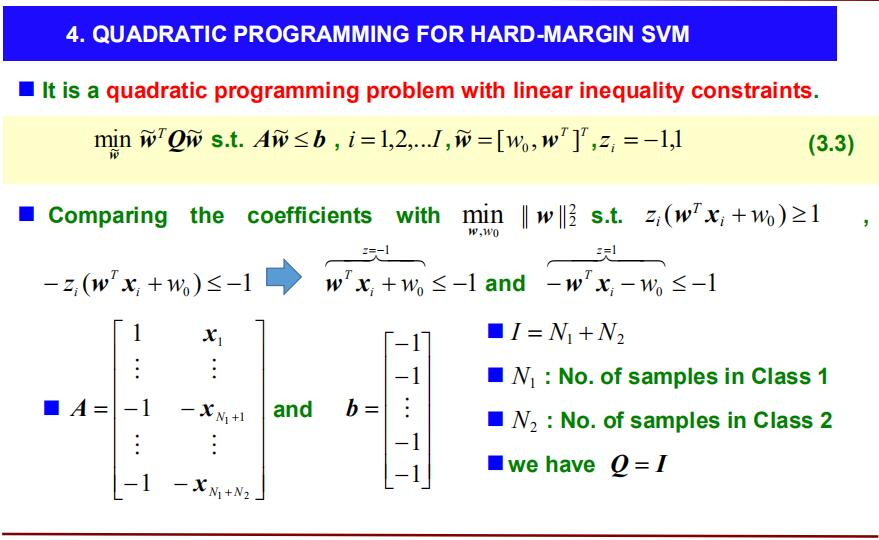

我们先写出上图3.3为我们求解的公式(不甚理解，后续待补)。w向量是我们希望求解出最佳w的自变量,Q矩阵是是单位矩阵(N1*N2)的，b是一个列向量，全为-1.

A矩阵本质上跟我们在感知机中做预处理很相似，把w2的向量全部乘以-1，这样在带入w的时候，误分类的点计算出的结果就是负数。所以A矩阵中，组成的行向量就是训练集中的样本向量，w1类向量不变，w2类向量皆乘-1,而且别忘了第一个元素都是常量1.

#### 求解硬分隔SVM过程

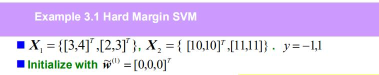

如上为题设，第一步，我们先写出公式：

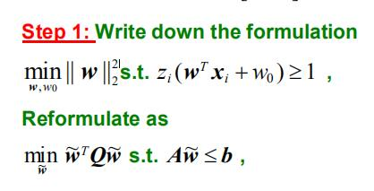

列出各个矩阵的值：

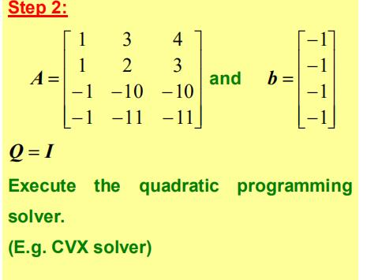

然后用计算机程序求解(滑稽。。。。。)

### 梯度下降求解软分隔SVM

求解软分隔SVM，我们允许一定的误差(损失)，我们的求解目标函数定义为：

且损失函数的公式为：

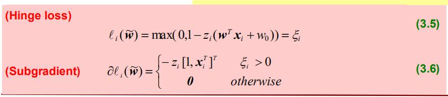

上述公式中，z函数仍为原来定义，也就是w1类为1，w2类为-1。损失函数为0和1-z(wx+x0)中的最大值，下面subgradient为对其求导。

梯度求解的迭代公式则为：

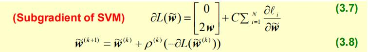

下面是例题的求解过程

#### 例题求解

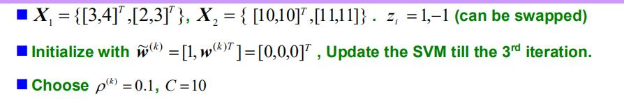

以上是题设，给出了训练集X1，X2.初始化w1向量为0.求第三次迭代后的w。步长p为0.1，C常数取10.我们按照步骤公式，从公式3.5开始逐步求解变量：

先求解出hinge loss和subgradient

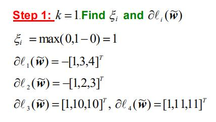

由于先求解出损失函数大于0，所以我们要求subgradient。

然后我们就能迭代求解，根据公式3.7和3.8

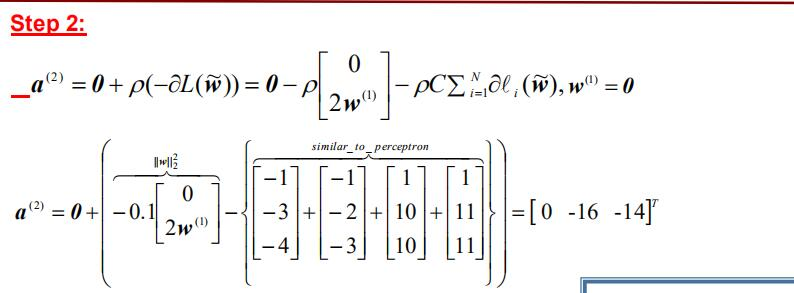

逐个带入公式3.7,3.8就可以了，注意公式3.8，就是对step1中求出的变量的累加，而公式中的2w不包括w0(题设中~w=\[1,w1,...wn\])，w0被设置为了0，然后再与后面变量累加。

这样就求出了第二步的w,w2(上图中的a)。由于w改变了，我们接下来迭代第三步也要重新计算公式3.5.

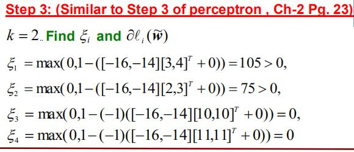

然后遵循公式计算接下来的步骤

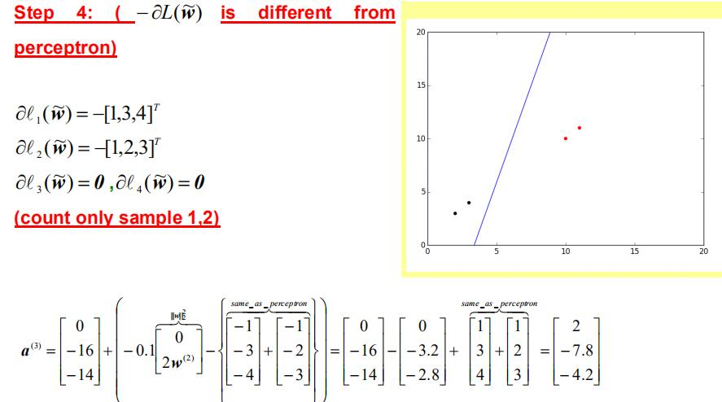

### 软分隔SVM和硬分割SVM的求解对比

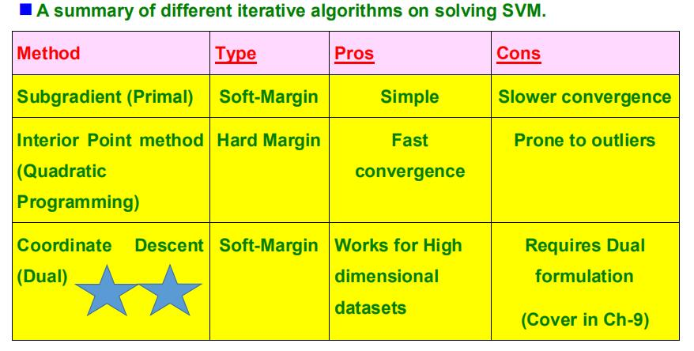
