# 最大似然估计

## 参数模型和非参数模型

### 模型和参数
这里首先还是要提到模型和参数的概念。根据经典的机器学习文献，可以将模型看作假设，**而参数是根据特定的数据集对假设进行的具体调整**。

模型是否具有固定或可变数量的参数，决定了模型是“参数”模型或“非参”模型。

比如正态分布这个模型(也叫高斯分布),就是一个模型，其依赖于参数变量的期望和方差(两个参数)。

`若随机变量X服从一个数学期望为μ、方差为σ^2的正态分布，记为N(μ，σ^2)。`


### 参数模型
如果我们对所要学习的问题有足够的认识，具备一定的先验知识，此时我们一般会假定要学习的目标函数f(x)或分布P(y|x)的具体形式。然后，通过训练数据集，基于ERM、SRM、MLE、MAP等学习策略，可以估计出f(x)或P(y|x)中含有的未知参数。一旦未知参数估计完毕，训练数据一般来说，就失去其作用了，因为这些估计出来的参数就是训练数据的浓缩。通过这种方式建立起来的模型就是参数模型。参数模型的一个很重要的特点是，如果对于模型的假设正确，那么只需要很少的训练数据就可以从假设空间中学出一个很好的模型。

但是，如果模型的假设错误，那么无论训练的数据量有多大，甚至趋于无穷大，学出的模型都会与实际模型出现不可磨灭的偏差。感知机、逻辑斯特回归、朴素贝叶斯、线性支持向量机都属于参数模型。

### 非参数模型
当我们对所**要学习的问题知之甚少**，此时我们一般不会对潜在的模型做过多的假设。在面对预测任务的时候，我们通常会用上所有的训练数据。

非参数模型的一个很重要的特点就是：let the data speak for itself. 正因为如此，非参数模型的存储开销、计算开销都会比参数模型大的多。但是，由于不存在模型的错误假定问题，可以证明，当训练数据量趋于无穷大的时候，非参数模型可以逼近任意复杂的真实模型。这正是非参数模型诱人的一点。另外需要说明的一点是，非参数模型之所以叫做非参数，并不是因为模型中没有参数。实际上，非参数模型中一般会含有一个或多个超参数，外加无穷多个普通的参数。

**k近邻就是典型的非参数模型**,k近邻只用数据(训练集)说话，没有建立出一个模型。

时下流行的深度学习，其本质是一个半参数模型的神经网络。通过加大网络的深度(加大隐层数目)以及宽度(增加每一层神经元的个数)，使假设空间的复杂度得到极大的提高。复杂的假设空间有极强的表达能力，当训练数据量很大的时候，不会陷入过拟合。所以，深度学习的成功，从理论上讲，一方面来源于海量的训练数据，另一方面来源于其复杂的网络结构。

## 无偏差估计

考虑一个observation：


`x[n]`是对参数n的估计,`负无穷 < A < 正无穷`是最终的估计值，`w[n]`是噪声(**white Gaussian noise (WGN)高斯白噪声**)

一个合理无偏差(Unbiased)的估计，所有样本的估计平均值average mean为A。

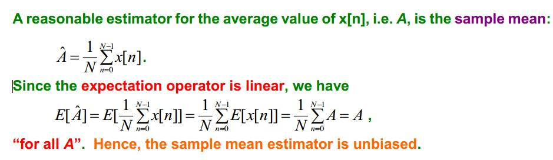

如上图，对于`x[n]`的平均值求期望，由于`x[n]`的期望`E[x[n]]`是A,所以可以知道`E[A^]=A`

### 例
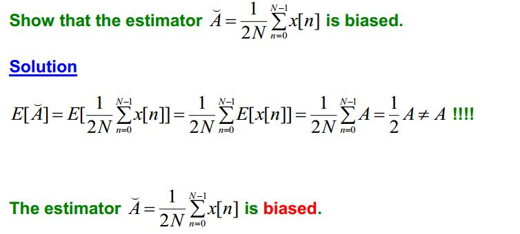

对`E[A^]`求期望，结果不为A，则这个估计是一个有偏差(biased)的估计。

## 最大似然估计
最大似然估计提供了一种给定观察数据来评估模型参数的方法，即：“**模型已定，参数未知**”。简单而言，假设我们要统计全国人口的身高，首先假设这个身高服从服从**正态分布**，但是该分布的均值与方差未知。我们没有人力与物力去统计全国每个人的身高，但是可以通过采样，获取部分人的身高，然后通过最大似然估计来获取上述假设中的正态分布的均值与方差。

简单来说：**最大似然估计是利用已知的样本的结果，在使用某个模型的基础上，反推最有可能导致这样结果的模型参数值**。

最大似然估计中采样需满足一个很重要的假设，就是**所有的采样都是独立同分布的**。zwlj：也就是说所有采样出现的概率都可以乘起来

我们设 θ为模型参数,f为我们所使用的模型。参数为θ的模型f产生采样可表示为：

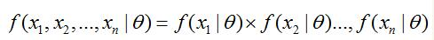

f是一个模型，可以理解为其输出的值就是在模型参数为θ下,样本(x1....xn)出现(被采样到)的概率。

显然，在我们有采样数据和模型的情况下，我们只要想办法让这个f的值最大，那么这个参数θ就是最好的参数了。

我们把似然L定义为(其实就是把f反过来写)：

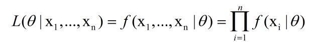

在实际应用中常用的是两边取对数(方便求导)，得到公式如下：

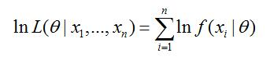

上面式子的右边就是f进行展开以后，由于求了对数所以就是对f(x|θ)进行求和。上面式子也称为**对数似然**。

而下式`l^`则称为平均对数似然。

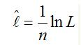

最大似然估计就是写出似然函数，然后找出使得似然最大时θ的值(求极值)。

### 求解过程
由此我们可知最大似然函数的一般求解过程。

1. 写出似然函数；

2. 对似然函数取对数，并整理；

3. 求导数 ；

4. 解似然方程

注意：最大似然估计只考虑某个模型能产生某个给定观察序列的概率。而未考虑该模型本身的概率。这点与贝叶斯估计区别。这句话的意思是说最大似然估计的前提是已知模型，但实际问题中我们也许需要该模型出现的概率大小，比如上面的问题，统计全国人口身高时采用的是正态分布模型，但该做法并没有考虑正态分布模型自身的概率，也许可能服从其他分布模型，所以此处P(正态分布)\<1，但在最大似然估计方法中我们认为P(正态分布)=1。

### 例子
假如有一个罐子，里面有黑白两种颜色的球，数目多少不知，两种颜色的比例也不知。我 们想知道罐中白球和黑球的比例.我们可以每次任意从已经摇匀的罐中拿一个球出来，记录球的颜色，然后把拿出来的球再放回罐中。每次抽出来的球的颜 色**服从同一独立分布模型**

假如在前面的一百次重复记录中，有七十次是白球，请问罐中白球所占的比例最有可能是多少？

很显然，70%，想都不需要想。但是要理论依据：

上题就是很典型的，已知服从**独立分布模型**,模型已知。这个模型也就是 p(白) = 1 - p(黑)，p是概率。

**zwlj:其实这个题的模型也就是伯努利分布Bernoulli distribution(课件有所以记录下)，也就是p(0)=θ,p(1)=1-θ。只有两种情况出现的分布，这是最大似然估计的一个很典型应用。**

写出似然函数

```
L(Data | θ) = P(Data | θ)

　　　　　= P(x1,x2,…,x100|M)

　　　　　= P(x1|M)P(x2|M)…P(x100|M)

　　　　　= p^70(1-p)^30.
```

θ是模型的参数，显然就是p概率嘛。

对L求导可以得到p去0.7. p取0.7的时候，有最大似然，也就是说取样到70个白球的概率最大，此时p最有可能是0.7.

假如是服从的正太分布，也一样求解。

假如我们有一组连续变量的采样值（x1,x2,…,xn），我们知道这组数据服从**正态分布，标准差已知**。请问这个正态分布的期望值为多少时，产生这个已有数据的概率最大？

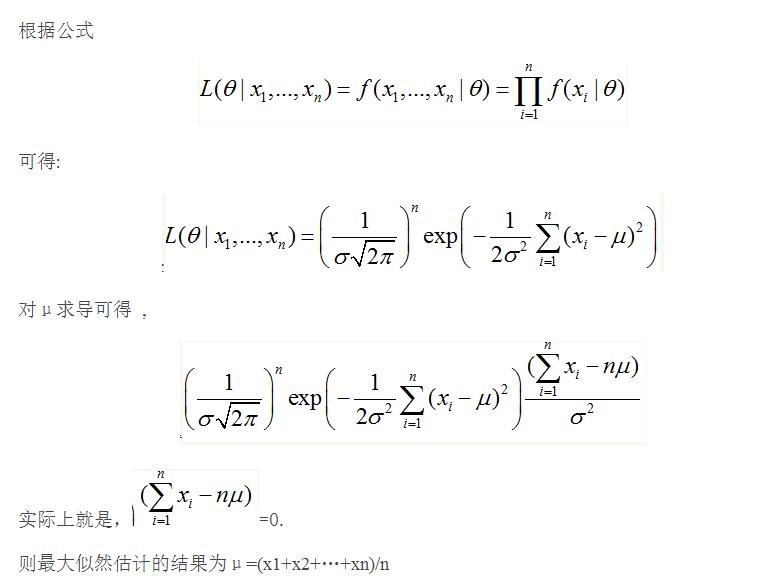

### 最大似然估计正态分布模型
假如我们的标准差和期望**是一样的**，也就是只有一个参数。

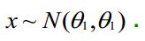

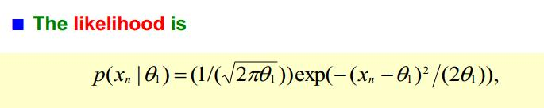

所以要求最大似然，就是把他们的概率都乘起来，对数求导，得

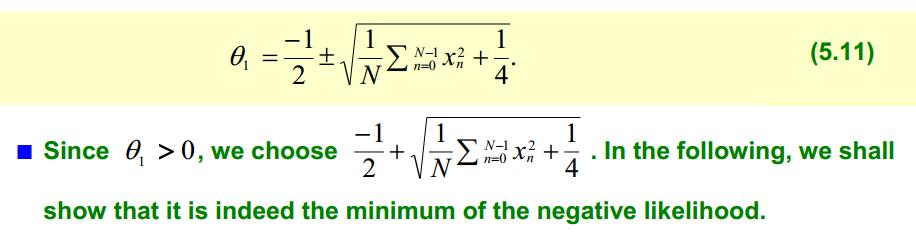

**假如期望和方差不一样，那么：**

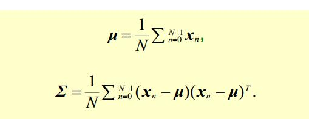
