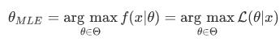
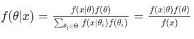
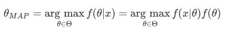

## 最大后验估计
我们知道，最大似然估计是指求当似然函数取得最大时参数θ的值，即

想要求解参数θ的值，只需要对L取导数，令导数等于0，得到似然方程，求解似然方程即可。

而最大后验估计，在确定了模型的基础上，引入了参数的先验分布g(也可以理解为时该模型出现的概率)，求解对于已有的观测序列，能使得后验概率最大的参数的值。根据贝叶斯公式，后验概率

同时**f(x)的具体值与参数θ**无关，不影响求解参数θ的最大估计，所以求最优只用考虑上述式子分子的部分，最大后验估计可以表示为

本质上也就是求f(x|θ)*f(θ),这个函数的最优值下θ的值。
