## 贝叶斯决策
**贝叶斯决策以基本概率论为基础，所以可以复习概率统计相关笔记，回忆概率统计基础**。

贝叶斯分类主要借助概率论的知识来通过比较提供的数据属于每个类型的条件概率, 将他们分别计算出来然后预测具有最大条件概率的那个类别是最后的类别。当然样本越多我们统计的不同类型的特征值分布就越准确，使用此分布进行预测则会更加准确。

### 贝叶斯准则
首先先回忆一下条件概率：

条件概率：

P(A|B) = P(AB) / P(B)

其中P(A|B)表示的B发生的情况下A发生的概率，这就是条件概率(结合概率统计相关笔记,可知即是面积B中，A占的比例)。

朴素贝叶斯分类器中最核心的便是贝叶斯准则，他用如下的公式表示:

根据概率统计的基础，我们很容易得知，贝叶斯定理无非就是在已知结果的情况下，求后验概率。根据条件概率公式可以轻易推得贝叶斯定理。

我们的贝叶斯模型便是通过贝叶斯准则去计算某个样本在不同类别条件下的条件概率并取具有最大条件概率的那个类型作为分类的预测结果。

### 连续随机变量的贝叶斯定理
贝叶斯定理不仅仅适用于离散随机变量，还适用于连续随机变量(连续随机变量详见概率统计笔记)。

假定我们有连续随机变量X,大写P(X=x)表示概率，小写的p代表随机变量X的随机密度函数。

假如我们我们有两个类别w1,w2,x是随机变量的取值,则我们可以画出w1,和w2下，X的密度函数

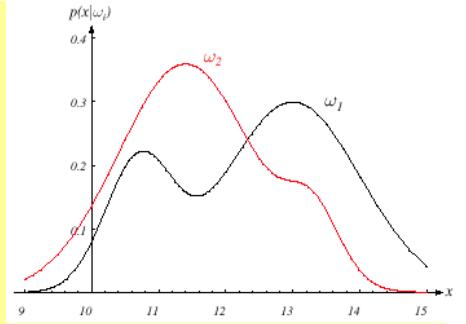

可以这么理解，假如我们钓鱼，钓到的鱼可能有两种,w1鱼和w2鱼,x是鱼的重量,上图就是概率密度函数。那么我们就可以用已知的一些数据去知道不同重量下，w1还是w2的概率。

以下就是贝叶斯定理的推广：

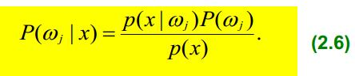

在已经掉出一条鱼，并且得知重量的情况下，倒推鱼属于哪一类。也就是在求后验概率。要用到概率密度函数p来求。其中p(x)为每种w类下，p(x)的值之和。

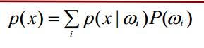

如此我们便可根据后验概率的大小，判断类别了。

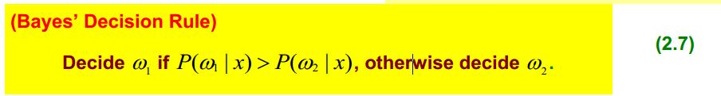

### 最小错误率二进制分类器
分类的时候我们要考虑错误率，而比较常用的错误率函数loss function，就是01 loss function。

**假定仅需要分两个类，我们根据公式判断出来的类为α1/α2,变量实际属于ω1/ω2**,则有：

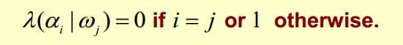

则我们有Risk风险函数，公式为

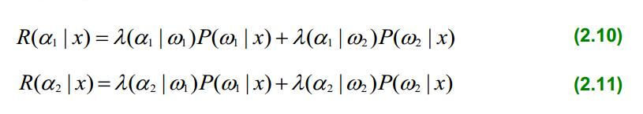

Risk函数的含义就是判断w类时，判断错误的风险。我们应该选风险小的。然后我们就可以根据Risk函数来判定x到底属于哪个类了

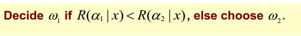

所以可以看到，我们是选择Risk函数小的来作为判定类别。

由于我们使用的是01 loss function，那么本质上就是：

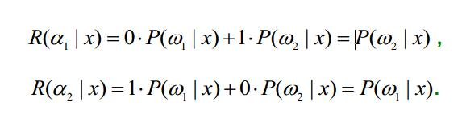

这么一看来，01 loss function本质上并没有对纯粹的贝叶斯决策进行到优化。

#### 添加了Penalizing权重的情况
01 loss function并没有进行到优化，然而有些情况，我们要对判断错误时，惩罚的权重加大。

比如，判断癌症时，我们把癌症病人误判为正常的危害性远远比把正常人误判为癌症的危害性大。所以我们要对把癌症病人误判这个惩罚Penalizing加大。

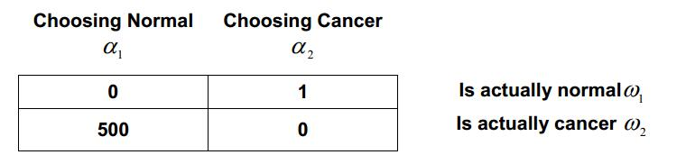

如上图，权重分配，则有：

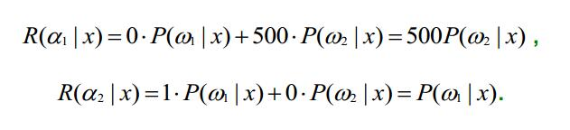

说明有时候，我们甚至要允许杀错也不要放过。

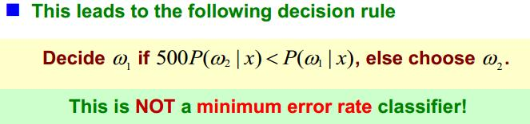

### 多类别情况的最小错误率分类
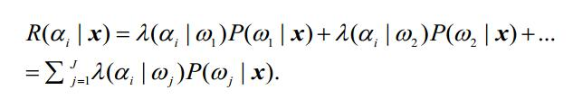

本质上还是一样的，只不过要多给出几个权重，并且要多给出几个Risk公式而已。
