## 非参数估计
当我们不知道模型是什么的时候，我们又想根据数据知道数据的概率密度函数(见概率笔记，概率密度函数的面积才代表概率)。这时会用到非参数估计的方法。

非参数方法的做法是，不假定密度的形式，直接从样本来估计类条件概率密度

### 直方图Histogram
直方图是数据的一个简单的可视化：我们在直方图中定义了组距和组数，并对每个组中的数据点数进行统计。

我们通过这个例子来分析一下直方图方法与核密度估计方法的异同之处：我们利用下面的6个数据点(一维数据)来做：

```
x1=−2.1,x2=−1.3,x3=−0.4,x4=1.9,x5=5.1,x6=6.2
```

直方图的方法是将x根据数据的大致范围分为一系列的bin(抽屉/间隔)，以上面的6个数据点为例，可将范围设置为(−4,8)，每个bin的长度为2

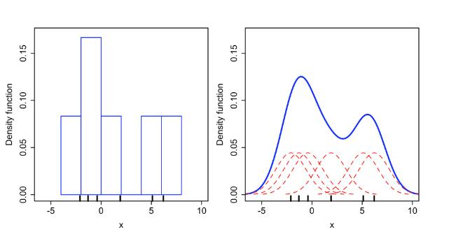

即可分为[−4,−2),[−2,0),[0,2)[2,4)[4,6)[6,8)共6个bin，每个bin的高度初始值设置为0。然后遍历所有的样本点，判定其落在哪一个bin之上，并在相应的bin的高度上加1/N,N是样本个数，这里等于6。从而就得到了上图所示的直方图显示。

最后这个直方图，就可以作为我们估计的概率密度函数(面积加起来刚好为1)。

简单来说就是可以得到直方图估计密度的公式：

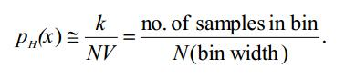

但是直方图终究是不连续的，且容易以后维度灾难，所以比较适用于低维问题。

上图的右边，核密度估计的方法生成的密度估计是一个连续的光滑的曲线，具体的方法是在对应的数据点上放置一个kernel函数，然后将所有数据点上的kernel叠加在一起，就可以构成一个光滑的密度函数。以上面的样本为例，上图右边的图中红色的虚线表示的是在对应6个数据点上放置的kernel函数，而蓝色的线代表的就是将所有的kernel函数叠加在一起构成的密度函数。

### 选点确定区域的两种不同的方法

一种方法是固定体积（volume）如下图，原理是取一个固定大小的区域R，观察有多少样本落入其中。

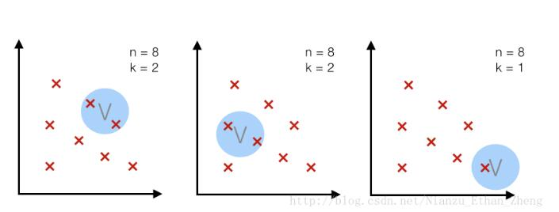

另外一种方法是样本数目K固定；k近邻算法就是这个原理，即是，对于一定大小的样本总数，我们取能框住k个样本的区域R

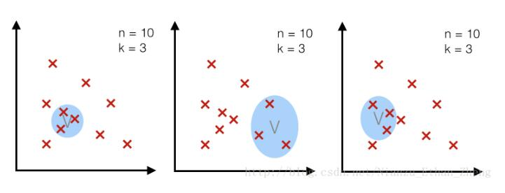


### PARZEN WINDOWS
Parzen窗法是另外一种在取值空间中进行取样估计的方法，或者说可以看作是用核函数对样本在取值空间中进行插值。

Parzen windown 是一种应用广泛的非参数估计方法，从采样的样本p(xn)中估计概率密度函数p(x)。

公式直接如下

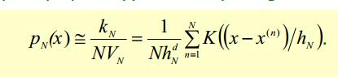

K是核函数，如下

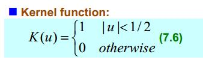

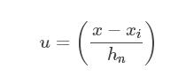

简单理解就是说，假如我们想知道x点的概率密度，也就是p(x)，那我们就在x点附近画出一个区域，看看其他点是不是在这个区域里(**看看离中心点位置的绝对值有没有超过二分之h**)，PARZEN WINDOWS的核函数则是画一个超立方体区域。然后看看有多少点落入了这个超立方体，最后代入公式累加。可以在后面例题中知道思想

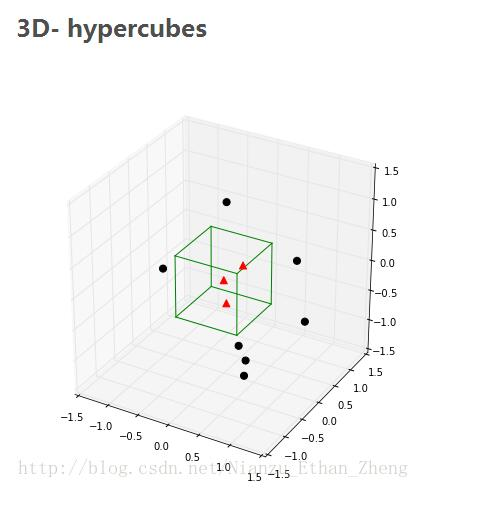

这种方法最基本的思想是给定一个特定的区域（Window）对落入其中的样本进行计数，可以得到样本落入该区域的概率

#### example

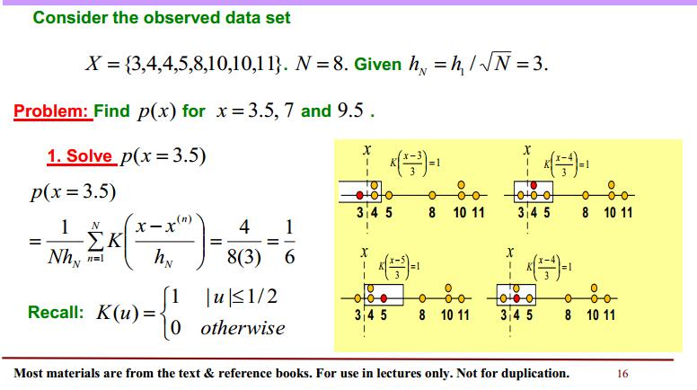

如上题，给出了8个数据点，并给出了h(超立方体的边长为3)，求给定点的概率密度。

那么比如p(3.5)，那就是在3.5为中心的的地方画一个长度为3的矩形。这样2-5的区域都被囊括在里面了，显然3445这四个点都在里面.这根据公式一样能得到，

超立方体的计算就是,代入具体数据到核函数K(|3-3.5|/3),由于小于二分之一，说明在矩形内，所以K(|3-3.5|/3)=1，说明落入超立方体中。很直观的可以知道这样的点有4个，所以，矩形外的点K为0，所以按照公式累加起来就是六分之一。

同理有：

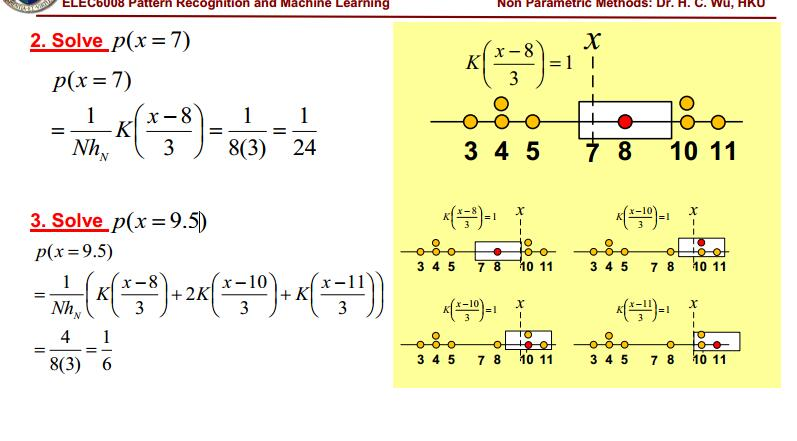

可知ParzenWindow对h/V(区域)的选取很敏感。

### KNN
跟上述类似，相求p(x)的概率密度，就以x为中心扩大区域，直到k个点被包含进来。每次都能保证至少可以包含k个点。

公式如下(求某个点属于某class的概率)：

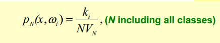

V相当于划分出的区域的体积，具体公式是：

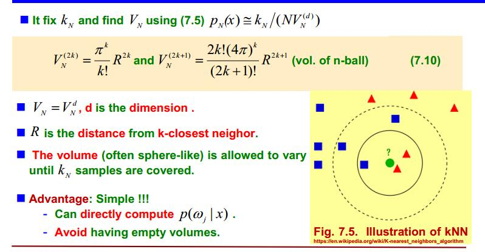

V要根据多方面来计算，首先跟维度(奇偶)有关，还跟扩大之后R的值有关。看例子：

#### example

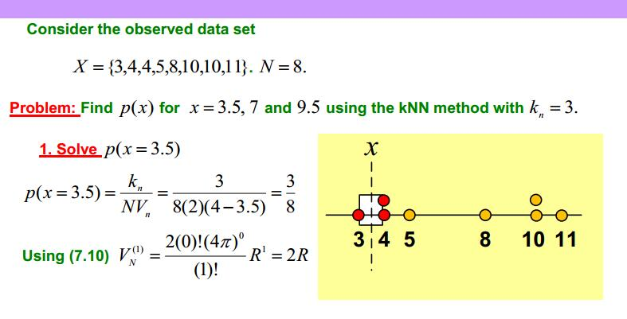

X有8个点，k取3，求p(3.5)，

则根据3.5为中心划区域，可知R=0.5的时候，恰好就可以包括到3个点，此时由于维度是1，V根据公式可得2R(矩形长度)是1.则根据KNN公式得出p(x=3.5)=3/8.

同理：

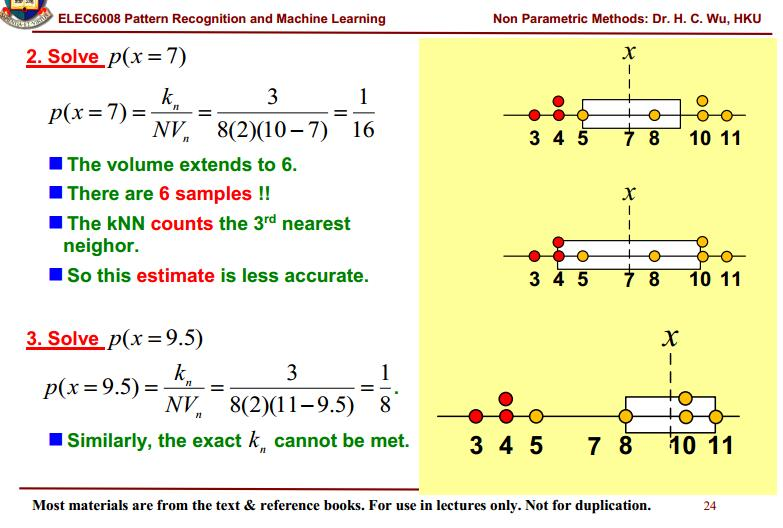

#### 综合example

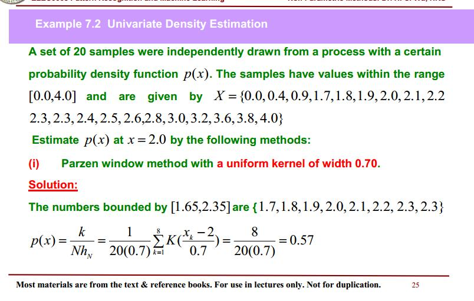


原理同上两道例题，注意第一问求点时，直接根据超立方体边长的一半h/2来圈定点。
