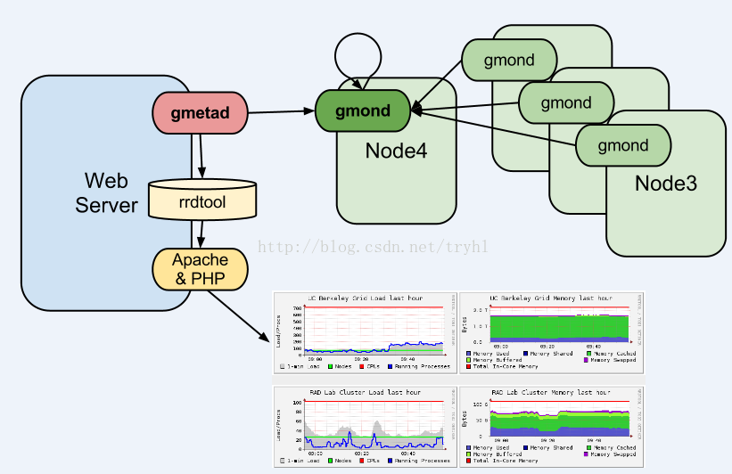
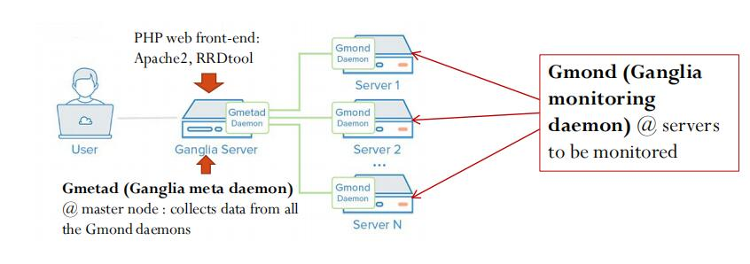

## Ganglia
Ganglia是UC Berkeley发起的一个**开源集群监视项目**，设计用于测量数以千计的节点。Ganglia的核心包含gmond、gmetad以及一个Web前端。主要是用来监控系统性能，如：cpu 、mem、硬盘利用率， I/O负载、网络流量情况等，通过曲线很容易见到每个节点的工作状态，对合理调整、分配系统资源，提高系统整体性能起到重要作用。

### 构成

如上图，可以知道，Ganglia主要由三部分组件构成，gmond,gmetad,以及一个php服务器用来展示前端页面。

简而言之，就是在我们需要监控的节点中安装gmond，然后gmond就会收集节点信息和存储信息。在中间设置一台服务器(master node)安装Gmetad组件，这个Gmetad组件会去轮询各个节点，收集节点信息并放在**rrd数据库**中。最后通过Gweb，把这些收集来的信息通过网页的方式展示出来。
