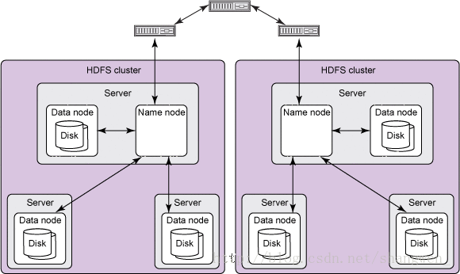

## Hadoop基本概念
Hadoop是一个开源框架，允许使用简单的编程模型在 **跨计算机集群的分布式环境中存储和处理大数据** 。它的设计是从单个服务器扩展到数千个机器，每个都提供本地计算和存储。

Hadoop基于几个模块，其中比较重要的两个模块是 **MapReduce和HDFS**，其中HDFS用于分布式文件存储，MapReduce用于分布式计算，Hadoop模块如下图：

 - HDFS: 分布式文件存储
 - YARN: 分布式资源管理
 - MapReduce: 分布式计算
 - Others: 利用YARN的资源管理功能实现其他的数据处理方式

### Hadoop Distributed File System，分布式文件系统

如上图所示，为HDFS的基本架构。

HDFS和操作系统一样，也是 **按块** 来存储的，但块会比操作系统的的大的多，默认为 **64MB** 作为独立的存储单元，也可以自行设置（例如128MB），但和其他操作系统不同的是，小于一个块大小的文件不会占据整个块的空间，块的大小的设置影响寻址的时间。

在一般情况下HDFS cluster主要包括一个`NameNode`和多个`DataNode`组成，大多数情况下，会有 **单独的一台机运行namenode实例**，客户端通过一个可配置的TCP端口链接到NameNode，NameNode,dataNode之间通过远程过程调用RPC进行通信。

在各节点的通信中，NameNode可以看作是datanode的管理者和仲裁者，它不会主动发起请求（防止负载过大），而是对客户端或者dataNode发起的请求进行响应，每个datanode都会维护一个开放的socket，支持客户端或者其他datanode进行读写操作，namenode知道该socket和主机的位置和端口。

简而言之几个角色便是：

- NameNode：**是Master节点**，是大领导。管理数据块映射；处理客户端的读写请求；配置副本策略；管理HDFS的名称空间；

- SecondaryNameNode：是一个小弟，分担大哥namenode的工作量；是NameNode的冷备份；合并fsimage和fsedits然后再发给namenode。

- DataNode：**Slave节点**，奴隶，干活的。负责存储client发来的数据块block；执行数据块的读写操作。

### MapReduce模型
MapReduce是一种分布式计算模型，由Google提出，主要用于搜索领域，解决海量数据的计算问题。

MapReduce理念合并了两种经典函数：

 - **映射（Mapping）** 对集合里的每个目标 **应用同一个操作**。即，如果你想把表单里每个单元格乘以二，那么把这个函数单独地应用在每个单元格上的操作就属于mapping。

 - **化简（Reducing ）** 遍历集合中的元素来返回一个  **综合的结果**。即，输出表单里一列数字的和这个任务属于reducing。

MR理念也就是分治，Mapping是分给其他人计算，Reduce是遍历每个结果获得最终答案。

所以MapReduce的计算模型如下图：

注意，我们得到数据交给Map计算完以后，在进入Reduce前先要经过一个 **Barrier屏障**，进行结果的整理(aggregation & shuffle),比如对结果进行排序之类的特殊处理，以便Reduce利用。

#### 局限性
MapReduce有其局限性：

 - 需要把每一个计算任务都实现为一个MapReduce任务，流程繁琐，不够直观
 - 处理非线性任务很麻烦，需要使用多个MapReduce来解决问题
 - MapReduce是批处理模型，不是永不停息的计算流，需要用户启动任务， 启动和结束任务有开销.

**MapReduce关注的是吞吐量而非实时性**

### YARN
YARN是开源项目Hadoop的一个**资源管理系统**，最初设计是为了解决Hadoop中MapReduce计算框架中的资源管理问题，但是现在它已经是一个更加通用的资源管理系统，可以把MapReduce计算框架作为一个应用程序运行在YARN系统之上，通过YARN来管理资源。

YARN是基于Master/Slave模式的分布式架构，我们先看一下，YARN的架构设计，如图所示（来自官网文档）

以上关注线的类型，表示出各节点的交互。

#### YARN client
YARN Client提交Application到RM(**Resource Manager**)，它会首先创建一个Application上下文件对象，并设置AM(**Aplication Master**)必需的资源请求信息，然后提交到RM。YARN Client也可以与RM通信，获取到一个已经提交并运行的Application的状态信息等，具体详见后面ApplicationClientProtocol协议的分析说明。

#### ResourceManager(RM)
**RM是YARN集群的Master**，负责管理整个集群的资源和资源分配。RM作为集群资源的管理和调度的角色，**如果存在单点故障，则整个集群的资源都无法使用**。在2.4.0版本才新增了RM HA的特性，这样就增加了RM的可用性。

#### NodeManager(NM)
**NM是YARN集群的Slave**，是集群中**实际拥有实际资源的工作节点**。我们提交Job以后(Client->RM)，会将组成Job的多个Task调度到对应的NM上进行执行。Hadoop集群中，为了获得分布式计算中的Locality特性，**会将DN(HDFS中的DataNode)和NM在同一个节点上运行**，这样对应的HDFS上的Block可能就在本地，而无需在网络间进行数据的传输。

#### Container
Container是YARN集群中**资源的抽象**，将NM上的资源进行量化，根据需要组装成一个个Container，然后服务于已授权资源的计算任务。计算任务在完成计算后，系统会回收资源，以供后续计算任务申请使用。**Container包含两种资源：内存和CPU**，后续Hadoop版本可能会增加硬盘、网络等资源。

#### ApplicationMaster(AM)
AM主要管理和监控部署在YARN集群上的Application，以MapReduce为例，MapReduce Application是一个用来处理MapReduce计算的服务框架程序，为用户编写的MapReduce程序提供运行时支持。通常我们在编写的一个MapReduce程序可能包含多个Map Task或Reduce Task，而各个Task的运行管理与监控都是由这个MapReduce Application来负责，比如运行Task的资源申请，由AM向RM申请；启动/停止NM上某Task的对应的Container，由AM向NM请求来完成。

下面，我们基于Hadoop 2.6.0的YARN源码，来探讨YARN内部实现原理。
