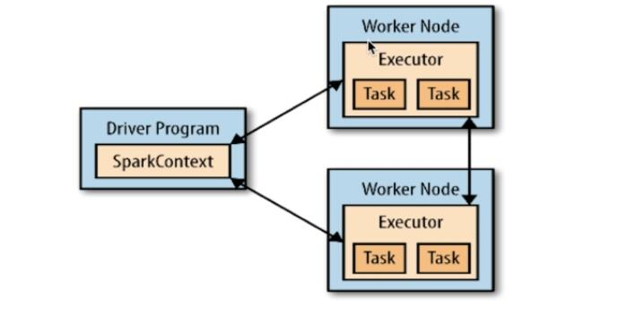
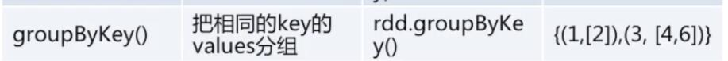
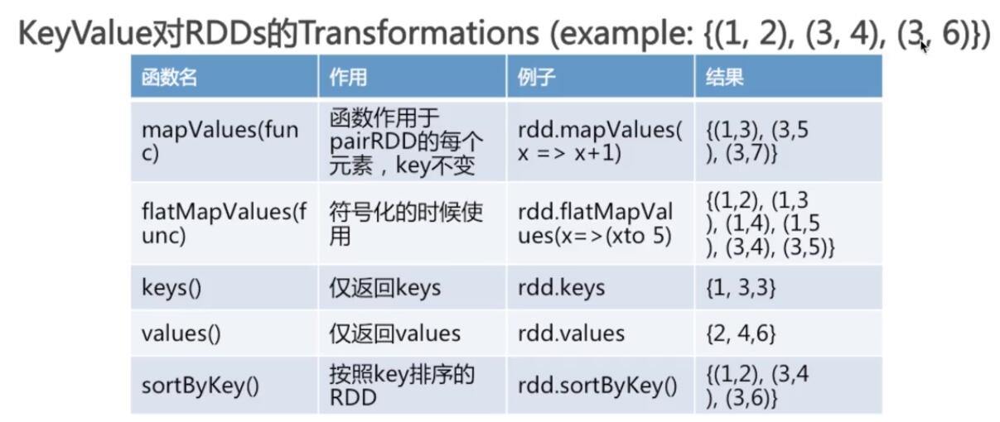
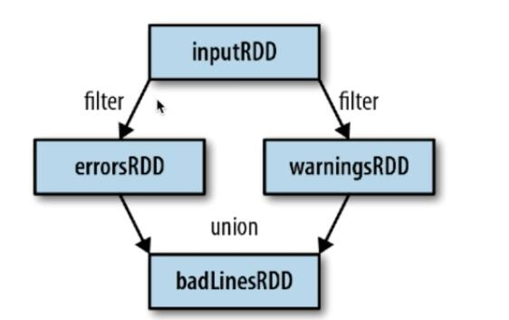
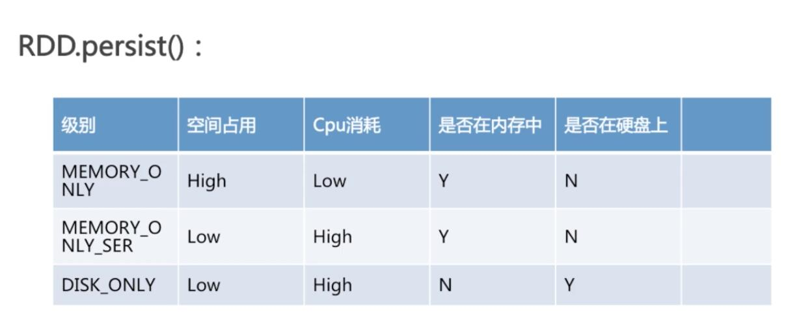
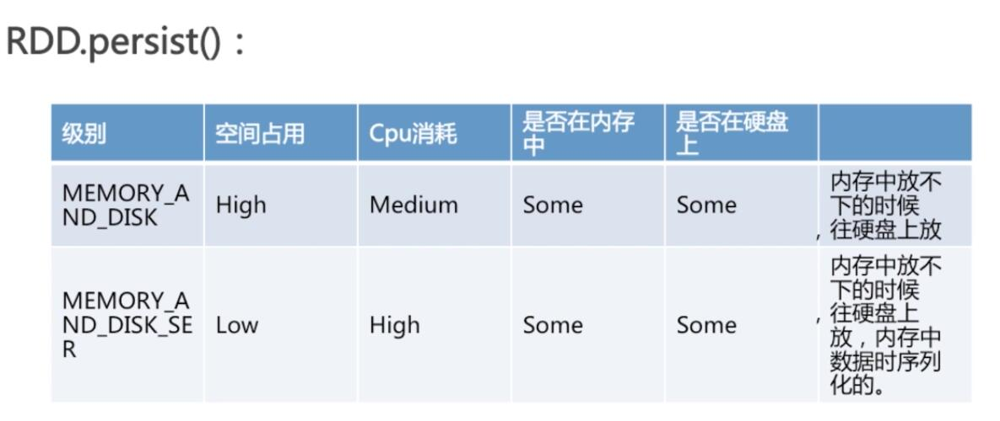

# Spark RDD

http://blog.csdn.net/guohecang/article/details/51736572

 在集群背后，有一个非常重要的分布式数据架构，即**弹性分布式数据集**（Resilient Distributed Dataset，RDD）。RDD是Spark的最基本抽象,是对分布式内存的抽象使用，**实现了以操作本地集合的方式来操作分布式数据集的抽象实现**。

RDD是Spark最核心的东西，**它表示已被分区，不可变的并能够被并行操作的数据集合**，不同的数据集格式对应不同的RDD实现。**RDD必须是可序列化的**。RDD可以cache到内存中，每次对RDD数据集的操作之后的结果，都可以存放到内存中，下一个操作可以直接从内存中输入，**省去了MapReduce大量的磁盘IO操作**。这对于迭代运算比较常见的机器学习算法, 交互式数据挖掘来说，效率提升比较大。

## RDD特点
1. 创建：只能通过转换 ( transformation ，如**map/filter/groupBy/join** 等，区别于动作 action) 从两种数据源中创建 RDD 1 ）稳定存储中的数据； 2 ）其他 RDD。

2. 只读：状态不可变，不能修改。

3. 分区：支持使 RDD 中的元素**根据那个 key 来分区** ( partitioning ) ，保存到多个结点上。还原时只会重新计算丢失分区的数据，而不会影响整个系统。

4. 路径：在 RDD 中叫世族或血统 ( lineage ) ，即 RDD 有充足的信息关于它是如何从其他 RDD 产生而来的。

5. 持久化：支持将会被重用的 RDD 缓存 ( 如 in-memory 或溢出到磁盘 )。

6. 延迟计算： Spark 也会延迟计算 RDD ，使其能够将转换管道化 (pipeline transformation)。

7. 操作：丰富的转换（transformation）和动作 (action),count/reduce/collect/save 等。执行了多少次transformation操作，RDD都不会真正执行运算（记录lineage），只有当action操作被执行时，运算才会触发。

## RDD优势
1. RDD只能从持久存储或通过Transformations操作产生，相比于分布式共享内存(DSM)可以更高效实现容错，对于丢失部分数据分区只需根据它的lineage就可重新计算出来，而不需要做特定的Checkpoint。
2. RDD的不变性，可以实现类Hadoop MapReduce的推测式执行。
3. RDD的数据分区特性，可以通过数据的本地性来提高性能，这不Hadoop MapReduce是一样的。
4. RDD都是可序列化的，**在内存不足时可自动降级为磁盘存储**，把RDD存储于磁盘上，这时性能会有大的下降但不会差于现在的MapReduce。
5. 批量操作：任务能够根据数据本地性 (data locality) 被分配，从而提高性能。

## RDD详解
前面已经介绍了RDD，RDD一旦读取到内存中，那么就是**不可变的**。我们在shell操作中，用sc(也就是后面提到的SparkContext对象)读取到的文本文件，在内存中就成了RDD结构。

一个RDD也由许多个Partition(分片)组成。

### 分片Partition
每个分片包括RDD一部分数据，partitions可以在集群不同的节点上进行计算。

### Driver program
在Sprak体系中，driver program是一个程序，这个程序包含main方法，也有RDDs的定义和操作。它将管理着很多节点。



Driver Program里会有一个SparkContext对象。

#### SparkContext
 - Driver program通过SparkContext对象来访问Spark。
 - SparkContext对象代表和一个集群的连接
 - 在Shell中SparkContext则是自动创建好的，就是**sc**


### 集合类处理成RDD
可以调用SparkContext的一些方法，把集合类对象转换为RDD结构。


比如scala中

```
val rdd = sc.parallelize(Array(1,2,2,4),4)
```

以上调用**Parallelize**方法，把集合并行化处理，第二个参数是分片partitions的个数。

### RDD的Transformation
RDD的Transformation，即是从之前的RDD构建一个新的RDD，比如map()和filter().

#### map()
map()接受函数，把函数应用到每个RDD，最后返回新的RDD。

```
val rdd = sc.parallelize(Array("a","b","c","d"),4)

val rdd2 = rdd.map(word=>(word,1))

```

map用以构造新rdd，这里也是输入一个匿名函数，最后把word构成一个新元素(word,1)

#### filter()
filter接受函数，返回只满足filter函数的元素的rdd。

也就是一个过滤器，过滤掉rdd里不符合要求的内容。

```
val rdd = sc.parallelize(Array("a","b","c","d"),4)

val rdd2 = rdd.filter(word=>word.contains("a"))

```

#### flatMap()
对每个输入元素，输出多个输出元素。

```
val rdd = sc.parallelize(Array("a b","b","c","d"),4)

val rdd2 = rdd.flatmap(word=>word.split("a"))

```

flatmap会可能把一个元素分割成多个元素，所以就是用于分裂。

#### 集合操作
 - distinct，去重
 - union，求并集
 - intersection，求交集
 - substract，求rdd1和rdd2的差集，也就是rdd1有而rdd2没有的。

### RDD的Action
操作RDD并且产生一个结果。

#### reduce

reduce，接受一个函数，作用在rdd两个相同类型的元素上面，返回新的元素，**持续操作**。可以实现累加，计数等聚集操作。

``` scala
val rdd = sc.parallelize(Array(1,2,3,3))
rdd.reduce((x,y)=>x+y)
```

最后输出的int值是9，相当于遍历，依次累加了每个元素的值。

#### collect
遍历整个RDD，向driver program返回rdd的内容。需要单机内存能够容纳的下。

#### take(n)
返回RDD的n个元素，同时尝试访问最少的partitions，结果是无序的，一般测试的时候使用。

#### top
根据RDD中数据比较器排序，选top N。

#### foreach
用函数执行RDD中的每个元素，但是不返回给本地。

### RDD创建KeyValue对
例如，一个包含数行数据的RDD，把每行数据第一单词作为keys，整行作为value。

``` scala
val rdd2 = rdd.map(line=>(line.split(" ")(0),line))

//手动创建键值对(类似pair)
val rdd = sc.parallelize(Array((1,2),(3,5),(6,8)))
```

#### reduceByKey(func)
把相同key的元素的value，操作后合并。

#### groupByKey
把相同key的values收集起来，成为一个集合。



#### 一些常用函数


#### combineByKey(重)
函数中会有很多参数,这个函数非常常用，要重点理解。

``` scala
combineByKey(createCombiner,mergeValue,mergeCombiners,partitioner)
```

函数返回的类型可以与输入类型不同。

combineByKey的执行流程如下，

combineByKey首先分别执行与RDD的每个partition中，遍历每个partition中的数据，遇到该partition中第一次遇到的key，则对value执行createCombiner函数，遇到重复的key，则对value执行mergeValue函数。最后，整合各个partition的时候，执行mergeCombiners函数。

看一个例子

``` scala
var rdd1 = sc.makeRDD(Array(("A",1),("A",2),("B",1),("B",2),("C",1)))

rdd1.combineByKey(
(v : Int) => List(v),　　　　　　　　　　　　　--将1 转换成 list(1)
(c : List[Int], v : Int) => v :: c,　　　　　　　--将list(1)和2进行组合从而转换成list(1,2)
(c1 : List[Int], c2 : List[Int]) => c1 ::: c2　　--将全局相同的key的value进行组合
).collect
res65: Array[(String, List[Int])] = Array((A,List(2, 1)), (B,List(2, 1)), (C,List(1)))
```

### 血统关系图
Spark维护着RDD之间的创建和依赖关系，使用血统关系图来计算RDD的需求和恢复丢失的数据。



如上图rdd之间的依赖

### 延迟计算(Lazy Evaluation)
Spark对RDD的计算，在他们第一次使用action操作的时候才进行。

这种方式在处理大数据的时候特别有用，可以减少数据的传输。Spark内部记录metadata信息表明transformation操作被相应。

加载数据也是延迟计算，数据只有在必要的时候才被加载。

zwlj：只要没进行action操作，前面那些各种操作都不会执行，比如transformation这些。

### RDD.persist()持久化


由于RDD不可变的特性，所以参考于那个血统关系图，每次action操作后，都不会产生具体的rdd实例，而是通过重新根据血统关系图计算来得到，比如上图用badLines，所以会从inputRDD重新计算得到。

这时候要调庸rdd.persist方法进行持久化，把实例数据保存到缓存当中。

unpersist方法，则用于从缓存中移除。

#### persist级别





不同级别，具体保存在何处会有差异。
