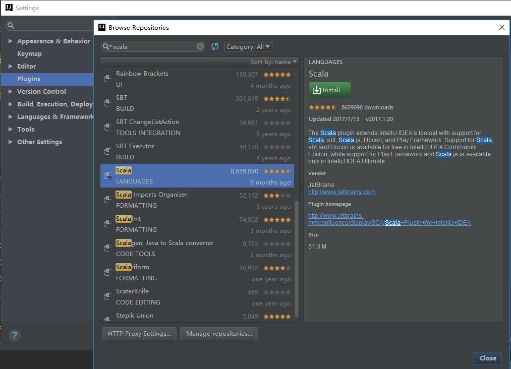

## Spark安装
Spark是用Scala写的，运行在JVM上。所以运行环境要Java1.7以上，如果用PySpark，则要安装python2.6或者3.4+。Spark1.6.2对应Scala2.10，Spark2.0对应Scala2.11

### 下载
官网下载linux对应的tgz包，然后再linux环境下解压即可。

### Spark shell
spark在linux下解压以后，进入bin目录，可以执行spark shell。

 - Spark的shell帮助用户处理分布在集群中的数据
 - Spark把数据加载到节点的内存中，因此分布式处理可在秒级完成。
 - 使用shell可以**分析数据，快速迭代计算，实时查询**。
 - 有**Python shell和Scala shell**两种

pySpark在bin目录下，运行pyspark来执行。Scala shell则是运行spark-shell来运行。

在shell下，我们就可以读入文件到内存，然后操作rdd。

### itelij进行Spark开发
开发Scala的Spark程序，同样可以用iteliJ进行安装。只不过是需要安装额外的plugin。

我们须得搜索scala插件进行安装，内部也包含了一个SBT的打包插件，也可以安装。

由于Scala就是运行在JVM上的，所以我们只要有JVM和Scala插件，就可以运行Scala代码了，所以使用IDE，很方便。安装好Scala插件后，我们new project时选择Scala，并且选择sbt打包项目就可以了。
