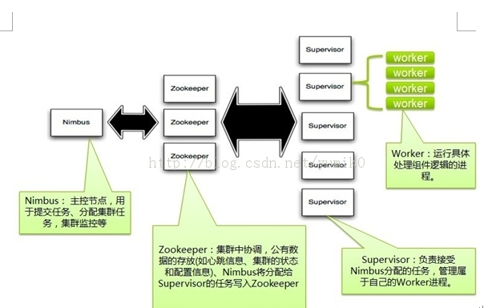
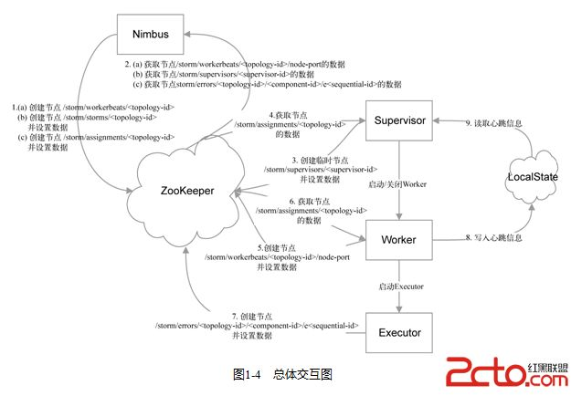

## Storm框架
Storm是一个免费并开源的分布式实时计算系统。利用Storm可以很容易做到可靠地处理无限的数据流，像Hadoop批量处理大数据一样，Storm可以实时处理数据。Storm简单，可以使用任何编程语言。

**Storm比起Hadoop更注重实时性**

### 模型

计算模型如下图所示

简单介绍一些基本概念：

#### Topology
拓扑结构，代表整个实时数据处理程序，包含数据处理的所有逻辑。

一个Storm拓扑跟一个MapReduce的任务(job)是类似的。主要区别是MapReduce任务最终会结束，而拓扑会一直运行（当然直到你杀死它)。

由模型图可知，Topology其实就是一个由Spout和Bolt组成的有向无环图，每个Spout与Bolt，Bolt与Bolt之间，通过一种流的概念相连接。

#### 流(Streams)
流是Storm中的核心抽象。一个流由无限的元组序列组成，这些元组会被分布式并行地创建和处理。通过流中元组包含的字段名称来定义这个流。
每个流声明时都被赋予了一个ID。只有一个流的Spout和Bolt非常常见，所以OutputFieldsDeclarer提供了不需要指定ID来声明一个流的函数(Spout和Bolt都需要声明输出的流)。这种情况下，流的ID是默认的“default”。

#### 元组(Tuple)
元组是Storm提供的一个轻量级的数据格式，可以用来包装你需要实际处理的数据。元组是一次消息传递的基本单元。一个元组是一个命名的值列表，其中的每个值都可以是任意类型的。元组是动态地进行类型转化的--字段的类型不需要事先声明。在Storm中编程时，就是在操作和转换由元组组成的流。通常，元组包含整数，字节，字符串，浮点数，布尔值和字节数组等类型。要想在元组中使用自定义类型，就需要实现自己的序列化方式。

#### Spout消息源
Spoil喷嘴，也就是消息源。通常Spout从外部数据源，如消息队列中读取元组数据并吐到拓扑里。Spout可以是可靠的(reliable)或者不可靠(unreliable)的。可靠的Spout能够在一个元组被Storm处理失败时重新进行处理，而非可靠的Spout只是吐数据到拓扑里，不关心处理成功还是失败了。

Spout获取元祖的过程不应该阻塞其他Spout，因为Storm会在一个相同的线程中处理所有Spout任务。

#### Bolts消息处理单元
消息处理单元Bolts就是逻辑处理的实现，每个消息处理单元只完成一项简单的任务。

Bolt可以做函数处理，过滤，流的合并，聚合，存储到数据库等操作。Bolt就是流水线上的一个处理单元，把数据的计算处理过程合理的拆分到多个Bolt、合理设置Bolt的task数量，能够提高Bolt的处理能力，提升流水线的并发度。

所有的操作包括提交元祖，确认成功失败都会在一个线程中进行，所以不允许这些方法产生阻塞。

#### 可靠性(Reliability)
Storm保证了拓扑中Spout产生的每个元组都会被处理。Storm是通过跟踪每个Spout所产生的所有元组构成的树形结构并得知这棵树何时被完整地处理来达到可靠性。每个拓扑对这些树形结构都有一个关联的“消息超时”。如果在这个超时时间里Storm检测到Spout产生的一个元组没有被成功处理完，那Sput的这个元组就处理失败了，后续会重新处理一遍。

为了发挥Storm的可靠性，需要你在创建一个元组树中的一条边时告诉Storm，也需要在处理完每个元组之后告诉Storm。这些都是通过Bolt吐元组数据用的OutputCollector对象来完成的。标记是在emit函数里完成，完成一个元组后需要使用ack函数来告诉Storm。

### 总体架构

Storm主要分为两种组件Nimbus和Supervisor。这两种组件都是快速失败的，没有状态。任务状态和心跳信息等都保存在Zookeeper上的，提交的代码资源都在本地机器的硬盘上。

 - Nimbus负责在集群里面发送代码,管理整个集群，分配工作给机器，并且监控状态。全局只有一个。

 - 每个计算节点上有一个Supervisor进程，Supervisor会监听分配给它那台机器的工作，根据需要启动/关闭工作进程Worker。每一个要运行Storm的机器上都要部署一个，并且，按照机器的配置设定上面分配的槽位数。

 - Zookeeper是Storm重点依赖的外部资源。Nimbus和Supervisor甚至实际运行的Worker都是把心跳保存在Zookeeper上的。Nimbus也是根据Zookeerper上的心跳和任务运行状况，进行调度和任务分配的。

### Zookeeper
zookeeper是一个为分布式应用所设计的开源协调服务，提供同步，配置管理，分组和命名服务。

Storm采用zookeeper来保存元数据。

以上为交互图。

### 与Hadoop比较
Storm强调实时性，**可以对不断运行的Topology对实时流入的数据进行处理**。

Apache Storm是一个纯粹的计算引擎和框架，也就是说它不负责分布式存储。而Hadoop核心组件的HDFS则是分布式存储的解决方案。
