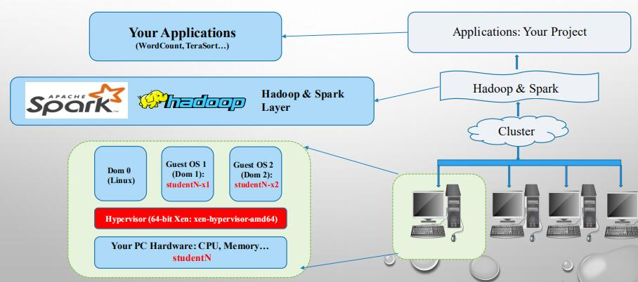
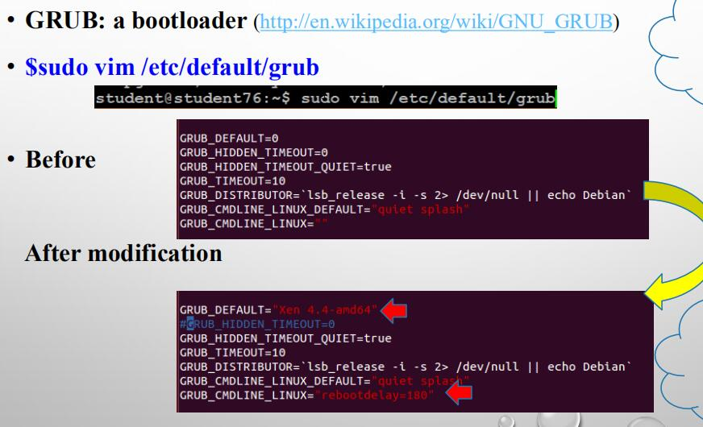
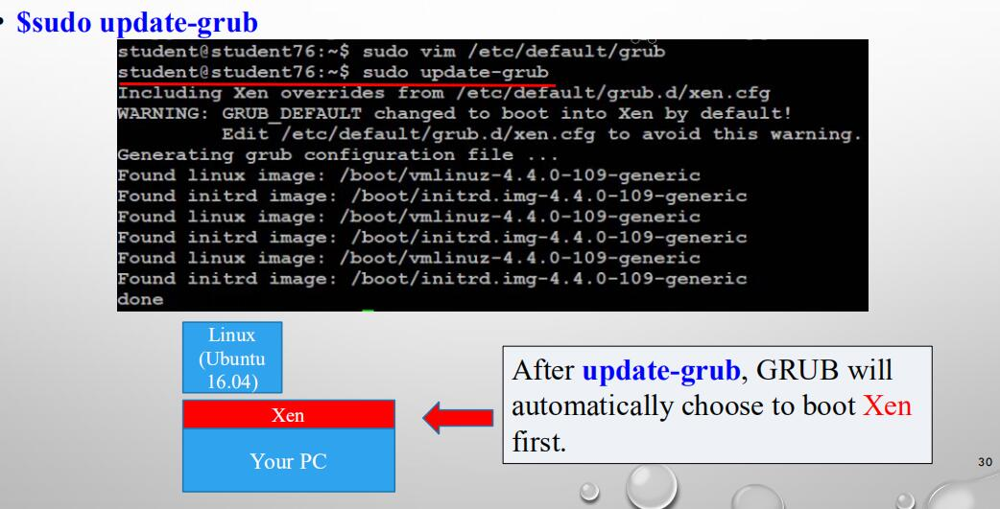
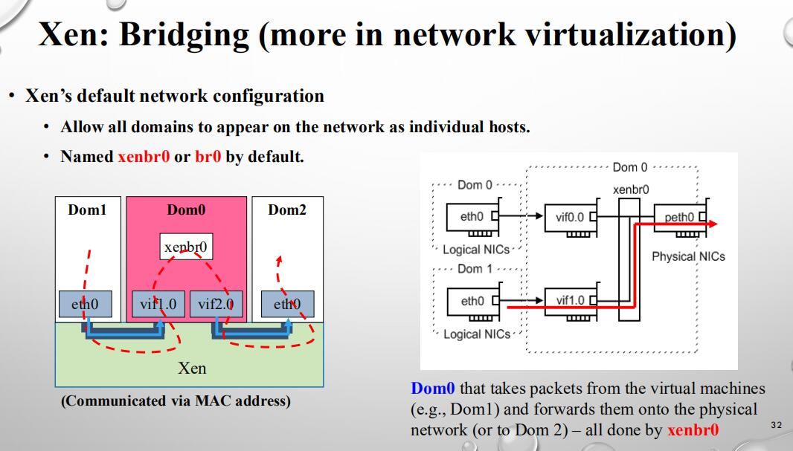

## Xen
Xen 是一个开放源代码虚拟机监视器，由剑桥大学开发。它打算在单个计算机上运行多达100个满特征的操作系统。操作系统必须进行显式地修改（“移植”）以在Xen上运行（但是提供对用户应用的兼容性）。这使得Xen无需特殊硬件支持，就能达到高性能的虚拟化。

### 工作原理
在Xen环境中，主要有两个组成部分。

一个是**虚拟机监控器VMM**，也叫**hypervisor**。Hypervisor层在硬件与虚拟机之间，是必须最先载入到硬件的第一层。Hypervisor载入后，就可以部署虚拟机了。在Xen中，**虚拟机叫做“domain”**。在这些虚拟机中，其中一个扮演着很重要的角色，**就是domain0，具有很高的特权**。通常，在任何虚拟机之前安装的操作系统才有这种特权。

如图，Hypervisor层在我们的硬件层之上。在这一层上，我们部署虚拟机。

Domain0要负责一些专门的工作。由于hypervisor中不包含任何与硬件对话的驱动，也没有与管理员对话的接口，这些驱动就由domain0来提供了。通过domain0，管理员可以利用一些Xen工具来创建其它虚拟机（Xen术语叫domainU）。这些domainU也叫无特权domain。这是因为在基于i386的CPU架构中，它们绝不会享有最高优先级，只有domain0才可以。

### 基本使用
我们在linux里可以用apt-get直接安装Xen。

然后我们便可以用grub配置使其可用。

#### 网络配置

我们需要配置virtual switch做网络包的中转，使得我们创建的虚拟机可以连接网络。

通过安装bridge-utils我们可以比较轻松的实现。

如图，假如我们dom1想和dom2连接，我们的网络流量通过Xen层，到达Dom0然后再去往dom2层。总之Dom0如同核心节点，接受来自VM的packet然后转发出去。
