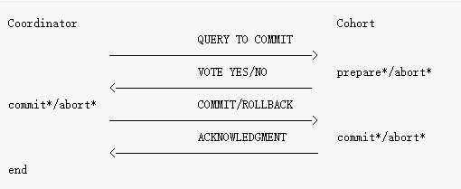
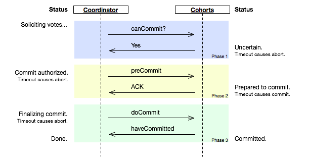
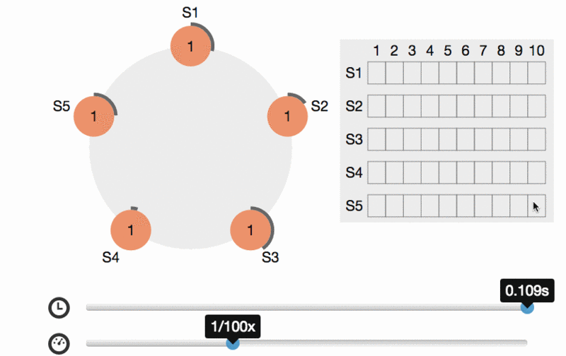

## 分布式协议总结
为了解决分布式系统的一致性问题，在长期的探索研究过程中，涌现出了一大批经典的一致性协议和算法。

分布式中一致性是非常重要的，分为 **弱一致性和强一致性**。现在主流的一致性协议一般都选择的是 **弱一致性的特殊版本：最终一致性**。

### 基本原则

 - CAP（Consistency一致性，Availability可用性，Partition tolerance分区容错性）理论是当前分布式系统公认的理论，亦即一个分布式系统不可能同时满足这三个特性，只能三求其二。对于分布式系统，P是基本要求，如果没有P就不是分布式系统了，所以一般都是在满足P的情况下，在C和A之间寻求平衡。【见CAP笔记】

 - ACID（Atomicity原子性，Consistency一致性，Isolation隔离性，Durability持久性）是事务的特点，具有强一致性，一般用于单机事务，分布式事务若采用这个原则会丧失一定的可用性，属于CP系统。

 - BASE（Basically Availabe基本可用，Soft state软状态，Eventually consistency最终一致性）理论是对大规模的互联网分布式系统实践的总结，用弱一致性来换取可用性，不同于ACID，属于AP系统。

#### 2PC
2 Phase Commit，两阶段提交，系统有两个角色 **协协调者Coordinator和参与者Cohort**，事务提交过程分为两阶段：

1. 提交事务请求（投票阶段）
 - 协调者向参与者发送事务内容，询问是否可以执行事务提交操作，等待响应
 - 参与者执行事务操作，并将undo和redo日志记录
 - 参与者回复协调者，执行成功则回Yes否则No

2. 执行事务提交（执行阶段）

 - 如果参与者都回复Yes，则协调者向参与者发送提交请求，否则发送回滚请求
 - 参与者根据协调者的请求执行事务提交或回滚，并向协调者发送Ack消息
 - 协调者收到所有的Ack消息过后判断事务的完成或者中断

 该协议可以视为强一致的算法，通常用来保证多份数据操作的原子性，也可以实现数据副本之间的一致性，实现简单，但是缺点也很多，比如单点故障（协调者挂了整个系统就没法对外服务，任一节点挂了事务就没法执行，没有容错机制）、阻塞（两个阶段都涉及同步等待阻塞，极大降低了吞吐量）、数据不一致（参与者回复Yes/No后如果因为网络原因没有收到提交/中断请求，此时它就不知道该如何操作了，导致集群数据不一致）......

 当然，如果网络环境较好，该协议一般还是能很好的工作的，2PC广泛应用于 **关系数据库的分布式事务处理**，如mysql的内部与外部XA都是基于2PC的。

### 3PC
3 Phase Commit，三阶段提交，是二阶段提交的改进，系统也有两个角色协调者和参与者，事务提交过程分为三阶段：

1. 事务询问（canCommit）
 - 协调者向参与者发送一个包含事务内容的询问请求，询问是否可以执行事务并等待
 - 参与者根据自己状态判断并回复yes、no

2. 执行事务预提交（preCommit）
 - 若协调者收到全是yes，就发送preCommit请求否则发布abort请求
 - 参与者若收到preCommit则执行事务操作并记录undo和redo然后发送Ack，若收到abort或者超时则中断事务

3. 执行事务提交（doCommit）
 - 协调者收到所有的Ack则发送doCommit请求，若收到了No或者超时则发送abort请求
 - 参与者收到doCommit就执行提交并发送ACk，否则执行回滚并发送Ack
 - 协调者收到Ack判断是完成事务还是中断事务

三阶段相对于两阶段的改善就是把准备阶段一分为二，亦即多了一个canCommit阶段

多了一次确认，增大了事务执行成功的概率。而且3PC的协调者即使出了故障，参与者也能继续执行事务（但是也可能因此导致集群数据不一致）

### Paxos
上面两个协议的协调者都需要人为设置而无法自动生成，是不完整的分布式协议，而Paxos 就是一个真正的完整的分布式算法。系统一共有几个角色：Proposer提案者（提出提案）、Acceptor（参与决策）接受者、Learner学习者（不参与提案，只负责接收已确定的提案，一般用于提高集群对外提供读服务的能力），实践中一个节点可以同时充当多个角色。(分布式一致性与公式算法笔记里也有说到)

**提案选定类似于2PC**

1. Prepare阶段
 - Proposer选择一个提案编号M，向Acceptor某个超过半数的子集成员发送该编号的Prepare请求
 - Acceptor收到M编号的请求时，若M大于该Acceptor已经响应的所有Prepare请求的编号中的最大编号N，那么他就将N反馈给Proposer，同时承诺不会再批准任何编号小于M的提案

 2. Accept阶段
 - 如果Proposer收到超过半数的Acceptor对于M的prepare请求的响应，就发送一个针对[M,V]提案的Accept请求给Acceptor，其中V是收到的响应编号中编号的最大的提案值，如果响应中不包括任何提案值，那么他就是任意值
 - Acceptor收到这个针对[M,V]的Accept请求只要改Acceptor尚未对大于M编号的提案做出过响应，他就通过这个提案

3. Learn阶段（本阶段不属于选定提案的过程）
 - Proposer将通过的提案同步到所有的Learner

Paxos协议的容错性很好，只要有超过半数的节点可用，整个集群就可以自己进行Leader选举，也可以对外服务，**通常用来保证一份数据的多个副本之间的一致性**，适用于构建一个分布式的一致性状态机。

### Raft
**Raft协议对标Paxos，容错性和性能都是一致的**，但是Raft比Paxos **更易理解和实施**。系统分为几种角色： Leader（发出提案）、Follower（参与决策）、Candidate（Leader选举中的临时角色）。

 - 刚开始所有节点都是Follower状态，然后进行Leader选举
 - 成功后Leader接受所有客户端的请求，然后把日志entry(数据变化)发送(广播)给所有Follower，
 - 当收到过半的节点的回复（而不是全部节点）时就给客户端 **返回成功** (相当于commit 变化)。并把commitIndex设置为该entry的index，所以是满足最终一致性的。

Leader同时还会周期性地发送心跳给所有的Follower（会通过心跳同步提交的序号commitIndex），Follower收到后就保持Follower状态（并应用commitIndex及其之前对应的日志entry），如果Follower等待心跳超时了，则开始新的Leader选举：首先把当前term计数加1(一个用于leader选举的变量)，自己成为Candidate(选举leader时的临时角色)，然后给自己投票并向其它结点发投票请求。直到以下三种情况：

 - 它赢得选举
 - 另一个节点成为Leader
 - 一段时间没有节点成为Leader

 在选举期间，Candidate可能收到来自其它自称为Leader的写请求，如果该Leader的term不小于Candidate的当前term，那么Candidate承认它是一个合法的Leader并回到Follower状态，否则拒绝请求。
如果出现两个Candidate得票一样多，则它们都无法获取超过半数投票，这种情况会持续到超时，然后进行新一轮的选举，这时同时的概率就很低了，那么首先发出投票请求的的Candidate就会得到大多数同意，成为Leader。

如上图，S4先超时，然后自己选举自己为leader，然后用心跳数据包联络其他节点保持自己是leader。

成为leader之后接受客户端请求和更新，数据更新后的leader会把数据的变化广播给其他follower节点。

在Raft协议出来之前，Paxos是分布式领域的事实标准，但是Raft的出现打破了这一个现状（raft作者也是这么想的，请看论文），Raft协议把Leader选举、日志复制、安全性等功能分离并模块化，使其更易理解和工程实现

[动画演示](http://thesecretlivesofdata.com/raft/)，有空这个笔记会把整个流程细节都补充完。

Raft协议目前被用于 cockrouchDB，TiKV等项目中，据我听的一些报告来看，一些大厂自己造的分布式数据库也在使用Raft协议。

### 参考
https://juejin.im/post/5a5de9fe6fb9a01c9c1f08fd

https://blog.csdn.net/chdhust/article/details/52651741

https://segmentfault.com/a/1190000014503967
