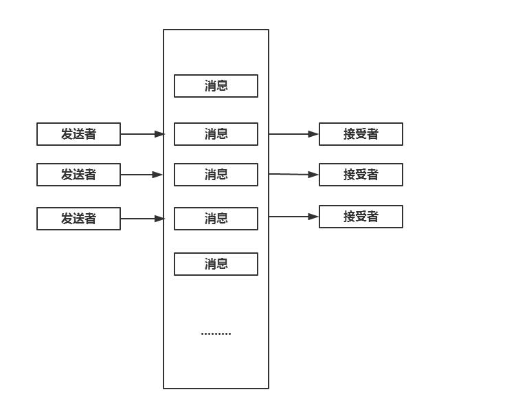

## 通信系统高层抽象

### RPC
系统最细粒度的抽象单位一般是**函数**。一般来说，一个模块调用另外一个模块，都是通过调用此模块的**函数接口**，这很直观，也易于理解和围护。

但是分布式系统中，不同的子系统可能分属于不同的服务器，所以A子系统想调用B子系统的服务，没办法简单通过过程调用来实现，需要**利用网络通信**，此时就有了**RPC技术**。

**RPC（Remote Procedure Call）——远程过程调用**，它是一种通过网络从远程计算机程序上请求服务，而不需要了解底层网络技术的协议。RPC协议假定某些传输协议的存在，如TCP或UDP，为通信程序之间携带信息数据。在OSI网络通信模型中，RPC跨越了传输层和应用层。RPC使得开发包括网络分布式多程序在内的应用程序更加容易。

简而言之就是A系统通过网络请求发送给B系统调用它的服务，B系统通过网络返回结果。

上图就是RPC架构的执行流程，RPC架构其实就是分层和封装，使底层通信对用户透明

RPC已有许多成熟框架，比如Thrift。

### RESTful
可见前端基础笔记中的RESTful架构。

RESTful是一种架构设计风格，专业一点(中文)就叫做**表现层状态转移**。如何准确理解表现层状态转移这种设计架构呢？

要先知道几个概念：

#### 资源
资源，指的是**网络中的一个实体文件**，当然就有标识符URI(Uniform Resource Identifier),访问uri就是访问相应的资源。

#### 表现层
什么是表现层呢？**表现层就是资源的表现形式**，也可以理解成格式，比如可能资源是json，html，txt甚至是图片jpg，png，等。

#### 状态转移
对资源的访问，牵涉到对资源的修改。而REST抽象中，资源的修改就是资源的状态改变了，这就是**资源的状态转移**。

资源的修改也就是意味着资源的表现层发生了变化，所以RESTful的核心就是这里**表现层状态转移**。

#### HTTP RESTful
RESTful是一种网络抽象架构风格，**HTTP也只是实现RESTful的一种手段**，并不能将其与RESTful划等号。

比如，http通过put，delete请求，发送给服务器，操作资源文件，这就改变了资源的状态，这就是用http实现了restful。

#### 总结
所以RESTful设计原则就是

 - 用URI表示网络资源文件
 - 可以用某种方法(比如HTTP请求)操作服务器的资源，完成状态转移。

### 消息队列

在操作系统IPC通信机制笔记里，曾经提到过消息队列，事实上消息队列这个抽象，依然可以用作网络高层抽象。

RPC机制下，系统A调用系统B的服务，这里其实是一个紧耦合，通过消息队列，可以形成松耦合。

上面是消息队列的模型，中间的消息队列的构成可能为一个分布式集群服务。消息队列帮助发送方完成消息的投递，接受者主动去拉消息。

### 序列化与反序列化
当然，传输数据时我们可能需要对传输的数据进行编码和解析。基本上有两种解决方案

1. 利用JSON，XML库进行数据的序列化和反序列化

2. 传输二进制数据，然后自己实现数据解析

利用JSON和XML这些的优点是：

 - 纯文本传输，序列化后人类可以理解，方便检查错误。
 - 各种语言都有库可以支持

但是缺点就是：
 - 语言迁移学习新库要成本
 - **纯文本数据传输冗余严重**，数据传输量高的场合下无法使用

很多方案会使用二进制传输，自己定义序列化协议，这也有优缺点。

优点是：

 - 二进制协议难以理解，一旦出现问题难以发现
 - 需要自己开发库来解析，提高了时间成本。
