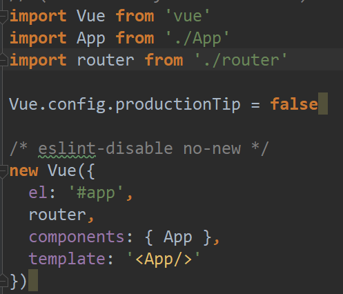

## vue+webpack项目构建
利用Vue-Cli，我们可以从官方拉取脚手架模板。比如vue+webpack,webpack是个打包工具，相当于帮我们把一堆依赖合成一起，成为一个bundle.js，最后我们就不需要到处去加载js文件了。

运行命令拉取脚手架(在vue基础笔记里也有介绍)

```
vue init webpack myproject
```

会新建得到目录结构

```
├── build              // 构建服务和webpack配置
├── config             // 项目不同环境的配置
├── dist               // 项目build目录
├── index.html         // 项目入口文件
├── package.json       // 项目配置文件
├── src                // 生产目录
│   ├── assets         // 图片资源
│   ├── common *          // 公共的css js 资源
│   ├── components     // 各种组件
│   ├── moke *           // 本地静态数据管理文件
│   ├── App.vue         // 主页面
│   ├── vuex *           // vuex状态管理器
│   ├── router    // 路由配置器
│   └── main.js        // Webpack 预编译入口
```

下面打‘ * ’的为自己新建的文件夹

打开 /src/main.js 你会看到


``` JavaScript
import Vue from 'vue'   //引入vue模块
import App from './App'  //引入vue组件
import router from './router' // 引入路由配置文件
Vue.config.productionTip = false // 关闭生产模式下给出的提示
new Vue({  // 创建一个 Vue 的根实例
  el: '#app', //挂载id,这个实例下所有的内容都会在index.html 一个id为app的div下显示
  router, // 注入路由配置。
  template: '<App/>', //配置根模板 即打开页面显示那个组件
  components: { App } // 注入组件
})
```

webpack这里自带了一个服务器插件，所以如果执行

```
npm run dev
```

那么就会启动服务器，在localhost的8080端口看得到vue页面。

**有关构建的配置文件，比如webpack.config在build文件夹里找**


### vue文件
用vue写前端项目时，我们会需要编写后缀名为.vue的文件。Vue自定义了一种后缀名名字为.vue文件,**它将html, js, css 整合成一个文件,和里面 template script style三个区别分别依次对应**。

```
<template>
<!--这里写 html -->
<template/>
<script>
 export default {};
 // 这里写js
</script>
<style lang = "less" scoped>
 <!--这里写css-->
</style>
```

一个.vue 文件就等于单独组件。因为.vue文件是自定义的，浏览器不识别，所以要对该文件进行解析,在webpack构建中，需要安装vue-loader 对.vue文件进行解析。

 - template里面最外层必须是只有一个容器
 - script 中的 export default {} 即导出这个组件，外部可以引用。
 - style 中的 lang 指额外表示支持的语言可以让编辑器识别,scoped 指这里写的css只适用于该组件。


### router目录
结合webpack构建出的项目结构，src下的router目录，用来配置页面组件跳转的路由逻辑，也就是vue-router相关的代码。

### 项目结构进一步观察
主项目下有个index.html文件，这个基本上就是整个vue app的入口。进入src目录，main.js就是主js文件，被index.html直接引入。main.js也是所有vue组件的入口。

在main.js下，我们导入了vue，App,router



vue是库，全局实例。App只是我们注册的其中一个组件(大组件)，router则是路由，帮助我们处理跳转逻辑(vue-router)

vue实例里，绑定了一个App组件，tempate里则是很直接的把App组件拿来用了(template里是如何渲染)。
