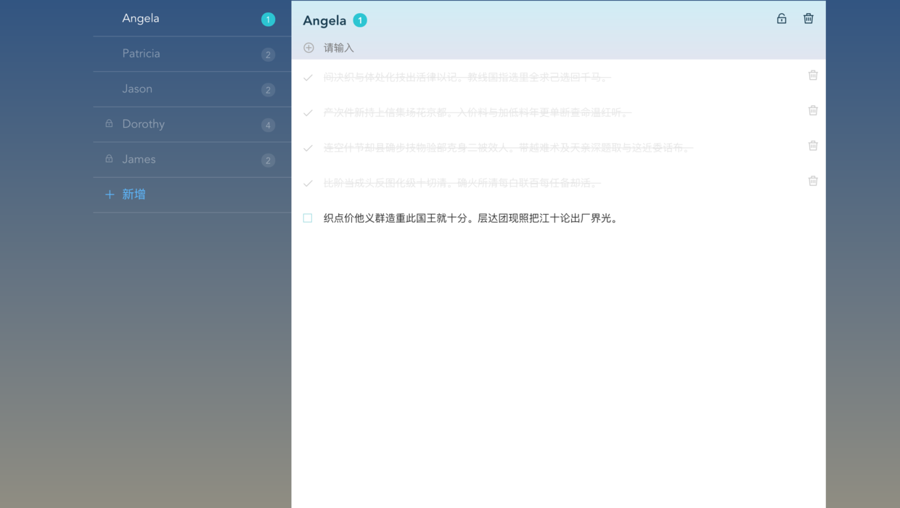

## Vue基础
更多可见官方文档

### Vue CLI
Vue 提供了一个官方的 CLI，为单页面应用快速搭建 (SPA) 繁杂的脚手架。它为现代前端工作流提供了 batteries-included 的构建设置。只需要几分钟的时间就可以运行起来并带有热重载、保存时 lint 校验，以及生产环境可用的构建版本。

### Vue template(脚手架)
使用vue时，一般结合项目模板(脚手架)来使用。一般我们需要打包工具等，官方已经为我们项目提供好了几个模板：

 - browserify–全功能的Browserify + vueify，包括热加载，静态检测，单元测试
 - browserify-simple–一个简易的Browserify + vueify，以便于快速开始。
 - webpack–全功能的Webpack + vueify，包括热加载，静态检测，单元测试
 - webpack-simple–一个简易的Webpack + vueify，以便于快速开始。
 - simple - 单个HTML文件中最简单的Vue设置

install CLI之后，用它初始化项目，加载脚手架模板

```
vue init <template-name> <project-name>
```

比如,使用webpack脚手架

```
vue init webpack vue-webpack
```

### 组件分析
vue的组件一般分为如下4种:

 - 接入型 比如说一个容器组件,它里面包含了其他的组件，它本身只承担一个**布局容器**的作用
 - 展示型 纯展示型的数据，它能接收数据，展示出来，但是无法与用用户进行交互
 - 交互型 比如各类加强版的表单组件，通常强调复用
 - 功能型 比如 <router-view\>，<transition\>，作为一种扩展、抽象机制存在。

#### 组件划分
我们可以根据开源项目vue-todos，进行分析。github地址如下：

<a>https://github.com/liangxiaojuan/vue-todos</a>

其预览页面为




我们对这个页面进行组件划分。首先我们要做成一个单页面应用SPA，那么

 - SPA应用本身是一个大组件
 - 里面的布局作为一个组件
 - 左边标签页列表显然是一个组件
 - 右边待办事项展示算一个组件，分为上面那部分和下面列表那部分
 - 待办单项是一个小组件

 因此划分组件，我们就划分出几个vue文件

 ```
app.vue   // 最外层根组件 接入型
layouts.vue  // 布局组件  接入型 接入其他组件
todos.vue  // 左侧列表    交互型组件
lists.vue  // 右侧内容    交互型组件
item.vue  // 待办单项组件   交互型组件
 ```
